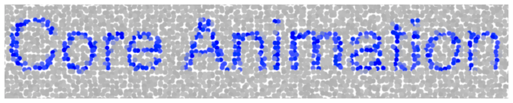

> Navigation: [Technologies](../../technologies.md) · [Core Animation](../../quartzcore.md) · [CALayer](../calayer.md)

# filters

<sub>Instance Property</sub>

An array of Core Image filters to apply to the contents of the layer and its sublayers. Animatable.

<sub>iOS, iPadOS, Mac Catalyst, macOS, tvOS, visionOS</sub>

```swift
var filters: [Any]? { get set }
```

## Discussion

The filters you add to this property affect the content of the layer, including its border, filled background and sublayers. The default value of this property is `nil`.

Changing the inputs of the [CIFilter](../../coreimage/cifilter-swift.class.md) object directly after it is attached to the layer causes undefined behavior. It is possible to modify filter parameters after attaching them to the layer but you must use the layer’s [setValue(_:forKeyPath:)](<../../objectivec/nsobject-swift.class/setvalue(__forkeypath_).md>) method to do so. In addition, you must assign a name to the filter so that you can identify it in the array. For example, to change the `inputRadius` parameter of the filter, you could use code similar to the following:

**Swift**

```swift
let layer = CALayer()
         
if let filter = CIFilter(name:"CIGaussianBlur") {
    filter.name = "myFilter"
    layer.backgroundFilters = [filter]
    layer.setValue(1,
                   forKeyPath: "backgroundFilters.myFilter.inputRadius")
}
```

**Objective-C**

```objc
CIFilter *filter = ...;
CALayer *layer = ...;
 
filter.name = @"myFilter";
layer.filters = [NSArray arrayWithObject:filter];
[layer setValue:[NSNumber numberWithInt:1] forKeyPath:@"filters.myFilter.inputRadius"];
```

The following code shows how to create a text layer and apply a [CIPointillize](https://developer.apple.com/library/archive/documentation/GraphicsImaging/Reference/CoreImageFilterReference/index.html#//apple_ref/doc/filter/ci/CIPointillize) filter to it.

```swift
view.layer = CALayer()
view.layerUsesCoreImageFilters = true
   
let textLayer = CATextLayer()
textLayer.string = "Core Animation"
textLayer.foregroundColor = NSColor.blue.cgColor
textLayer.backgroundColor = NSColor.lightGray.cgColor
textLayer.alignmentMode = kCAAlignmentCenter
textLayer.fontSize = 100
textLayer.frame = CGRect(x: 10, y: 10, width: 700, height: 140)
    
if let filter = CIFilter(name: "CIPointillize",
                         withInputParameters: ["inputRadius": 6]) {
    textLayer.filters = [filter]
}
   
view.layer?.addSublayer(textLayer)
```

The following figure shows the result: a pointillist effect is added to the text.



### Special Considerations

This property is not supported on layers in iOS.

## See Also

### Layer filters

- [compositingFilter](compositingfilter.md) — A CoreImage filter used to composite the layer and the content behind it. Animatable.
- [backgroundFilters](backgroundfilters.md) — An array of Core Image filters to apply to the content immediately behind the layer. Animatable.
- [minificationFilter](minificationfilter.md) — The filter used when reducing the size of the content.
- [minificationFilterBias](minificationfilterbias.md) — The bias factor used by the minification filter to determine the levels of detail.
- [magnificationFilter](magnificationfilter.md) — The filter used when increasing the size of the content.
