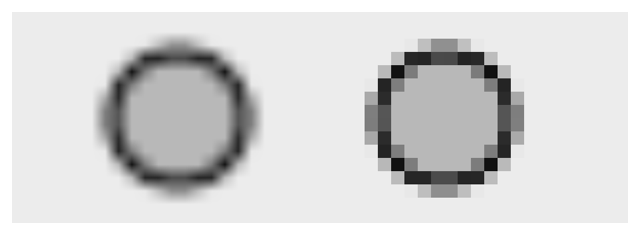

> Navigation: [Technologies](../../technologies.md) · [Core Animation](../../quartzcore.md) · [CALayer](../calayer.md)

# magnificationFilter

<sub>Instance Property</sub>

The filter used when increasing the size of the content.

<sub>iOS, iPadOS, Mac Catalyst, macOS, tvOS, visionOS</sub>

```swift
var magnificationFilter: CALayerContentsFilter { get set }
```

## Discussion

The possible values for this property are listed in [Scaling Filters](../scaling-filters.md).

The default value of this property is [kCAFilterLinear](../calayercontentsfilter/linear.md).

[Figure 1](/documentation/quartzcore/calayer/1410907-magnificationfilter#2851435) shows the difference between linear and nearest filtering when a 10 x 10 point image of a circle is magnified by a scale of 10.



The circle on the left uses [kCAFilterLinear](../calayercontentsfilter/linear.md) and the circle on the right uses [kCAFilterNearest](../calayercontentsfilter/nearest.md).

## See Also

### Layer filters

- [filters](filters.md) — An array of Core Image filters to apply to the contents of the layer and its sublayers. Animatable.
- [compositingFilter](compositingfilter.md) — A CoreImage filter used to composite the layer and the content behind it. Animatable.
- [backgroundFilters](backgroundfilters.md) — An array of Core Image filters to apply to the content immediately behind the layer. Animatable.
- [minificationFilter](minificationfilter.md) — The filter used when reducing the size of the content.
- [minificationFilterBias](minificationfilterbias.md) — The bias factor used by the minification filter to determine the levels of detail.
