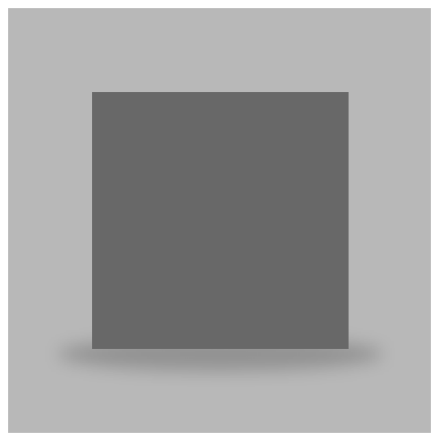
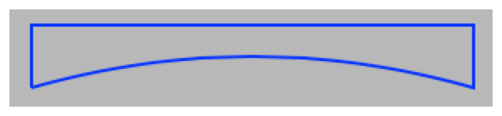
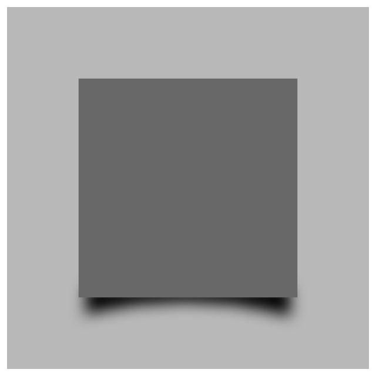

> Navigation: [Technologies](../../technologies.md) · [Core Animation](../../quartzcore.md) · [CALayer](../calayer.md)

# shadowPath

<sub>Instance Property</sub>

The shape of the layer’s shadow. Animatable.

<sub>iOS, iPadOS, Mac Catalyst, macOS, tvOS, visionOS</sub>

```swift
var shadowPath: CGPath? { get set }
```

## Discussion

The default value of this property is `nil`, which causes the layer to use a standard shadow shape. If you specify a value for this property, the layer creates its shadow using the specified path instead of the layer’s composited alpha channel. The path you provide defines the outline of the shadow. It is filled using the non-zero winding rule and the current shadow color, opacity, and blur radius.

Unlike most animatable properties, this property (as with all `CGPathRef` animatable properties) does not support implicit animation. However, the path object may be animated using any of the concrete subclasses of [CAPropertyAnimation](../capropertyanimation.md). Paths will interpolate as a linear blend of the “on-line” points; “off-line” points may be interpolated non-linearly (to preserve continuity of the curve’s derivative). If the two paths have a different number of control points or segments, the results are undefined. If the path extends outside the layer bounds it will not automatically be clipped to the layer, only if the normal layer masking rules cause that.

Specifying an explicit path usually improves rendering performance.

The value of this property is retained using the Core Foundation retain/release semantics. This behavior occurs despite the fact that the property declaration appears to use the default assign semantics for object retention.

### Using Shadow Path for Special Effects

You can use a layer’s shadow path to create special effects such as simulating the shadows available in [Pages](http://www.apple.com/pages/).

The following code shows the code required to add an elliptical shadow to the bottom of a layer to simulate the Pages _Contact Shadow_ effect.

```swift
let layer = CALayer()
     
layer.frame = CGRect(x: 75, y: 75, width: 150, height: 150)
layer.backgroundColor = NSColor.darkGray.cgColor
layer.shadowColor = NSColor.gray.cgColor
layer.shadowRadius = 5
layer.shadowOpacity = 1
     
let contactShadowSize: CGFloat = 20
let shadowPath = CGPath(ellipseIn: CGRect(x: -contactShadowSize,
                                          y: -contactShadowSize * 0.5,
                                          width: layer.bounds.width + contactShadowSize * 2,
                                          height: contactShadowSize),
                        transform: nil)
     
layer.shadowPath = shadowPath
```



The following code shows how to create a path to simulate the Pages _Curved Shadow_. The left, top and right sides of the path are straight lines, and the bottom is a concave curve as illustrated in the following figure.



```swift
let layer = CALayer()
layer.frame = CGRect(x: 75, y: 75, width: 150, height: 150)
layer.backgroundColor = NSColor.darkGray.cgColor
     
layer.shadowColor = NSColor.black.cgColor
layer.shadowRadius = 5
layer.shadowOpacity = 1
     
let shadowHeight: CGFloat = 10
let shadowPath = CGMutablePath()
shadowPath.move(to: CGPoint(x: layer.shadowRadius,
                            y: -shadowHeight))
shadowPath.addLine(to: CGPoint(x: layer.shadowRadius,
                               y: shadowHeight))
shadowPath.addLine(to: CGPoint(x: layer.bounds.width - layer.shadowRadius,
                               y: shadowHeight))
shadowPath.addLine(to: CGPoint(x: layer.bounds.width - layer.shadowRadius,
                               y: -shadowHeight))
     
shadowPath.addQuadCurve(to: CGPoint(x: layer.shadowRadius,
                                    y: -shadowHeight),
                        control: CGPoint(x: layer.bounds.width / 2,
                                         y: shadowHeight))
     
layer.shadowPath = shadowPath
```



## See Also

### Modifying the layer’s appearance

- [contentsGravity](contentsgravity.md) — A constant that specifies how the layer’s contents are positioned or scaled within its bounds.
- [Contents Gravity Values](../contents-gravity-values.md) — The contents gravity constants specify the position of the content object when the layer bounds is larger than the bounds of the content object. They are used by the [contentsGravity](contentsgravity.md) property.
- [opacity](opacity.md) — The opacity of the receiver. Animatable.
- [hidden](ishidden.md) — A Boolean indicating whether the layer is displayed. Animatable.
- [masksToBounds](maskstobounds.md) — A Boolean indicating whether sublayers are clipped to the layer’s bounds. Animatable.
- [mask](mask.md) — An optional layer whose alpha channel is used to mask the layer’s content.
- [doubleSided](isdoublesided.md) — A Boolean indicating whether the layer displays its content when facing away from the viewer. Animatable.
- [cornerRadius](cornerradius.md) — The radius to use when drawing rounded corners for the layer’s background. Animatable.
- [maskedCorners](maskedcorners.md)
- [CACornerMask](../cacornermask.md)
- [borderWidth](borderwidth.md) — The width of the layer’s border. Animatable.
- [borderColor](bordercolor.md) — The color of the layer’s border. Animatable.
- [backgroundColor](backgroundcolor.md) — The background color of the receiver. Animatable.
- [shadowOpacity](shadowopacity.md) — The opacity of the layer’s shadow. Animatable.
- [shadowRadius](shadowradius.md) — The blur radius (in points) used to render the layer’s shadow. Animatable.
