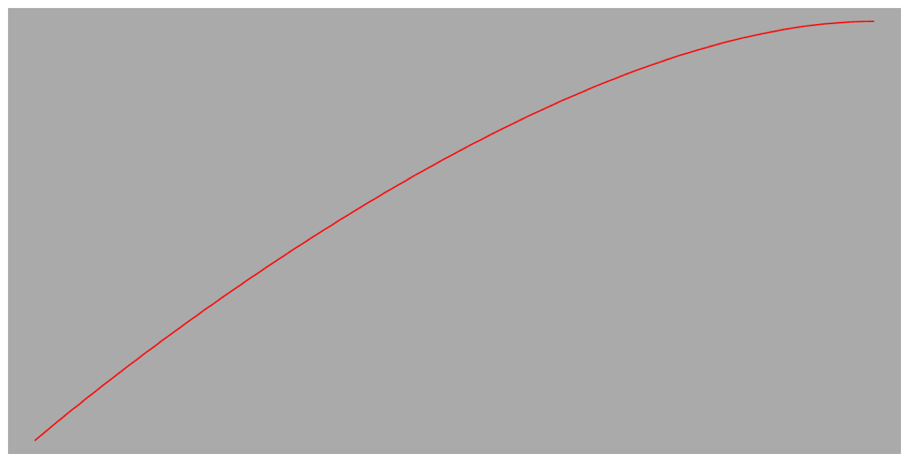

> Navigation: [Technologies](../../technologies.md) · [Core Animation](../../quartzcore.md) · [CAMediaTimingFunctionName](../camediatimingfunctionname.md)

# easeOut

<sub>Type Property</sub>

Ease-out pacing, which causes an animation to begin quickly and then slow as it progresses.

<sub>iOS, iPadOS, Mac Catalyst, macOS, tvOS, visionOS</sub>

```swift
static let easeOut: CAMediaTimingFunctionName
```

## Discussion

This is a Bézier timing function with the control points (0.0,0.0) and (0.58,1.0).

The following code shows how to create a basic animation object using ease-out interpolation.

```swift
 let verticalAnimation = CABasicAnimation(keyPath: "position.y")
 verticalAnimation.fromValue = 310
 verticalAnimation.toValue = 10
 verticalAnimation.timingFunction = CAMediaTimingFunction(name: kCAMediaTimingFunctionEaseOut)
```

A layer animated with the animation created by the code above and with linearly interpolated horizontal movement would describe a path similar to the following figure.



## See Also

### Constants

- [kCAMediaTimingFunctionLinear](linear.md) — Linear pacing, which causes an animation to occur evenly over its duration.
- [kCAMediaTimingFunctionEaseIn](easein.md) — Ease-in pacing, which causes an animation to begin slowly and then speed up as it progresses.
- [kCAMediaTimingFunctionEaseInEaseOut](easeineaseout.md) — Ease-in-ease-out pacing, which causes an animation to begin slowly, accelerate through the middle of its duration, and then slow again before completing.
- [kCAMediaTimingFunctionDefault](default.md) — The system default timing function. Use this function to ensure that the timing of your animations matches that of most system animations.
