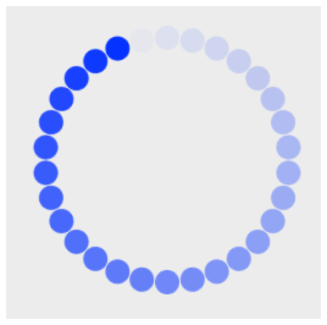

> Navigation: [Technologies](../../technologies.md) · [Core Animation](../../quartzcore.md) · [CAReplicatorLayer](../careplicatorlayer.md)

# instanceDelay

<sub>Instance Property</sub>

Specifies the delay, in seconds, between replicated copies. Animatable.

<sub>iOS, iPadOS, Mac Catalyst, macOS, tvOS, visionOS</sub>

```swift
var instanceDelay: CFTimeInterval { get set }
```

## Discussion

The default value is `0.0`, meaning that any animations added to replicated copies will be synchronized.

The following code shows a replicator layer being used to create an animated activity monitor. The replicator layer creates 30 small circles forming a larger circle. The source layer, `circle`, has a 1 second animated fade out and each of the copies offsets the time of the animation by 1 / 30 seconds.

```swift
let replicatorLayer = CAReplicatorLayer()
     
let circle = CALayer()
circle.frame = CGRect(origin: CGPoint.zero,
                      size: CGSize(width: 10, height: 10))
circle.backgroundColor = NSColor.blue.cgColor
circle.cornerRadius = 5
circle.position = CGPoint(x: 0, y: 50)
replicatorLayer.addSublayer(circle)
     
let fadeOut = CABasicAnimation(keyPath: "opacity")
fadeOut.fromValue = 1
fadeOut.toValue = 0
fadeOut.duration = 1
fadeOut.repeatCount = Float.greatestFiniteMagnitude
circle.add(fadeOut, forKey: nil)
     

let instanceCount = 30
replicatorLayer.instanceCount = instanceCount
replicatorLayer.instanceDelay = fadeOut.duration / CFTimeInterval(instanceCount)
     
let angle = -CGFloat.pi * 2 / CGFloat(instanceCount)
replicatorLayer.instanceTransform = CATransform3DMakeRotation(angle, 0, 0, 1)
```

The following illustration shows the result of the above code:



## See Also

### Setting Instance Display Properties

- [instanceCount](instancecount.md) — The number of copies to create, including the source layers.
- [instanceTransform](instancetransform.md) — The transform matrix applied to the previous instance to produce the current instance. Animatable.
