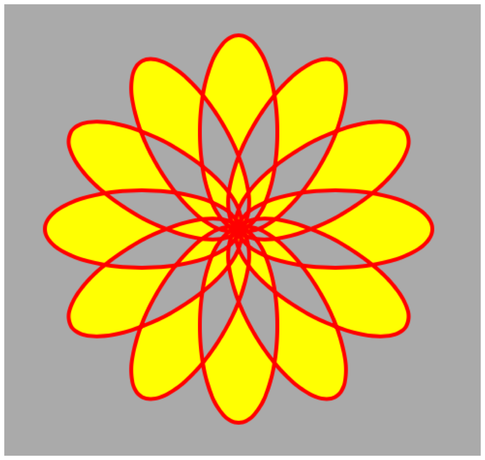

> Navigation: [Technologies](../technologies.md) · [Core Animation](../quartzcore.md)

# CAShapeLayer

<sub>Class</sub>

A layer that draws a cubic Bezier spline in its coordinate space.

<sub>iOS, iPadOS, Mac Catalyst, macOS, tvOS, visionOS</sub>

```swift
class CAShapeLayer
```

## Overview

The shape is composited between the layer’s contents and its first sublayer.

The shape will be drawn antialiased, and whenever possible it will be mapped into screen space before being rasterized to preserve resolution independence. However, certain kinds of image processing operations, such as CoreImage filters, applied to the layer or its ancestors may force rasterization in a local coordinate space.

The following code shows how you can build complex, composite paths and display them using a shape layer. In this example, a series of progressively transformed ellipses form a simple flower shape. The shape layer that displays the path has its [fillRule](cashapelayer/fillrule.md) set to [kCAFillRuleEvenOdd](cashapelayerfillrule/evenodd.md) which stops the overlapping “petals” from filling with the yellow [fillColor](cashapelayer/fillcolor.md).

```swift
let width: CGFloat = 640
let height: CGFloat = 640
     
let shapeLayer = CAShapeLayer()
shapeLayer.frame = CGRect(x: 0, y: 0,
                          width: width, height: height)
     
let path = CGMutablePath()
     
stride(from: 0, to: CGFloat.pi * 2, by: CGFloat.pi / 6).forEach {
    angle in 
    var transform  = CGAffineTransform(rotationAngle: angle)
        .concatenating(CGAffineTransform(translationX: width / 2, y: height / 2))
    
    let petal = CGPath(ellipseIn: CGRect(x: -20, y: 0, width: 40, height: 100),
                       transform: &transform)
    
    path.addPath(petal)
}
    
shapeLayer.path = path
shapeLayer.strokeColor = UIColor.red.cgColor
shapeLayer.fillColor = UIColor.yellow.cgColor
shapeLayer.fillRule = kCAFillRuleEvenOdd
```

The following figure shows the resulting shape layer.



> [!note] Note
> Shape rasterization may favor speed over accuracy. For example, pixels with multiple intersecting path segments may not give exact results.

## Relationships

- **Inherits From**: [CALayer](calayer.md)

- **Conforms To**: [CAMediaTiming](camediatiming.md), [CVarArg](../swift/cvararg.md), [CustomDebugStringConvertible](../swift/customdebugstringconvertible.md), [CustomStringConvertible](../swift/customstringconvertible.md), [Equatable](../swift/equatable.md), [Hashable](../swift/hashable.md), [NSCoding](../foundation/nscoding.md), [NSObjectProtocol](../objectivec/nsobjectprotocol.md), [NSSecureCoding](../foundation/nssecurecoding.md), [Sendable](../swift/sendable.md), [SendableMetatype](../swift/sendablemetatype.md)

## Topics

### Specifying the Shape Path

- [path](cashapelayer/path.md) — The path defining the shape to be rendered. Animatable.

### Accessing Shape Style Properties

- [fillColor](cashapelayer/fillcolor.md) — The color used to fill the shape’s path. Animatable.
- [fillRule](cashapelayer/fillrule.md) — The fill rule used when filling the shape’s path.
- [lineCap](cashapelayer/linecap.md) — Specifies the line cap style for the shape’s path.
- [lineDashPattern](cashapelayer/linedashpattern.md) — The dash pattern applied to the shape’s path when stroked.
- [lineDashPhase](cashapelayer/linedashphase.md) — The dash phase applied to the shape’s path when stroked. Animatable.
- [lineJoin](cashapelayer/linejoin.md) — Specifies the line join style for the shape’s path.
- [lineWidth](cashapelayer/linewidth.md) — Specifies the line width of the shape’s path. Animatable.
- [miterLimit](cashapelayer/miterlimit.md) — The miter limit used when stroking the shape’s path. Animatable.
- [strokeColor](cashapelayer/strokecolor.md) — The color used to stroke the shape’s path. Animatable.
- [strokeStart](cashapelayer/strokestart.md) — The relative location at which to begin stroking the path. Animatable.
- [strokeEnd](cashapelayer/strokeend.md) — The relative location at which to stop stroking the path. Animatable.

### Constants

- [Shape Fill Mode Values](shape-fill-mode-values.md) — These constants specify the possible fill modes for [fillRule](cashapelayer/fillrule.md).
- [Line Join Values](line-join-values.md) — These constants specify the shape of the joints between connected segments of a stroked path.
- [Line Cap Values](line-cap-values.md) — These constants specify the shape of endpoints for an open path when stroked.

## See Also

### Text, Shapes, and Gradients

- [CATextLayer](catextlayer.md) — A layer that provides simple text layout and rendering of plain or attributed strings.
- [CAGradientLayer](cagradientlayer.md) — A layer that draws a color gradient over its background color, filling the shape of the layer.
