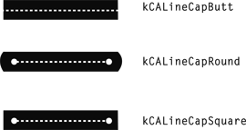

> Navigation: [Technologies](../../technologies.md) · [Core Animation](../../quartzcore.md) · [CAShapeLayer](../cashapelayer.md)

# lineCap

<sub>Instance Property</sub>

Specifies the line cap style for the shape’s path.

<sub>iOS, iPadOS, Mac Catalyst, macOS, tvOS, visionOS</sub>

```swift
var lineCap: CAShapeLayerLineCap { get set }
```

## Discussion

The line cap style specifies the shape of the endpoints of an open path when stroked. The supported values are described in [Line Cap Values](../line-cap-values.md). The following figure shows the appearance of the available line cap styles.



The default is [kCALineCapButt](../cashapelayerlinecap/butt.md).

## See Also

### Accessing Shape Style Properties

- [fillColor](fillcolor.md) — The color used to fill the shape’s path. Animatable.
- [fillRule](fillrule.md) — The fill rule used when filling the shape’s path.
- [lineDashPattern](linedashpattern.md) — The dash pattern applied to the shape’s path when stroked.
- [lineDashPhase](linedashphase.md) — The dash phase applied to the shape’s path when stroked. Animatable.
- [lineJoin](linejoin.md) — Specifies the line join style for the shape’s path.
- [lineWidth](linewidth.md) — Specifies the line width of the shape’s path. Animatable.
- [miterLimit](miterlimit.md) — The miter limit used when stroking the shape’s path. Animatable.
- [strokeColor](strokecolor.md) — The color used to stroke the shape’s path. Animatable.
- [strokeStart](strokestart.md) — The relative location at which to begin stroking the path. Animatable.
- [strokeEnd](strokeend.md) — The relative location at which to stop stroking the path. Animatable.
