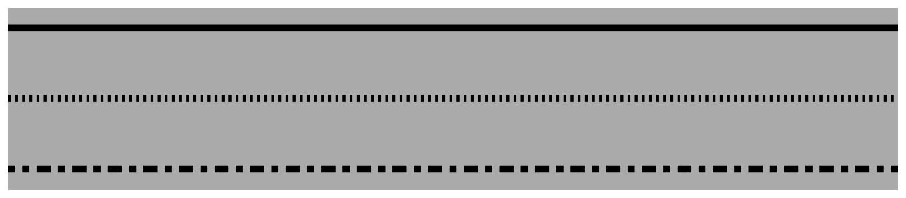

> Navigation: [Technologies](../../technologies.md) · [Core Animation](../../quartzcore.md) · [CAShapeLayer](../cashapelayer.md)

# lineDashPattern

<sub>Instance Property</sub>

The dash pattern applied to the shape’s path when stroked.

<sub>iOS, iPadOS, Mac Catalyst, macOS, tvOS, visionOS</sub>

```swift
var lineDashPattern: [NSNumber]? { get set }
```

## Discussion

The dash pattern is specified as an array of `NSNumber` objects that specify the lengths of the painted segments and unpainted segments, respectively, of the dash pattern.

For example, passing an array with the values `[2,3]` sets a dash pattern that alternates between a 2-user-space-unit-long painted segment and a 3-user-space-unit-long unpainted segment. Passing the values `[10,5,5,5]` sets the pattern to a 10-unit painted segment, a 5-unit unpainted segment, a 5-unit painted segment, and a 5-unit unpainted segment.

Default is `nil`, a solid line.

The following code shows how how you can create three shape layers using the dash patterns described above. Each shape layer contains a simple path that describes a horizontal line.

```swift
let layer = CALayer()
      
let lineDashPatterns: [[NSNumber]?]  = [nil, [2,3], [10, 5, 5, 5]]
     
for (index, lineDashPattern) in lineDashPatterns.enumerated() {
    
    let shapeLayer = CAShapeLayer()
    shapeLayer.strokeColor = UIColor.black.cgColor
    shapeLayer.lineWidth = 5
    shapeLayer.lineDashPattern = lineDashPattern
    
    let path = CGMutablePath()
    let y = CGFloat(index * 50)
    path.addLines(between: [CGPoint(x: 0, y: y),
                            CGPoint(x: 640, y: y)])
    
    shapeLayer.path = path
    
    layer.addSublayer(shapeLayer)
}
```

The following figure shows three shape layers created with the code above. The top solid line has a `nil` [lineDashPattern](linedashpattern.md), the middle has `[2,3]` and the bottom has `[10,5,5,5]`.



## See Also

### Accessing Shape Style Properties

- [fillColor](fillcolor.md) — The color used to fill the shape’s path. Animatable.
- [fillRule](fillrule.md) — The fill rule used when filling the shape’s path.
- [lineCap](linecap.md) — Specifies the line cap style for the shape’s path.
- [lineDashPhase](linedashphase.md) — The dash phase applied to the shape’s path when stroked. Animatable.
- [lineJoin](linejoin.md) — Specifies the line join style for the shape’s path.
- [lineWidth](linewidth.md) — Specifies the line width of the shape’s path. Animatable.
- [miterLimit](miterlimit.md) — The miter limit used when stroking the shape’s path. Animatable.
- [strokeColor](strokecolor.md) — The color used to stroke the shape’s path. Animatable.
- [strokeStart](strokestart.md) — The relative location at which to begin stroking the path. Animatable.
- [strokeEnd](strokeend.md) — The relative location at which to stop stroking the path. Animatable.
