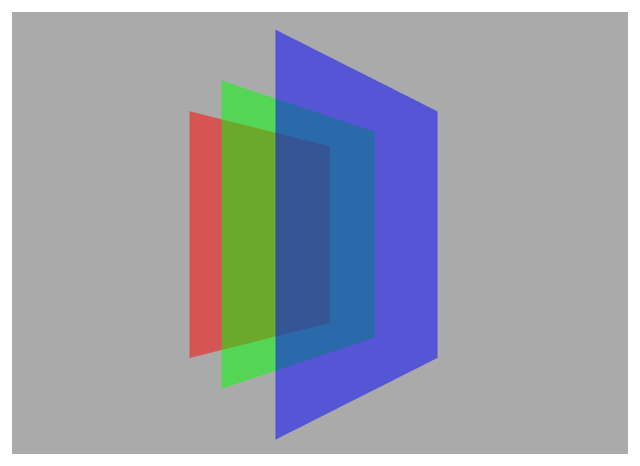
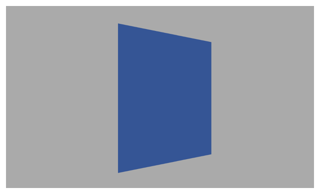

> Navigation: [Technologies](../technologies.md) · [Core Animation](../quartzcore.md)

# CATransformLayer

<sub>Class</sub>

Objects used to create true 3D layer hierarchies, rather than the flattened hierarchy rendering model used by other layer types.

<sub>iOS, iPadOS, Mac Catalyst, macOS, tvOS, visionOS</sub>

```swift
class CATransformLayer
```

## Overview

Unlike normal layers, transform layers do not flatten their sublayers into the plane at `Z=0`. Due to this, they do not support many of the features of the `CALayer` class compositing model:

- Only the sublayers of a transform layer are rendered. The `CALayer` properties that are rendered by a layer are ignored, including: `backgroundColor`, `contents`, border style properties, stroke style properties, etc.
- The properties that assume 2D image processing are also ignored, including: `filters`, `backgroundFilters`, `compositingFilter`, `mask`, `masksToBounds`, and shadow style properties.
- The `opacity` property is applied to each sublayer individually, the transform layer does not form a compositing group.
- The [- hitTest:](<calayer/hittest(__).md>) method should never be called on a transform layer as they do not have a 2D coordinate space into which the point can be mapped.

### Example: Displaying layers in 3D

Because [CATransformLayer](catransformlayer.md) creates true 3D layer hierarchies, you can display otherwise hidden layers when applying 3D transforms.

The following code shows three layers with different colors but identical sizes added at the same position to `layer`. The blue layer is visible because it has the highest [zPosition](calayer/zposition.md). Defining the layer’s transform rotates the viewpoint in 3D space and, because `layer` is a [CATransformLayer](catransformlayer.md), all three layers are visible as illustrated below.

```swift
let layer = CATransformLayer()
     
func layerOfColor(_ color: UIColor, zPosition: CGFloat) -> CALayer {
    let layer = CALayer()
    layer.frame = CGRect(x: 200, y: -200, width: 400, height: 400)
    layer.backgroundColor = color.cgColor
    layer.zPosition = zPosition
    layer.opacity = 0.5
    
    return layer
}
     
layer.addSublayer(layerOfColor(.red, zPosition: 20))
layer.addSublayer(layerOfColor(.green, zPosition: 40))
layer.addSublayer(layerOfColor(.blue, zPosition: 60))
     
var perspective = CATransform3DIdentity
perspective.m34 = -1 / 100
     
layer.transform = CATransform3DRotate(perspective, 0.1, 0, 1, 0)
```



However, if `layer` is created as a [CALayer](calayer.md), the green and red layers, being hidden by the blue layer, are not rendered as illustrated in the following figure.



## Relationships

- **Inherits From**: [CALayer](calayer.md)

- **Conforms To**: [CAMediaTiming](camediatiming.md), [CVarArg](../swift/cvararg.md), [CustomDebugStringConvertible](../swift/customdebugstringconvertible.md), [CustomStringConvertible](../swift/customstringconvertible.md), [Equatable](../swift/equatable.md), [Hashable](../swift/hashable.md), [NSCoding](../foundation/nscoding.md), [NSObjectProtocol](../objectivec/nsobjectprotocol.md), [NSSecureCoding](../foundation/nssecurecoding.md), [Sendable](../swift/sendable.md), [SendableMetatype](../swift/sendablemetatype.md)

## See Also

### Advanced Layer Options

- [CAScrollLayer](cascrolllayer.md) — A layer that displays scrollable content larger than its own bounds.
- [CATiledLayer](catiledlayer.md) — A layer that provides a way to asynchronously provide tiles of the layer’s content, potentially cached at multiple levels of detail.
- [CAReplicatorLayer](careplicatorlayer.md) — A layer that creates a specified number of sublayer copies with varying geometric, temporal, and color transformations.
