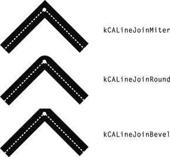

> Navigation: [Technologies](../technologies.md) · [Core Animation](../quartzcore.md) · [CAShapeLayer](cashapelayer.md)

# Line Join Values

API Collection

These constants specify the shape of the joints between connected segments of a stroked path.

## Overview

Used by [lineJoin](cashapelayer/linejoin.md). The following figure shows the appearance of the available line join styles.

## Topics

### Constants

- [kCALineJoinMiter](cashapelayerlinejoin/miter.md) — Specifies a miter line shape of the joints between connected segments of a stroked path.
- [kCALineJoinRound](cashapelayerlinejoin/round.md) — Specifies a round line shape of the joints between connected segments of a stroked path.
- [kCALineJoinBevel](cashapelayerlinejoin/bevel.md) — Specifies a bevel line shape of the joints between connected segments of a stroked path.

## See Also

### Constants

- [Shape Fill Mode Values](shape-fill-mode-values.md) — These constants specify the possible fill modes for [fillRule](cashapelayer/fillrule.md).
- [Line Cap Values](line-cap-values.md) — These constants specify the shape of endpoints for an open path when stroked.
