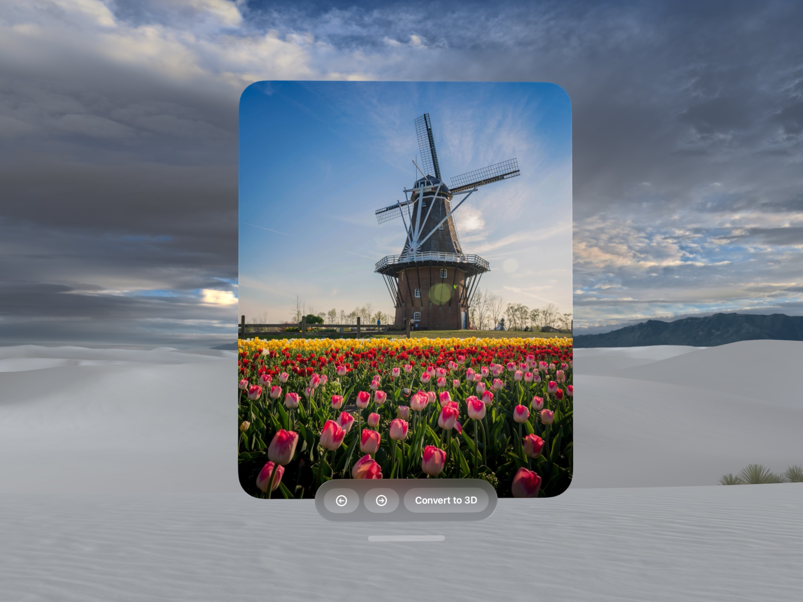

> Navigation: [Technologies](../technologies.md) · [RealityKit](../realitykit.md) · [Images](scene-content-images.md)

# Presenting images in RealityKit

<sub>Sample Code</sub>

Create and display spatial scenes in RealityKit

## Overview

RealityKit apps can easily display images in 3D space using [ImagePresentationComponent](imagepresentationcomponent.md), which can display traditional 2D and _spatial photos_ as well as generate and display _spatial scenes_ — which represents the content of an existing image in three dimensions.

Spatial scenes are different from _spatial photos_. A _spatial photo_ presents two separate 2D images, one to each eye, to create the illusion of a three dimensional view. _Spatial scenes_, on the other hand, generate textured 3D geometry from either a _spatial photo_ or a regular 2D image.



<sub>A screenshot of a visionOS window displaying a photograph of a windmill in the background and tulip flowers in the foreground. Below the window, there is an ornament view with left and right arrows and a button labeled Convert to 3D.</sub>

This sample app demonstrates how to use [ImagePresentationComponent](imagepresentationcomponent.md) and [Spatial3DImage](imagepresentationcomponent/spatial3dimage.md) to convert an existing 2D image to a 3D spatial scene, and how to present the 2D and 3D versions of the image using [RealityView](realityview.md) in a SwiftUI app.

## Choose viewing modes

Image presentation components can present images in several modes. Your apps can choose to use any or all of these modes.

- **[mono](imagepresentationcomponent/viewingmode-swift.struct/mono.md)** — Shows an image from a single point of view.
- **[spatial3D](imagepresentationcomponent/viewingmode-swift.struct/spatial3d.md)** — Shows a _spatial scene_ from the source image.
- **[spatial3DImmersive](imagepresentationcomponent/viewingmode-swift.struct/spatial3dimmersive.md)** — Shows a _spatial scene_ from the source image and displays it in immersive mode.
- **[spatialStereo](imagepresentationcomponent/viewingmode-swift.struct/spatialstereo.md)** — Shows an image as a _spatial photo_.
- **[spatialStereoImmersive](imagepresentationcomponent/viewingmode-swift.struct/spatialstereoimmersive.md)** — Shows an image as _spatial photo_ and displays it in immersive mode.

This sample displays images using `mono` and `spatial3D` viewing modes.

## Create an entity to present the image

To display an image, create an [ImagePresentationComponent](imagepresentationcomponent.md) and attach it to an entity in your scene. You can attach it to any entity, and you’ll also want to attach it to one that has no visual representation in your scene. This sample creates an empty [Entity](entity.md) property called `contentEntity` in the `AppModel` class for that purpose.

```swift
var contentEntity: Entity = Entity()
```

In the [RealityView](realityview.md) `make` closure, the app calls an asynchronous method to create an [ImagePresentationComponent](imagepresentationcomponent.md) and adds it to `contentEntity`.

```swift
await appModel.createImagePresentationComponent()
```

The `createImagePresentationComponent` function creates an [Spatial3DImage](imagepresentationcomponent/spatial3dimage.md) from a 2D image, then creates an image presentation component with that image and attaches it to the `contentEntity`:

```swift
func createImagePresentationComponent() async {
    guard let imageURL else {
        print("ImageURL is nil.")
        return
    }
    spatial3DImageState = .notGenerated
    spatial3DImage = nil
    do {
        spatial3DImage = try await ImagePresentationComponent.Spatial3DImage(contentsOf: imageURL)
    } catch {
        print("Unable to initialize spatial 3D image: \(error.localizedDescription)")
    }

    guard let spatial3DImage else {
        print("Spatial3DImage is nil.")
        return
    }
    
    let imagePresentationComponent = ImagePresentationComponent(spatial3DImage: spatial3DImage)
    contentEntity.components.set(imagePresentationComponent)
    if let aspectRatio = imagePresentationComponent.aspectRatio(for: .mono) {
        imageAspectRatio = CGFloat(aspectRatio)
    }
}
```

The `createImagePresentationComponent` method stores the [aspectRatio(for:)](<imagepresentationcomponent/aspectratio(for_).md>) of the newly created ImagePresentationComponent in the `AppModel`.

The app implements an [onChange(of:perform:)](<../swiftui/view/onchange(of_perform_).md>)  modifier for `aspectRatio` in the `AppModel` to ensure that the [UIWindowScene](../uikit/uiwindowscene.md) size matches the image.

```swift
.onChange(of: appModel.imageAspectRatio) { _, newAspectRatio in
    guard let windowScene = sceneDelegate.windowScene else {
        print("Unable to get the window scene. Resizing is not possible.")
        return
    }

    let windowSceneSize = windowScene.effectiveGeometry.coordinateSpace.bounds.size

    //  width / height = aspect ratio
    // Change ONLY the width to match the aspect ratio.
    let width = newAspectRatio * windowSceneSize.height

    // Keep the height the same.
    let size = CGSize(width: width, height: UIProposedSceneSizeNoPreference)

    UIView.performWithoutAnimation {
        // Update the scene size.
        windowScene.requestGeometryUpdate(.Vision(size: size))
    }
}
```

## Manage image presentation

In the `update` closure of the [RealityView](realityview.md), the app retrieves the presentation screen size of the image presentation component using the entity’s [observable](entity/observable-swift.property.md) property. This ensures that update is called when the `presentationScreenSize` changes.

```swift
guard let presentationScreenSize = appModel
    .contentEntity
    .observable
    .components[ImagePresentationComponent.self]?
    .presentationScreenSize, presentationScreenSize != .zero else {
        print("Unable to get a valid presentation screen size from the content entity.")
        return
}
```

The app sets the z axis position of the `contentEntity` to 0.0. This displays the image presentation component flush against the background.

```swift
let originalPosition = appModel.contentEntity.position(relativeTo: nil)
appModel.contentEntity.setPosition(SIMD3<Float>(originalPosition.x, originalPosition.y, 0.0), relativeTo: nil)
```

To display the image at an appropriate size, the app wraps a [RealityView](realityview.md) inside a [GeometryReader3D](../swiftui/geometryreader3d.md):

```swift
GeometryReader3D { geometry in
    RealityView { content in
```

In the `make` and `update` closure of the [RealityView](realityview.md), the app converts the geometry reader’s frame bounds into the scene’s coordinate space:

```swift
let availableBounds = content.convert(geometry.frame(in: .local), from: .local, to: .scene)
```

Then, the app calls the `scaleImagePresentationToFit` method which scales the image to fit into the geometry reader’s frame bounds:

```swift
scaleImagePresentationToFit(in: availableBounds)
```

The `scaleImagePresentationToFit` method calculates x and y scale values to preserve the aspect ratio of the presented image at the current [presentationScreenSize](imagepresentationcomponent/presentationscreensize.md), and sets those scale values as the content entity’s scale:

```swift
func scaleImagePresentationToFit(in boundsInMeters: BoundingBox) {
    guard let imagePresentationComponent = appModel.contentEntity.components[ImagePresentationComponent.self] else {
        return
    }

    let presentationScreenSize = imagePresentationComponent.presentationScreenSize
    let scale = min(
        boundsInMeters.extents.x / presentationScreenSize.x,
        boundsInMeters.extents.y / presentationScreenSize.y
    )

    appModel.contentEntity.scale = SIMD3<Float>(scale, scale, 1.0)
}
```

## Generate a spatial scene

It can take several seconds to generate a spatial scene. To preserve the user experience, you have two options:

- You can generate the spatial scene first and then add it to the image presentation component.
- Alternatively, you can can add it to the image presentation component first and then generate the spatial scene afterwards.

If you create the spatial scene before adding it to the component, the generated spatial scene appears as soon as you add it. If you add a 2D or stereo image to the component first and then generate the spatial scene later, the component presents a conversion UI like the one in the Photos app. This indicates that it’s generating the spatial scene

> [!note] Note
> Generation and viewing of spatial scenes is not supported in the simulator.

[A screen recording of a visionOS window displaying a photograph of a windmill in the background and tulip flowers in the foreground. Below the window, there is an ornament view with left and right arrows and a button labeled Convert to 3D. The user taps on the Convert to 3D button and colorful animation is shown on top of the photograph. The animation completes and the windmill and tulip flowers is shown as a spatial scene. The Convert to 3D button label changes to Show as 2D.](https://docs-assets.developer.apple.com/published/b7a17db05a3c235ab630ae61bf5bdff0/generate-spatial-scene.mp4)

This sample adds the images to the component first, then generates the spatial scene on a button press. It does that by first declaring an enumeration in the app data model to represent the current status of the displayed image.

```swift
enum Spatial3DImageState {
    case notGenerated
    case generating
    case generated
}
```

The app currently displays a 2D image in an [ImagePresentationComponent](imagepresentationcomponent.md). When the viewer clicks the Show as 3D button for the first time, it checks to see if the spatial 3D image has been generated, and returns if it has to avoid doing unnecessary work.

```swift
guard spatial3DImageState == .notGenerated else {
    print("Spatial 3D image already generated or generation is in progress.")
    return
}
```

The viewing mode of the image presentation component changes to [spatial3D](imagepresentationcomponent/viewingmode-swift.struct/spatial3d.md), calls [generate()](<imagepresentationcomponent/spatial3dimage/generate().md>) on the spatial 3D image it displays, and sets the image state to `.generated` so it knows not to generate it again:

```swift
guard var imagePresentationComponent = contentEntity.components[ImagePresentationComponent.self] else {
    print("ImagePresentationComponent is missing from the entity.")
    return
}
// Set the desired viewing mode before generating so that it will trigger the
// generation animation.
imagePresentationComponent.desiredViewingMode = .spatial3D
contentEntity.components.set(imagePresentationComponent)

// Generate the Spatial3DImage scene.
spatial3DImageState = .generating
try await spatial3DImage.generate()
spatial3DImageState = .generated
```

## Download

- [PresentingImagesInRealityKit.zip](https://docs-assets.developer.apple.com/published/7469d2a0cb00/PresentingImagesInRealityKit.zip)
