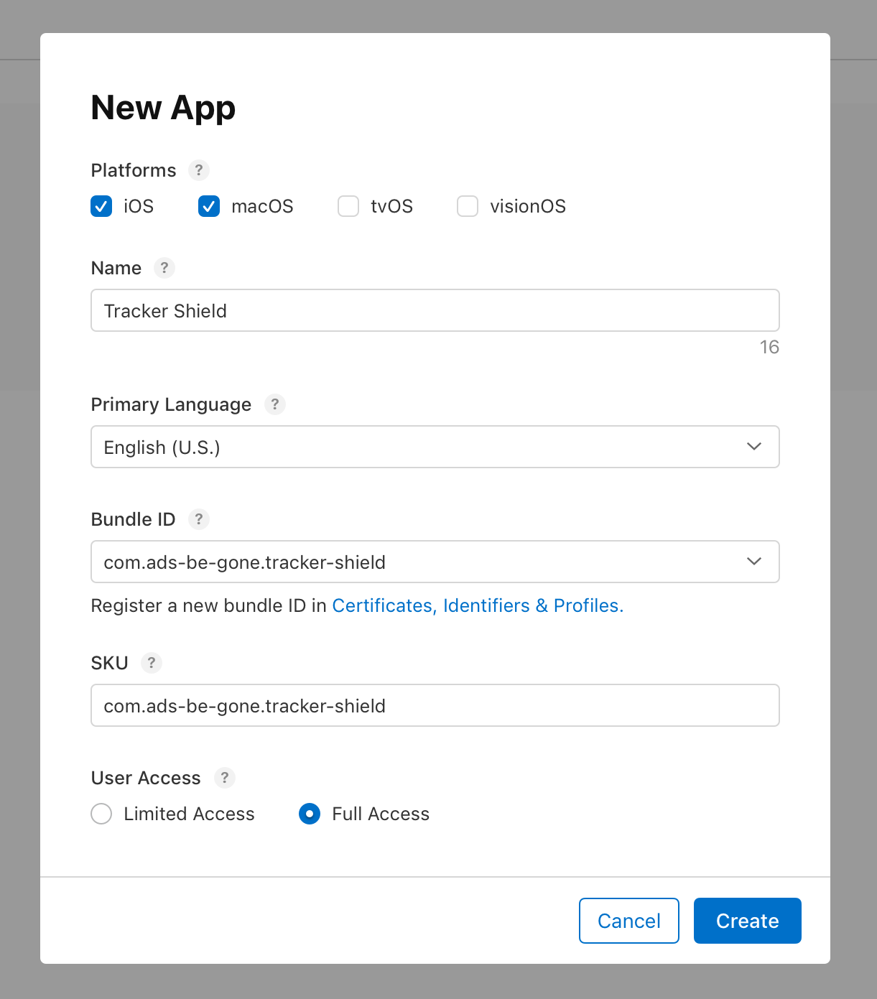
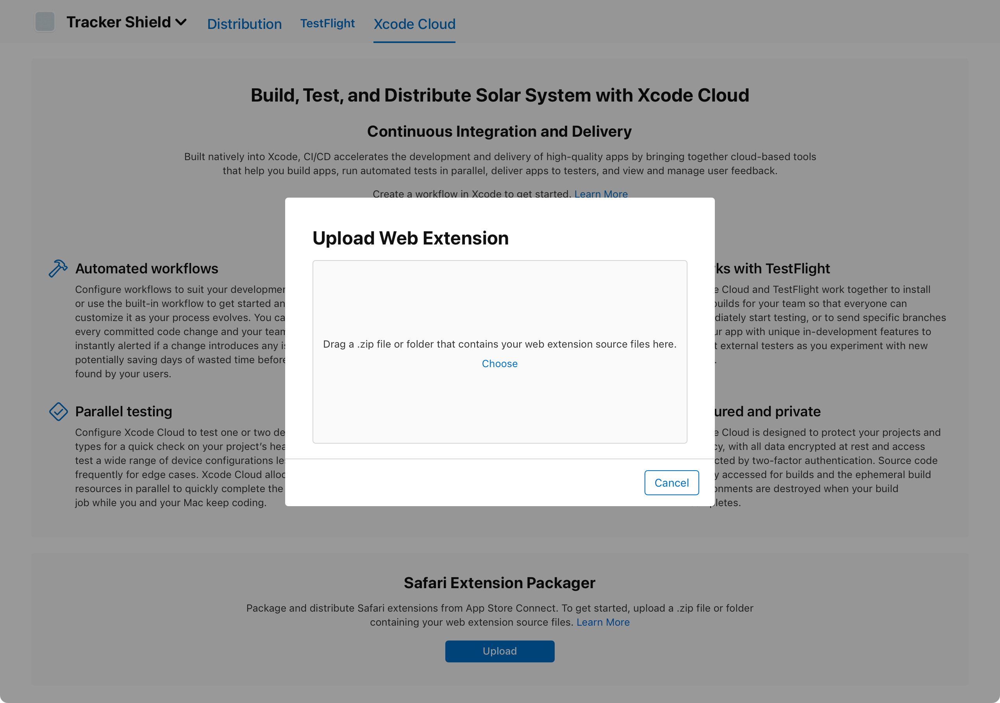
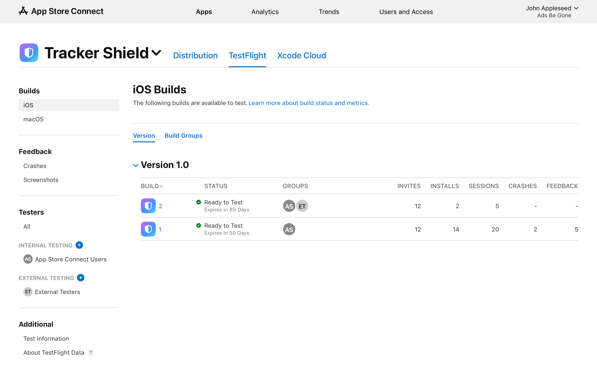

> Navigation: [Technologies](../technologies.md) · [Safari Services](../safariservices.md) · [Safari web extensions](safari-web-extensions.md)

# Packaging and distributing Safari Web Extensions with App Store Connect

Article

Upload and distribute Safari Web Extensions without using a Mac or Xcode.

## Overview

The Safari web extension packager enables you to package and distribute your Safari extensions using App Store Connect from any web browser, without requiring a Mac or access to Xcode. After packaging your extension, you can use TestFlight to test your extension or submit it to the App Store for distribution.

Safari web extension packager is also available as a command line tool which you can use alongside Xcode on a Mac. To learn more about using the command line tool, see [Packaging a web extension for Safari](packaging-a-web-extension-for-safari.md).

### Create an Apple Developer account

To access and use the Safari Extension Packager, you need to enroll your Apple account in the Apple Developer Program. For details on how to create an Apple Account and enroll in the Apple Developer program, see [Apple Developer Program enrollment](https://developer.apple.com/programs/enroll/)

### Create an app record

To create an app record, the Account Holder, Admin, or an App Manager opens [App Store Connect](https://appstoreconnect.apple.com/). Alternately, a team member with a Developer or Marketing role with access to create app records in App Store Connect can create this app record.

> [!note] Note
> The Safari web extension packager can create apps for both macOS and iOS. People can use the iOS app and extension on iOS, iPadOS, and visionOS.

Follow these steps:

1. In Apps, click the Add button (+) on the top left.
2. In the pop-up menu, select New App.
3. In the New App dialog, select the platforms (macOS, iOS, or both), and enter the app information.

    - If you’re registered as a company, you have the option to [set your developer name](https://developer.apple.com/help/app-store-connect/create-an-app-record/set-your-developer-name).
    - Choose a bundle identifier (ID) for your app. This uniquely identifies an app in the Apple ecosystem — every app needs a unique ID. It’s recommended that you use reverse domain-name notation, such as `com.example.MyApp`.
    - Choose a SKU for your app. This is a number you choose that helps you keep track of your app; the SKU isn’t viewable by people using your app.
    - Under User Access, choose Limited Access or Full Access. If you select Limited Access, choose who is able to access this app.
4. Click Create. Then, check for messages that indicate missing information.

For more information about creating an app record, see [Add a new app](https://developer.apple.com/help/app-store-connect/create-an-app-record/add-a-new-app/).

### Package the extension files

After creating an app record, navigate to the Xcode Cloud tab. Under Safari Web Extension Packager, click Upload.

Select and upload your extension files. The Safari Web Extension Package assembles the app for your extension. You need to upload the full contents of your extension, including the manifest and all related resources.

You can see the status of the packaging process on the Builds page. You can upload multiple builds at once. When packaging is complete, distribute your extension to beta testers using TestFlight. For more information on using TestFlight, see [Distributing your app for beta testing and releases](../xcode/distributing-your-app-for-beta-testing-and-releases.md)

Review any reported exceptions, and see [Assessing your Safari web extension’s browser compatibility](assessing-your-safari-web-extension-s-browser-compatibility.md) for details on how to resolve them.

> [!note] Note
> The compute time needed to package web extensions is deducted from the 25 hours per month of Xcode Cloud included in your Apple Developer Program membership.

A screenshot of the Safari web extension packager tool. The Upload Web Extension screen is open for someone to upload their web extension resources zip file.

### Distribute to beta testers with TestFlight

Use TestFlight to distribute beta builds of your app and extension, manage beta testers, and collect feedback. Make improvements to your extension and continue distributing builds until all issues are resolved before submitting your extension for App Store review and distribution.

For more information, see [TestFlight overview](https://developer.apple.com/help/app-store-connect/test-a-beta-version/testflight-overview).

### Distribute on the App Store

Before submitting your app to the App Store for review, confirm that it’s ready for public release and that you’re making the most of your product page.

Before submission, [complete all required metadata](https://developer.apple.com/help/app-store-connect/reference/required-localizable-and-editable-properties) and decide whether to [release your app manually, automatically](https://developer.apple.com/help/app-store-connect/manage-your-apps-availability/select-an-app-store-version-release-option), or [in phases](https://developer.apple.com/help/app-store-connect/update-your-app/release-a-version-update-in-phases).

When you’re ready to submit your app for review:

1. In your web browser, open App Store Connect.
2. Go to the Apps section.
3. Select your app.
4. Add the appropriate build for review.
5. Click Submit. After you submit your app, the app status changes to In Review.

Once your app is approved and ready for distribution on the App Store, its status changes to “Ready for Distribution.” For more information, see [Overview of publishing your app on the App Store](https://developer.apple.com/help/app-store-connect/manage-your-apps-availability/overview-of-publishing-your-app-on-the-app-store).

## See Also

### Extension conversions and packaging

- [Packaging a web extension for Safari](packaging-a-web-extension-for-safari.md) — Package your existing extension as a Safari web extension using Xcode’s command-line tool.
- [Converting a Safari app extension to a Safari web extension](converting-a-safari-app-extension-to-a-safari-web-extension.md) — Unify your web extensions and simplify development by sharing code with a Safari web extension.
