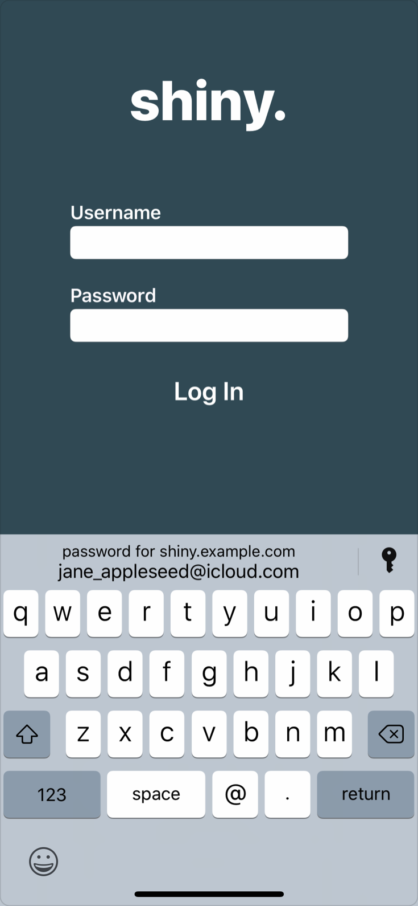
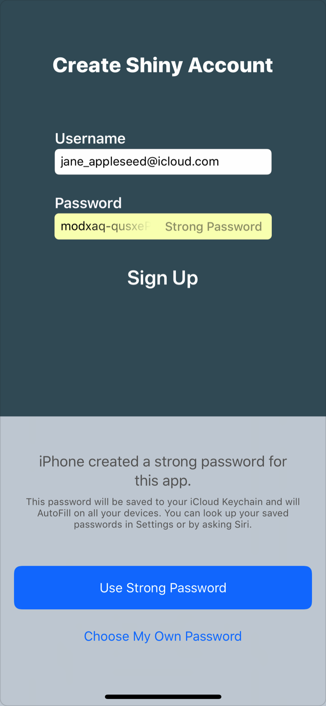
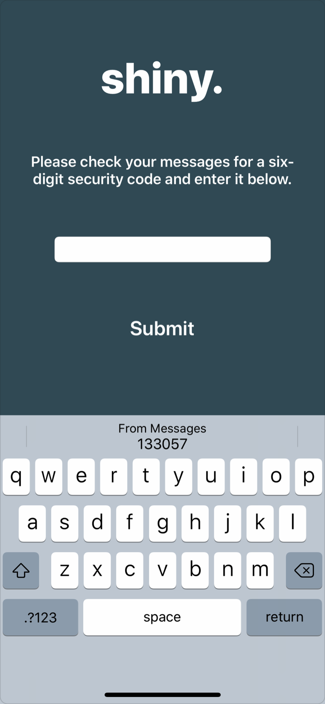

> Navigation: [Technologies](../technologies.md) · [Security](../security.md) · [Password AutoFill](password-autofill.md)

# About the Password AutoFill workflow

Article

Learn how Password AutoFill interacts with both iOS and web apps.

## Overview

Password AutoFill works with your app during a few key events, including when:

- Your app first installs on a device.
- The user selects a text input view in your app.
- The user taps on an AutoFill item from the QuickType bar.

### App installs

When your app installs on an iOS device, the system attempts to associate the app with all the domains listed in the app’s [Associated Domains Entitlement](../bundleresources/entitlements/com.apple.developer.associated-domains.md):

1. The system takes each domain from the [Associated Domains Entitlement](../bundleresources/entitlements/com.apple.developer.associated-domains.md).
2. It tries to download the Apple App Site Association file (`apple-app-site-association)` for that domain.
3. If all the steps succeed, the system associates the app with that domain, and enables Password AutoFill for that domain’s credentials.

### User selects a supported input field

When the user selects a supported input view or HTML input element, Password AutoFill displays the QuickType bar above the keyboard and populates it with relevant options for the given field.

If you haven’t tagged the input field, the system uses heuristics to identify the view’s type and determine if it’s supported. Password AutoFill supports input views and HTML input elements for user names, existing passwords, new passwords, and security codes.

User names and passwords. The QuickType bar only appears if the user has at least one password saved on the iOS device and the Keychain AutoFill setting is enabled. The key icon gives users access to all the credentials saved on the device, while the QuickType bar includes any credentials for your associated domains.

New passwords. The system suggests a strong, unique password in apps that have an associated domain. It also saves any new credentials. To set up associated domains, see [Supporting associated domains](../xcode/supporting-associated-domains.md).

If your website has specific password rules, you can define valid password formats by setting the text view’s [passwordRules](../uikit/uitextinputtraits/passwordrules.md) property. This property takes a [UITextInputPasswordRules](../uikit/uitextinputpasswordrules.md) objects, which contains a rules descriptor string.

In iOS 12, the [passwordRules](../uikit/uitextinputtraits/passwordrules.md) property is supported only on [UITextField](../uikit/uitextfield.md) objects, and the text field’s [isSecureTextEntry](../uikit/uitextinputtraits/issecuretextentry.md) property must be set to [true](../swift/true.md). The API is ignored if it is adopted on any other views.

For more information on the format of rules descriptors, see [Customizing Password AutoFill rules](customizing-password-autofill-rules.md).

Security code. If the system can parse a security code from an SMS message, the QuickType bar shows the code for up to three minutes after it has been received. If a security code arrives while the text input view is selected, the system pushes the incoming code to the QuickType bar.

To test the format of your SMS code for different languages, text a message to yourself. If you receive a message with an underlined security code, tap on the code. If a Copy Code option appears, the system has recognized your code.

### User taps on an AutoFill item

When users select an item from the QuickType bar, the system asks them to authenticate using Face ID or Touch ID. Your app becomes inactive when Face ID or Touch ID appears, triggering your app delegate’s [applicationWillResignActive(_:)](<../uikit/uiapplicationdelegate/applicationwillresignactive(__).md>) and [applicationDidBecomeActive(_:)](<../uikit/uiapplicationdelegate/applicationdidbecomeactive(__).md>) methods.

Don’t remove your user interface when these methods are called. If you do, the system won’t be able to autocomplete your input views.

> [!note] Note
> You may want to hide sensitive information when an app becomes inactive. However, if the user hasn’t logged in, no sensitive information is exposed, and this precaution should not be necessary.

As soon as the user authenticates successfully, the system changes the first responder to the views to be autocompleted — even if the app prevents changes to the first responder normally. The system then fills in all the relevant views.

Notifications are sent after the text changes. You can use these notifications to validate the information and update the form’s user interface — for example, by enabling the login button once the user name and password views are filled.

For iOS apps, the system always sends a [textDidChangeNotification](../uikit/uitextfield/textdidchangenotification.md) notification when a view has been modified. It also calls one of the delegate methods of the view — but the exact method depends on the view’s type:

- [UITextField](../uikit/uitextfield.md): The system calls your [UITextFieldDelegate](../uikit/uitextfielddelegate.md) object’s [textField(_:shouldChangeCharactersIn:replacementString:)](<../uikit/uitextfielddelegate/textfield(__shouldchangecharactersin_replacementstring_).md>) method.
- [UITextView](../uikit/uitextview.md): The system calls your [UITextViewDelegate](../uikit/uitextviewdelegate.md) object’s [textView(_:shouldChangeTextIn:replacementText:)](<../uikit/uitextviewdelegate/textview(__shouldchangetextin_replacementtext_).md>) method.
- Custom View adopting the [UITextInput](../uikit/uitextinput.md) protocol: The system calls the [insertText(_:)](<../uikit/uikeyinput/inserttext(__).md>) method or [replace(_:withText:)](<../uikit/uitextinput/replace(__withtext_).md>) in the [UIKeyInput](../uikit/uikeyinput.md) protocol.
