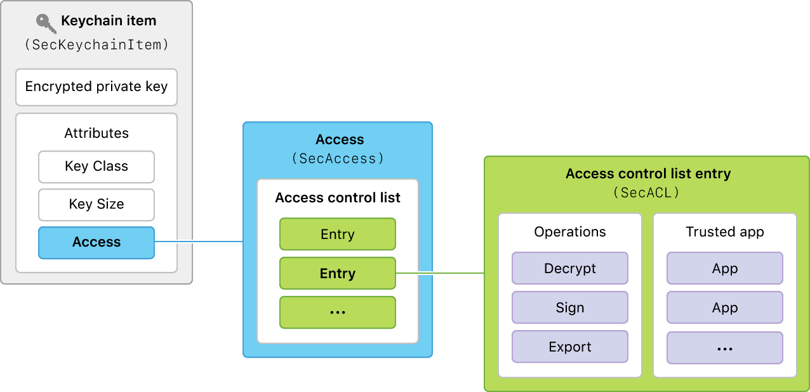

> Navigation: [Technologies](../technologies.md) · [Security](../security.md) · [Keychain services](keychain-services.md)

# Access Control Lists

API Collection

Control which apps have access to keychain items in macOS.

## Overview

In macOS, for items not stored on the iCloud keychain, each protected keychain item—like a password or private key—has an associated access instance that contains an access control list (ACL). The entries in this list in turn each contain an array of operations and an array of apps trusted to carry out those operations with the item. The collection of ACL entries govern the accessibility of the corresponding keychain item.

Diagram showing the detailed contents of access attribute of a kechain item, namely an access control list composed of entries for different operations and trusted apps.

When an app attempts to access a keychain item for a particular purpose—like using a private key to sign a document—the system looks for an entry in the item’s ACL containing the operation. If there’s no entry that lists the operation, then the system denies access and it’s up to the calling app to try something else or to notify the user.

If there is an entry that lists the operation, the system checks whether the calling app is among the entry’s trusted apps. If so, the system grants access. Otherwise, the system prompts the user for confirmation. The user may choose to Deny, Allow, or Always Allow the access. In the latter case, the system adds the app to the list of trusted apps for that entry, enabling the app to gain access in the future without prompting the user again.

> [!important] Important
> ACLs are not available in iOS or in macOS apps that use the iCloud keychain. For keychain item sharing in those environments, use access groups instead. See [Sharing access to keychain items among a collection of apps](sharing-access-to-keychain-items-among-a-collection-of-apps.md).

## Topics

### Access Creation

- [SecAccessCreate](<secaccesscreate(______).md>) — Creates a new access instance associated with a given protected keychain item. _(deprecated)_
- [SecAccessCreateWithOwnerAndACL](<secaccesscreatewithownerandacl(__________).md>) — Creates a new access instance using the owner and ACL entries you provide. _(deprecated)_
- [SecAccessOwnerType](secaccessownertype.md) — A type for flags that enable you to configure ACL ownership.
- [SecAccessOwnerType Values](secaccessownertype-values.md) — Flags that enable you to configure ACL ownership.
- [SecAccess](secaccess.md) — An opaque type that identifies a keychain item’s access information.
- [SecAccessGetTypeID](<secaccessgettypeid().md>) — Returns the unique identifier of the opaque type to which an access instance belongs. _(deprecated)_

### Access Query

- [SecAccessCopyACLList](<secaccesscopyacllist(____).md>) — Retrieves all the ACL entries of a given access instance. _(deprecated)_
- [SecAccessCopyMatchingACLList](<secaccesscopymatchingacllist(____).md>) — Retrieves selected ACL entries from a given access instance. _(deprecated)_
- [SecAccessCopyOwnerAndACL](<secaccesscopyownerandacl(__________).md>) — Retrieves the owner and the ACL entries of a given access instance. _(deprecated)_

### Access Control List Entries

- [SecACLCreateWithSimpleContents](<secaclcreatewithsimplecontents(__________).md>) — Creates a new ACL entry with the given characteristics, and adds it to an access instance. _(deprecated)_
- [SecACLRemove](<secaclremove(__).md>) — Removes the specified ACL entry from the access instance that contains it. _(deprecated)_
- [ACL Authorization Keys](acl-authorization-keys.md) — The operations an access control list entry applies to.
- [SecKeychainPromptSelector](seckeychainpromptselector.md) — Bits that define when a keychain should require a passphrase.
- [SecACL](secacl.md) — An opaque type that represents information about an ACL entry.
- [SecACLGetTypeID](<secaclgettypeid().md>) — Returns the unique identifier of the opaque type to which an ACL entry belongs. _(deprecated)_

### Access Control List Configuration

- [SecACLCopyContents](<secaclcopycontents(________).md>) — Returns the application list, description, and prompt selector for a given ACL entry. _(deprecated)_
- [SecACLSetContents](<secaclsetcontents(________).md>) — Sets the application list, description, and prompt selector for a given ACL entry. _(deprecated)_
- [SecACLCopyAuthorizations](<secaclcopyauthorizations(__).md>) — Retrieves the authorization tags of a given ACL entry. _(deprecated)_
- [SecACLUpdateAuthorizations](<secaclupdateauthorizations(____).md>) — Sets the authorization tags for a given ACL. _(deprecated)_

### Trusted Applications

- [SecTrustedApplicationCreateFromPath](<sectrustedapplicationcreatefrompath(____).md>) — Creates a trusted app instance based on the app at the given path in the file system. _(deprecated)_
- [SecTrustedApplicationCopyData](<sectrustedapplicationcopydata(____).md>) — Retrieves the data of a trusted app instance. _(deprecated)_
- [SecTrustedApplicationSetData](<sectrustedapplicationsetdata(____).md>) — Sets the data of a given trusted app instance. _(deprecated)_
- [SecTrustedApplication](sectrustedapplication.md) — An opaque type that contains information about a trusted app.
- [SecTrustedApplicationGetTypeID](<sectrustedapplicationgettypeid().md>) — Returns the unique identifier of the opaque type to which a trusted app instance belongs. _(deprecated)_

### Keychain Item Access

- [SecKeychainItemSetAccess](<seckeychainitemsetaccess(____).md>) — Sets the access of a given keychain item. _(deprecated)_
- [SecKeychainItemCopyAccess](<seckeychainitemcopyaccess(____).md>) — Retrieves the access of a given keychain item. _(deprecated)_
