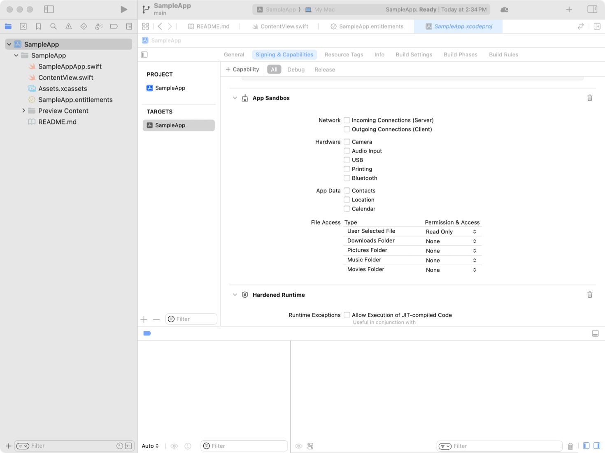
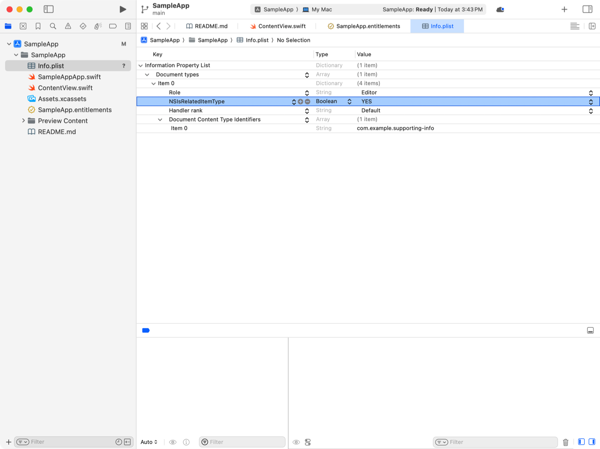
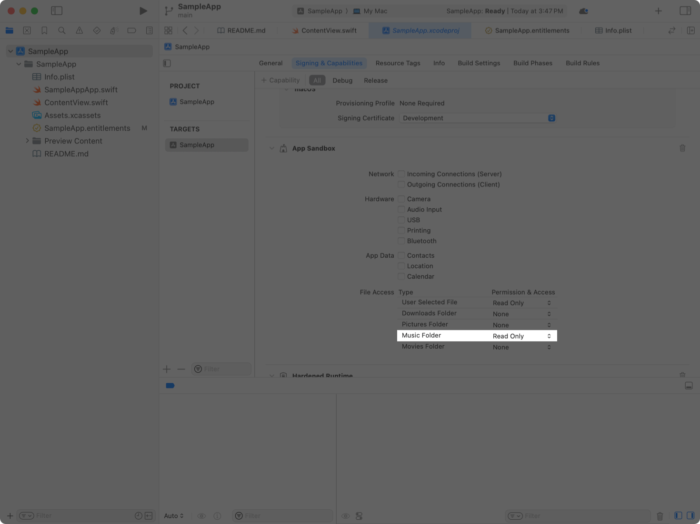

> Navigation: [Technologies](../technologies.md) · [Security](../security.md) · [App Sandbox](app-sandbox.md)

# Accessing files from the macOS App Sandbox

<sub>Article</sub>

Read and write documents and supporting files while maintaining security protection.

## Overview

App Sandbox improves the overall security of a Mac by restricting your app’s access to protected resources. macOS gives your app unrestricted access to limited parts of the Mac’s file system, but you can extend that access to:

- Read and write user-selected documents.
- Share files between running processes.
- Maintain access to files when your app next runs.
- Work with supporting files related to other documents.
- Share files between apps in an App Group.
- Use common file categories stored in standard locations.

Even in situations where App Sandbox permits your app to work with a file, discretionary access controls such as POSIX permissions or access control lists, or mandatory access controls built into macOS, may cause errors when your app attempts to use a file.

### Use files in your app’s container

When your sandboxed app launches for the first time, macOS creates a sandbox container on the file system (in `~/Library/Containers`) and associates it with your app. Your app has full read and write access to its sandbox container, and can run programs located there as well.

In macOS 14 and later, the operating system uses your app’s code signature to associate it with its sandbox container. If your app tries to access the sandbox container owned by another app, the system asks the person using your app whether to grant access. If the person denies access and your app is already running, then it can’t read or write the files in the other app’s sandbox container. If the person denies access while your app is launching and trying to enter the other app’s sandbox container, your app fails to launch. The system also requests permission for an app to access files in another app’s container if the app that’s attempting to access the files doesn’t have the app sandbox entitlement in its code signature. If the person grants permission, then the app can access files in any app sandbox container until it exits.

The operating system also tracks the association between an app’s code signing identity and its sandbox container for helper tools, including launch agents. If a person denies permission for a launch agent to enter its sandbox container and the app fails to start, `launchd` starts the launch agent again and the operating system re-requests access.

> [!note] Note
> In certain situations, two different versions of your app can have different designated requirements, leading the operating system to request permission when the second version tries to access the sandbox container. One case is using both the version of your app from the Mac App Store and a local build created in Xcode on the same computer. Another is if you transfer an app to another App Store team and the code signing identity used to sign the app changes between released versions.

### Access files with standard user interactions

Give your app access to files that a person chooses in open and save panels, or by following these steps:

1. Open your Xcode project.
2. Select your project in the file navigator.
3. Select your app’s target.
4. Open the Signing & Capabilities tab.
5. In the App Sandbox group, choose Read Only or Read/Write from the User Selected File menu.



<sub>A screenshot of the Signing and Capabilities editor in Xcode. In the App Sandbox capability, permission and access to User Selected Files is set to Read Only.</sub>

Present a standard open or save panel so that a person can choose a document that’s outside your app’s sandbox:

- From SwiftUI, use file import modifiers like [fileImporter(isPresented:allowedContentTypes:onCompletion:)](<../swiftui/view/fileimporter(ispresented_allowedcontenttypes_oncompletion_).md>), and file exporter modifiers like [fileExporter(isPresented:document:contentType:defaultFilename:onCompletion:)](<../swiftui/view/fileexporter(ispresented_document_contenttype_defaultfilename_oncompletion_)-32vwk.md>).
- From AppKit, use [NSOpenPanel](../appkit/nsopenpanel.md) and [NSSavePanel](../appkit/nssavepanel.md).
- From Mac Catalyst, use [UIDocumentPickerViewController](../uikit/uidocumentpickerviewcontroller.md).

The operating system displays open and save panels in a separate process, and extends your app’s sandbox to include the selected URLs.

The operating system starts security-scoped access on URLs passed from open panels, save panels, or items dragged to your app’s icon in the Dock, as if you called [startAccessingSecurityScopedResource()](<../foundation/nsurl/startaccessingsecurityscopedresource().md>). When you’ve finished with the resources, call [stopAccessingSecurityScopedResource()](<../foundation/nsurl/stopaccessingsecurityscopedresource().md>) to revoke your app’s access.

When the URL your app receives from a standard user interface interaction represents a folder, the operating system extends your app’s sandbox to items within that folder, and recursively in nested folders. Some items within the folder could still be inaccessible for other reasons, discussed in “Diagnose other reasons your app can’t access a file,” below.

Your app can’t run programs in locations outside its app bundle, sandbox container, or app group containers using the entitlements to access user-selected files. To write programs in user-selected locations, add the `com.apple.security.files.user-selected.executable` entitlement with the Boolean value `YES`.

### Persist file access with security-scoped URL bookmarks

Create bookmark data from a URL using [bookmarkData(options:includingResourceValuesForKeys:relativeTo:)](<../foundation/nsurl/bookmarkdata(options_includingresourcevaluesforkeys_relativeto_).md>), including the [withSecurityScope](../foundation/nsurl/bookmarkcreationoptions/withsecurityscope.md) option. Foundation creates a URL bookmark with an explicit security scope that your app can store and retrieve to subsequently access the resource at the URL, regardless of whether your app exits between accesses. If your app doesn’t need to write to the file on subsequent access, include the [securityScopeAllowOnlyReadAccess](../foundation/nsurl/bookmarkcreationoptions/securityscopeallowonlyreadaccess.md) option.

Unlike the bookmarks with implicit security scope that your app receives from standard system interactions or from communication with other processes, when you resolve a security-scoped bookmark that you retrieve from a stored representation, the system doesn’t automatically extend your app’s sandbox to include the bookmarked file. Call [startAccessingSecurityScopedResource()](<../foundation/nsurl/startaccessingsecurityscopedresource().md>) before you use the file at the resolved URL, and [stopAccessingSecurityScopedResource()](<../foundation/nsurl/stopaccessingsecurityscopedresource().md>) when you’re done with the file.

To access the file:

1. Resolve the URL using [init(resolvingBookmarkData:options:relativeTo:bookmarkDataIsStale:)](<../foundation/nsurl/init(resolvingbookmarkdata_options_relativeto_bookmarkdataisstale_).md>), including [withSecurityScope](../foundation/nsurl/bookmarkcreationoptions/withsecurityscope.md) in the options.
2. If the Boolean value returned in `bookmarkDataIsStale` is true, then recreate the bookmark using [bookmarkData(options:includingResourceValuesForKeys:relativeTo:)](<../foundation/nsurl/bookmarkdata(options_includingresourcevaluesforkeys_relativeto_).md>) and update your app’s stored version of the bookmark.
3. Call [startAccessingSecurityScopedResource()](<../foundation/nsurl/startaccessingsecurityscopedresource().md>) on the resolved URL.
4. Use the file at the resolved URL.
5. Call [stopAccessingSecurityScopedResource()](<../foundation/nsurl/stopaccessingsecurityscopedresource().md>) on the resolved URL.

You only need to create security-scoped bookmarks when your app might try to access the bookmarked resource after it exits and re-launches. In other situations, for example, passing a URL bookmark between processes, you can create and use a bookmark without security scope.

### Share file access between processes with URL bookmarks

Create bookmark data from a URL using [bookmarkData(options:includingResourceValuesForKeys:relativeTo:)](<../foundation/nsurl/bookmarkdata(options_includingresourcevaluesforkeys_relativeto_).md>), passing `[]` (Swift) or `0` (Objective-C) as the value for the options parameter. The bookmark Foundation creates refers to a security-scoped URL that grants access to the resource to a process that resolves the bookmark. Your app can pass that bookmark to another process, like a launch agent or an XPC service. Use the following example to access the resource in the receiving process:

**Swift**

```swift
do {
  let location = try URL(resolvingBookmarkData: bookmark)
  defer {
    location.stopAccessingSecurityScopedResource()
  }
  // Use the resource at the location URL.
}
catch let error {
  // Handle any errors.
} 
```

**Objective-C**

```objc
BOOL isStale = NO;
NSError *error = nil;
NSURL *location = [NSURL URLByResolvingBookmarkData:bookmark
                                            options:0
                                      relativeToURL:0
                                bookmarkDataIsStale:&isStale
                                              error:&error];
if (location == nil) {
  // Handle any errors.
} else {
  // Use the resource at the location URL.
  [location stopAccessingSecurityScopedResource];
}
```

The receiving process automatically attempts to extend its sandbox to include the bookmarked resource when it uses the security-scoped URL, as if it called [startAccessingSecurityScopedResource()](<../foundation/nsurl/startaccessingsecurityscopedresource().md>) after resolving the bookmark. To defer extending the process’s sandbox until you explicitly call [startAccessingSecurityScopedResource()](<../foundation/nsurl/startaccessingsecurityscopedresource().md>), pass the option [withoutImplicitStartAccessing](../foundation/nsurl/bookmarkresolutionoptions/withoutimplicitstartaccessing.md).

### Access files related to documents with document-relative bookmarks

Document-relative bookmarks extend access to project files to cover the supporting files those projects reference. Consider the example of an integrated development environment (IDE) app. An IDE project file could contain references to source code files, images, and other assets. Store document-relative bookmarks in the project document, so that when the sandboxed app opens the project document, it can resolve the bookmarks to access the other files.

Create bookmark data from a URL using [bookmarkData(options:includingResourceValuesForKeys:relativeTo:)](<../foundation/nsurl/bookmarkdata(options_includingresourcevaluesforkeys_relativeto_).md>), using the document’s URL as the `url` parameter. Foundation creates a bookmark that any process with access to the resource at the `relativeTo` URL can resolve.

### Share files between related apps with app group containers

Apps that are members of the same app group can create any number of shared containers that they use to exchange files. Your app can access files and folders in an app group container if it meets the following conditions:

- You get the location of the app group container by calling the [FileManager](../foundation/filemanager.md) method [containerURL(forSecurityApplicationGroupIdentifier:)](<../foundation/filemanager/containerurl(forsecurityapplicationgroupidentifier_).md>).
- Your app claims the [App Groups Entitlement](../bundleresources/entitlements/com.apple.security.application-groups.md) with a value that contains the app group’s identifier.
- Your app is distributed through the Mac App Store, or notarized.
- If your app is notarized, the app group’s identifier is contained in your app’s provisioning profile or prefixed with your Apple Developer team identifier.

In other situations, the system displays a request for someone to authorize your app’s access to the app group container.

### Use related file access to work with groups of files

To work with files that are related to a document chosen by the person using your app, like ancillary files or versions in different formats, identify your apps’ related file types with these steps:

1. Open your Xcode project.
2. Select your app’s `Info.plist` file in the file navigator.
3. Open the disclosure triangle next to Document types.
4. Add the `NSIsRelatedItemType` key to the dictionaries representing your app’s related file types, with the Boolean value `YES`.



<sub>A screenshot of Xcode, showing the property list editor for an app’s Info.plist file. The property list includes a document type with the NSIsRelatedItemType key and the value YES.</sub>

The `Info.plist` file entry for the related file type should look like this example.

```xml
<key>CFBundleDocumentTypes</key>
<array>
  <dict>
    <key>NSIsRelatedItemType</key>
    <true/>
    <key>CFBundleTypeRole</key>
    <string>Editor</string>
    <key>LSHandlerRank</key>
    <string>Default</string>
    <key>LSItemContentTypes</key>
    <array>
      <string>com.example.supporting-info</string>
    </array>
  </dict>
  <!-- Entries for your app’s main document types and other supporting files. -->
</array>
```

In your code, create an object that conforms to [NSFilePresenter](../foundation/nsfilepresenter.md). For a given document file, set that object’s [primaryPresentedItemURL](../foundation/nsfilepresenter/primarypresenteditemurl.md) to the document’s URL, and the [presentedItemURL](../foundation/nsfilepresenter/presenteditemurl.md) to the supporting file’s URL. Pass the created file presenter to an instance of [NSFileCoordinator](../foundation/nsfilecoordinator.md), and use the file coordinator to access the supporting file. The operating system automatically extends your app’s sandbox to give your app access to the supporting file.

### Request capabilities to access standard folders

Apps that work with common types of file including Music, Movies, or Photos, can request capabilities that grant access to the standard folders where these files are located, avoiding the need to individually request consent to access each file. For example, to access the Music folder:

1. Open your Xcode project.
2. Select your project in the file navigator.
3. Select your app’s target.
4. Open the Signing & Capabilities tab.
5. In the App Sandbox group, choose Read Only or Read/Write from the Music Folder menu.



<sub>A screenshot of the Signing and Capabilities editor in Xcode. In the App Sandbox capability, permission and access to the Music Folder is set to Read Only.</sub>

### Request full disk access to use all files on a Mac

Certain app workflows, like an app for backing up your Mac, require access to files wherever they reside on a file system. Your app can’t automatically gain full disk access through an entitlement or with code: the person using your app must choose to grant access in System Settings \> Privacy & Security.

In situations where your app tries to use a file outside of its sandbox, program defensively by handling failure cases, as someone may choose not to grant full disk access to your app.

### Diagnose other reasons your app can’t access a file

Your app may not have access to a file even if App Sandbox doesn’t block access. Any of the operating system facilities listed below may restrict access to the file.

- **POSIX permissions** — The read, write, or execute permission flags on the file, or a folder in the file’s path, deny access to the user account running your app. The app receives an error with the domain [NSPOSIXErrorDomain](../foundation/nsposixerrordomain.md) and code 13 (`EACCES`).
- **POSIX.1e access control lists** — The access control list on the file, or a folder in the file’s path, deny access to the user account running your app. The app receives an error with the domain [NSPOSIXErrorDomain](../foundation/nsposixerrordomain.md) and code 13 (`EACCES`).
- **System Integrity Protection** — The operating system prevents software from modifying certain parts of the file system to prevent damage to installed software. The app receives an error with the domain [NSPOSIXErrorDomain](../foundation/nsposixerrordomain.md) and code 1 (`EPERM`).
- **Data protection** — The file has a data protection class that prevents the app opening the file, for example, the file’s data protection class is [complete](../foundation/fileprotectiontype/complete.md) and the device is locked. The app receives an error with the domain [NSPOSIXErrorDomain](../foundation/nsposixerrordomain.md) and code 1 (`EPERM`).

> [!note] Note
> To determine whether the App Sandbox denied your app access to a file, see [Discovering and diagnosing App Sandbox violations](discovering-and-diagnosing-app-sandbox-violations.md).
