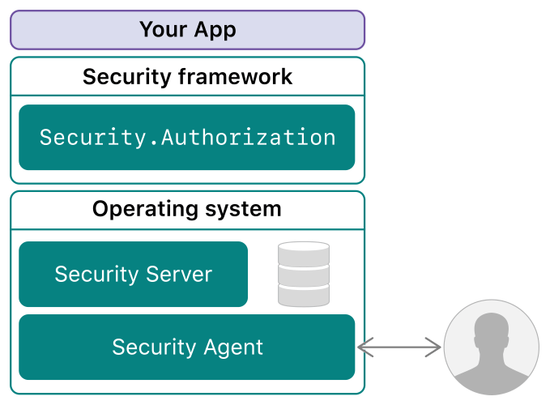

> Navigation: [Technologies](../technologies.md) · [Security](../security.md)

# Authorization Services

API Collection

Access restricted areas of the operating system, and control access to particular features of your macOS app.

## Overview

The `Security.Authorization` API is a programming interface to the Security Server and its policy database. This API facilitates access control to restricted areas of the operating system and allows you to restrict a user’s access to particular features in your macOS app. Use authorization services in:

- Software that restricts access to its own tools
- Applications that call system tools
- Software installers that install privileged tools or require access to restricted areas of the operating system

As shown in the image below, the Security Server is a daemon running in the operating system that provides a trusted implementation of various security protocols, including authorization computation. In turn, the Security Server relies on the Security Agent to interface with users when authentication is needed. Thus an app can verify credentials (usernames and passwords) without ever accessing them directly. This authorization process also allows the means of authentication to change in the future (such as adding Touch ID) without your having to modify your app.

Diagram showing your app sitting above the Security framework, which in turn sits above the Security Server and the Security Agent.

> [!note] Note
> For a simplified, class-based version of this API, consider using the [SFAuthorization](../securityfoundation/sfauthorization.md) class instead. When you need a user interface that enables display and control of the current authorization state for a particular set of rights, use the [SFAuthorizationView](../securityinterface/sfauthorizationview.md) class.

> [!important] Important
> The Authorization Services API is not supported within an App Sandbox because the API allows privilege escalation.

## Topics

### Authorization References

- [AuthorizationCreate](<authorizationcreate(________).md>) — Creates a new authorization reference and provides an option to authorize or preauthorize rights.
- [AuthorizationFree](<authorizationfree(____).md>) — Frees the memory associated with an authorization reference.
- [AuthorizationFlags](authorizationflags.md) — The flags used to specify authorization options.
- [AuthorizationRef](authorizationref.md) — A pointer to an opaque authorization reference structure.

### Authorization Items

- [AuthorizationItem](authorizationitem.md) — A structure containing information about an authorization right or the authorization environment.
- [AuthorizationItemSet](authorizationitemset.md) — A structure containing a set of authorization items.
- [AuthorizationRights](authorizationrights.md) — An authorization item set designated to represent a set of rights.
- [AuthorizationEnvironment](authorizationenvironment.md) — An authorization item set designated to hold environment information relevant to authorization decisions.
- [Authorization Name Tags](authorization-name-tags.md) — Use name tags to define authorization security items.
- [AuthorizationFreeItemSet](<authorizationfreeitemset(__).md>) — Frees the memory associated with a set of authorization items.

### Rights and Credentials

- [AuthorizationCopyInfo](<authorizationcopyinfo(______).md>) — Retrieves supporting data such as the user name and other information gathered during evaluation of authorization.
- [AuthorizationCopyRights](<authorizationcopyrights(__________).md>) — Authorizes and preauthorizes rights synchronously.
- [AuthorizationCopyRightsAsync](<authorizationcopyrightsasync(__________).md>) — Authorizes and preauthorizes rights asynchronously.
- [AuthorizationAsyncCallback](authorizationasynccallback.md) — A block used as a callback for the asynchronous version of copying authorization rights.
- [AuthorizationString](authorizationstring.md) — A zero-terminated string in UTF-8 encoding.
- [Authorization Rights Flags](authorization-rights-flags.md) — Recognize the values the Security Server sets in an authorization item’s flag field.

### Import and Export

- [AuthorizationMakeExternalForm](<authorizationmakeexternalform(____).md>) — Creates an external representation of an authorization reference.
- [AuthorizationCreateFromExternalForm](<authorizationcreatefromexternalform(____).md>) — Internalizes the external representation of an authorization reference.
- [AuthorizationExternalForm](authorizationexternalform.md) — The external representation of an authorization reference.
- [kAuthorizationExternalFormLength](kauthorizationexternalformlength.md) — The number of bytes in an external form structure’s array.

### The Policy Database

- [AuthorizationRightGet](<authorizationrightget(____).md>) — Retrieves a right definition as a dictionary.
- [AuthorizationRightSet](<authorizationrightset(____________).md>) — Creates or updates a right entry in the policy database.
- [AuthorizationRightRemove](<authorizationrightremove(____).md>) — Removes a right from the policy database.
- [Policy Database Constants](policy-database-constants.md) — Use these constants to set rights and rules in the policy database.

### Result Codes

- [Authorization Services Result Codes](authorization-services-result-codes.md) — Recognize result codes specific to the authorization services API.

## See Also

### Related Documentation

- [Authentication, Authorization, and Permissions Guide](https://developer.apple.com/library/archive/documentation/Security/Conceptual/AuthenticationAndAuthorizationGuide/Introduction/Introduction.html#//apple_ref/doc/uid/TP40011200)
- [Authorization Services Programming Guide](https://developer.apple.com/library/archive/documentation/Security/Conceptual/authorization_concepts/01introduction/introduction.html#//apple_ref/doc/uid/TP30000995)
