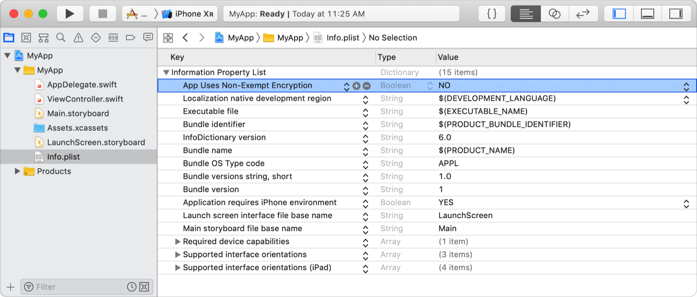
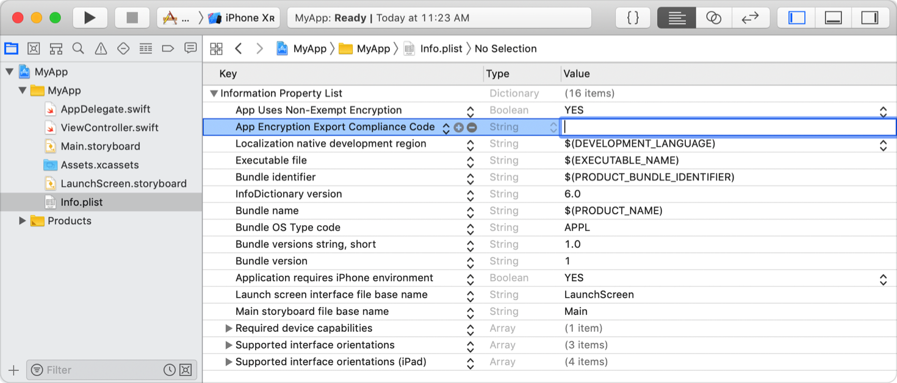

> Navigation: [Technologies](../technologies.md) · [Security](../security.md)

# Complying with Encryption Export Regulations

Declare the use of encryption in your app to streamline the app submission process.

## Overview

When you submit your app to TestFlight or the App Store, you upload your app to a server in the United States. If you distribute your app outside the U.S. or Canada, your app is subject to U.S. export laws, regardless of where your legal entity is based. If your app uses, accesses, contains, implements, or incorporates encryption, this is considered an export of encryption software, which means your app is subject to U.S. export compliance requirements, as well as the import compliance requirements of the countries where you distribute your app.

Every time you submit a new version of your app, App Store Connect asks you questions to guide you through a compliance review. You can bypass these questions and streamline the submission process by providing the required information in your app’s [Information Property List](../bundleresources/information-property-list.md) file.

For more information about export compliance, read [Export compliance overview](https://help.apple.com/app-store-connect/#/dev88f5c7bf9).

### Declare Your App’s Use of Encryption

Add the [ITSAppUsesNonExemptEncryption](../bundleresources/information-property-list/itsappusesnonexemptencryption.md) key to your app’s information property list with a Boolean value that indicates whether your app uses encryption. Set the value to `NO` if your app—including any third-party libraries it links against—doesn’t use encryption, or if it only uses forms of encryption that are exempt from export compliance documentation requirements. Otherwise, set it to `YES`.

Typically, the use of encryption that’s built into the operating system—for example, when your app makes HTTPS connections using [URLSession](../foundation/urlsession.md)—is exempt from export documentation upload requirements, whereas the use of proprietary encryption is not. To determine whether your use of encryption is considered exempt, see [Determine and upload app encryption documentation](https://developer.apple.com/help/app-store-connect/manage-app-information/determine-and-upload-app-encryption-documentation).

> [!important] Important
> If your app uses exempt forms of encryption, you might alternatively be required to submit a year-end self-classification report to the U.S. government. (If you use non-exempt encryption and provide documentation to Apple, the self-classification report isn’t necessary.) To learn more, see [How to file an Annual Self Classification Report](https://www.bis.doc.gov/index.php/policy-guidance/encryption/4-reports-and-reviews/a-annual-self-classification).

### Provide Compliance Documentation

If your app requires export compliance documentation, upload the required items to App Store Connect, as described in [Determine and upload app encryption documentation](https://developer.apple.com/help/app-store-connect/manage-app-information/determine-and-upload-app-encryption-documentation). After successfully reviewing the documents, Apple provides you with a code. Add this string as the value for the [ITSEncryptionExportComplianceCode](../bundleresources/information-property-list/itsencryptionexportcompliancecode.md) key in your app’s information property list.

## Topics

### Encryption Export Compliance Keys

- [ITSAppUsesNonExemptEncryption](../bundleresources/information-property-list/itsappusesnonexemptencryption.md) — A Boolean value indicating whether the app uses encryption.
- [ITSEncryptionExportComplianceCode](../bundleresources/information-property-list/itsencryptionexportcompliancecode.md) — The export compliance code provided by App Store Connect for apps that require it.
