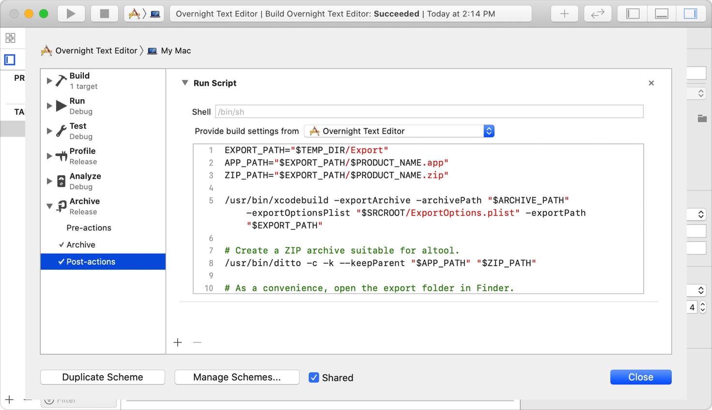
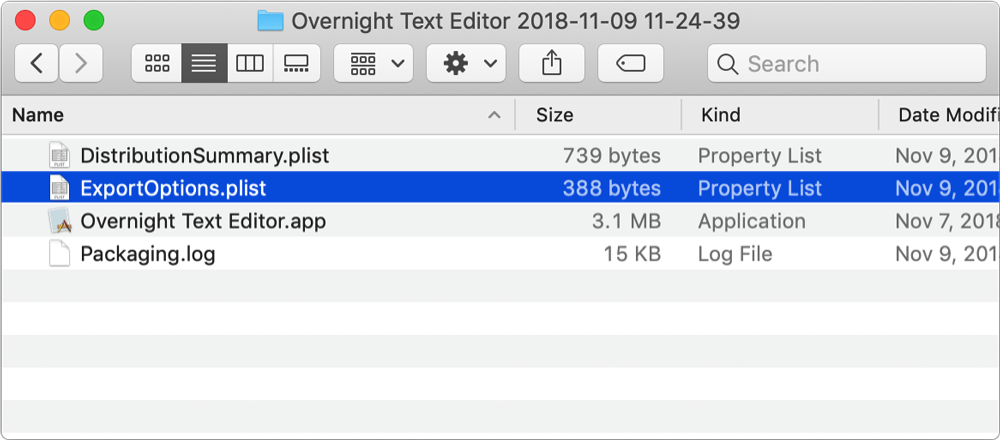

> Navigation: [Technologies](../technologies.md) · [Security](../security.md) · [Notarizing macOS software before distribution](notarizing-macos-software-before-distribution.md)

# Customizing the notarization workflow

Notarize your app from the command line to handle special distribution cases.

## Overview

The easiest way to notarize your app is through the Xcode user interface, as described in [Notarizing macOS software before distribution](notarizing-macos-software-before-distribution.md). However, if you have a more complex scenario, you can use command line tools to manually notarize your app. This workflow can be useful in a number of cases, like when you need to:

- Notarize software you’ve already shipped.
- Notarize plug-ins for other software packages.
- Notarize Xcode targets other than macOS app targets, including Aggregate and External Build System targets.
- Create complex distributions, like disk images or installer packages.
- Add the notarization process to a scripted build environment.

### Export a package for notarization

To prepare an app for notarization, you must export the app from Xcode. Using Xcode, you can export your archived app by clicking Distribute App in the Organizer window. But in a scripted build environment, you use the `xcodebuild` utility to perform the export. Because export directly follows archiving, the archive’s post-action script is a convenient place to perform the export from. You can edit the post-action from the scheme editor in Xcode.



The script begins by exporting the archive with `xcodebuild`:

```sh
EXPORT_PATH="$TEMP_DIR/Export"
/usr/bin/xcodebuild -exportArchive -archivePath "$ARCHIVE_PATH" -exportOptionsPlist "$SRCROOT/ExportOptions.plist" -exportPath "$EXPORT_PATH"
```

You tell `xcodebuild` which archive to export using an environment variable automatically defined by Xcode, and provide a location for the output by defining the `EXPORT_PATH` variable. Use the `exportOptionsPlist` option to indicate an options property list that configures the export operation. You typically obtain this file by exporting from Xcode just once. The export options file appears alongside the app in the export directory:



Alternatively, you can create a custom export options property list file with a text or property list editor.

> [!tip] Tip
> For a complete list of keys you can use with `xcodebuild -exportOptionsPlist`, run `xcodebuild -help`.

Because you can’t upload the `.app` bundle directly to the notary service, you’ll need to create a compressed archive containing the app:

```sh
APP_PATH="$EXPORT_PATH/$PRODUCT_NAME.app"
ZIP_PATH="$EXPORT_PATH/$PRODUCT_NAME.zip"

# Create a ZIP archive suitable for notarization.
/usr/bin/ditto -c -k --keepParent "$APP_PATH" "$ZIP_PATH"

# As a convenience, open the export folder in Finder.
/usr/bin/open "$EXPORT_PATH"
```

For a detailed example that shows how to automate notarization using post-action scripts, see [Customizing the Xcode archive process](customizing-the-xcode-archive-process.md).

Alternatively, you can put apps, kernel extensions, and other software in a container, like a disk image, and notarize the container. The notary service accepts disk images (UDIF format), signed flat installer packages, and ZIP archives. It processes nested containers as well, like packages inside a disk image.

> [!important] Important
> If you distribute your software via a custom third-party installer, you need two rounds of notarization. First you notarize the installer’s payload (everything the installer will install). You then package the notarized (and stapled, as described in [Staple the ticket to your distribution](customizing-the-notarization-workflow.md#Staple-the-ticket-to-your-distribution)) items into the installer and notarize it as you would any other executable. If you use a network installer, separately notarize both the installer and the items it downloads.

### Upload your app to the notarization service

You upload your app for notarization using `notarytool` command line tool. Xcode 13 or later supports this tool, so if you have more than one version of Xcode installed on your Mac, be sure to use the `xcode-select` utility to choose an appropriate version:

```sh
% sudo xcode-select -s /path/to/Xcode13.app
```

> [!note] Note
> The `altool` command has been deprecated, and the Apple notary service no longer supports `altool` from November 1, 2023. For more information, see the WWDC22 session [What’s new in notarization for Mac apps](https://developer.apple.com/wwdc22/10109).

Use `xcrun` to invoke the `notarytool` command with the `submit` option:

```sh
% xcrun notarytool submit OvernightTextEditor_11.6.8.zip
                   --keychain-profile "notarytool-password"
                   --wait
                   --webhook "https://example.com/notarization"
```

The notary service generates a ticket for the top-level file that you specify, as well as for each nested file. For example, if you submit a disk image that contains a signed installer package with an app bundle inside, the notarization service generates tickets for the disk image, installer package, and app bundle.

Use the `wait` flag to tell `notarytool` to exit only after the Notary service finishes processing the submission. This eliminates the need to poll the service for status. Use the `webhook` flag if you want to specify a URL for the service to access after processing the submission.

You can add the `apple-id` and `password` options to supply your App Store Connect credentials. Because App Store Connect requires two-factor authentication (2FA) on all accounts, you must create an app-specific password for `notarytool`, as described in [Using app-specific passwords](https://support.apple.com/en-us/HT204397).

Alternatively, to avoid including your password as cleartext in a script, you can provide a reference to a keychain item, as shown in the example above. This assumes the keychain holds a keychain item named `notarytool-password`. You can add a new keychain item for this purpose from the command line using the `notarytool` utility:

```sh
% xcrun notarytool store-credentials "notarytool-password"
               --apple-id "<AppleID>"
               --team-id <DeveloperTeamID>
               --password <secret_2FA_password>
```

If notarization succeeds, `notarytool` prints a submission identifier:

```console
Successfully uploaded file. 
 id: 2efe2717-52ef-43a5-96dc-0797e4ca1041
 path: /Users/janea/Desktop/OvernightTextEditor_11.6.8.zip
```

Save the `id` value to use later when checking the status of your request. For more information about `notarytool` and its options, see its manual page, or use the `help` option:

```sh
% xcrun notarytool --help
```

> [!note] Note
> To avoid a dependency on Xcode for interacting with the notary service, you can use the [Notary API](../notaryapi.md) described in [Submitting software for notarization over the web](../notaryapi/submitting-software-for-notarization-over-the-web.md).

### Check the status of your request

After you upload your app, the notarization process typically takes less than an hour. If you use the `wait` flag that the previous section demonstrates, `notarytool` returns with the status of the request:

```console
createdDate: 2021-04-29T01:38:09.498Z
id: 2efe2717-52ef-43a5-96dc-0797e4ca1041
name: OvernightTextEditor_11.6.8.zip
status: Accepted
```

To download a log file that contains any errors or warnings that occurred during notarization, use `notarytool` with the `log` command:

```sh
% xcrun notarytool log 2efe2717-52ef-43a5-96dc-0797e4ca1041 --keychain-profile "notarytool-password" developer_log.json
```

The `log` command downloads JSON-formatted data and saves it to the specified file:

```console
Successfully downloaded submission log
 id: 2efe2717-52ef-43a5-96dc-0797e4ca1041
 location: /Users/ravipatel/Desktop/developer_log.json
```

The file enumerates any issues that notarization found:

```json
{
    "archiveFilename": "Overnight TextEditor.app",
    "issues": [
        {
            "message": "The signature of the binary is invalid.",
            "path": "Overnight TextEditor.app/Contents/MacOS/Overnight TextEditor",
            "severity": "error"
        }
    ],
    "jobId": "2EFE2717-52EF-43A5-96DC-0797E4CA1041",
    "logFormatVersion": 1,
    "status": "Invalid",
    "statusSummary": "Archive contains critical validation errors",
    "ticketContents": null,
    "uploadDate": "2021-04-19T16:56:17Z"
}
```

> [!note] Note
> Always check the log file, even if notarization succeeds, because it might contain warnings that you can fix prior to your next submission.

For information about how to deal with common problems, see [Resolving common notarization issues](resolving-common-notarization-issues.md).

### Staple the ticket to your distribution

Notarization produces a ticket that tells Gatekeeper that your app is notarized. After notarization completes, the next time any user attempts to run your app on macOS 10.14 or later, Gatekeeper finds the ticket online. This includes users who downloaded your app before notarization.

You should also attach the ticket to your software using the `stapler` tool, so that future distributions include the ticket. This ensures that Gatekeeper can find the ticket even when a network connection isn’t available. To attach a ticket to your app, bundle, disk image, or flat installer package, use the `stapler` tool:

```sh
% xcrun stapler staple "Overnight TextEditor.app"
```

While you can notarize a ZIP archive, you can’t staple to it directly. Instead, run `stapler` against each item that you added to the archive. Then create a new ZIP file containing the stapled items for distribution. Although tickets are created for standalone binaries, it’s not currently possible to staple tickets to them.

### Ensure your build server has network access

To incorporate notarization into a custom workflow, your build server needs access to certain network resources.

The `notarytool` tool uses Amazon S3 Transfer Acceleration by default, which connects to `notary-submissions-prod.s3-accelerate.amazonaws.com`. Use the `no-s3-acceleration` flag during submission to use the `notary-submissions-prod.s3.us-west-2.amazonaws.com` endpoint instead. You can find the range of Internet Protocol (IP) addresses used by Amazon S3 in the documentation on [https://aws.amazon.com](https://aws.amazon.com).

In addition, `stapler` uses [CloudKit](../cloudkit.md) to download tickets, which requires access to the following IP address ranges, all on port 443:

```console
17.36.196.0/22
17.57.0.0/22
17.248.128.0/17
17.250.48.0/20
17.250.64.0/18
17.252.62.0/23
2403:300:a41::/48
2403:300:a50:100::/56
2403:300:1360::/44
2403:300:1502::/48
2620:149:a40::/46
2620:149:1360::/44
2a01:b740:984::/56
2a01:b740:984:100::/64
2a01:b740:a41::/48
2a01:b740:1360::/44
```

### Avoid long notarization response times and size limits

Notarization completes for most software within 5 minutes, and for 98 percent of software within 15 minutes. However, notarization can take longer under certain conditions. Help to avoid long response times by following a few rules:

- Minimize the total number of files, even when the individual files are small.
- Don’t save non-executable files in places that require code signatures, like `MyApp.app/Content/MacOS/`. Instead, save these files to a directory that doesn’t require a code signature, like `MyApp.app/Contents/Resources/`.
- Don’t submit corrupted disk images. You can verify the integrity of a disk image by running the `hdiutil` utility:

```sh
% hdiutil verify <image>
```

- Avoid heavily compressed disk images.
- Avoid huge, non-executable data files, especially when they change often.
- Limit notarizations to 75 per day.

For large uploads, try to exclude non-executable data from notarization. For example, if you use an installer package, you could move all your non-executable data into a folder next to a notarized installer package. Put both the data and the notarized installer package into a single disk image, and ship the disk image without notarization. For the best user experience, staple the notarization ticket to the installer package.

## Topics

### Automation

- [Customizing the Xcode archive process](customizing-the-xcode-archive-process.md) — Archive, export, and notarize your app in one step using Xcode post-action build scripts.

## See Also

### Related Documentation

- [Notary API](../notaryapi.md) — Submit your macOS software for notarization through a web interface.
