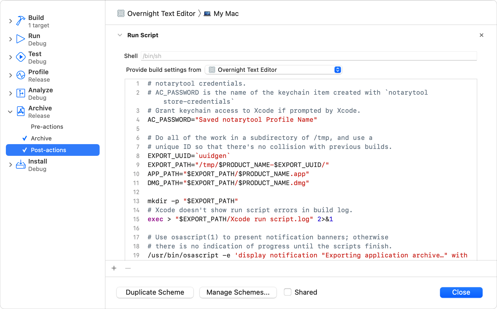

> Navigation: [Technologies](../technologies.md) · [Security](../security.md) · [Notarizing macOS software before distribution](notarizing-macos-software-before-distribution.md) · [Customizing the notarization workflow](customizing-the-notarization-workflow.md)

# Customizing the Xcode archive process

<sub>Article</sub>

Archive, export, and notarize your app in one step using Xcode post-action build scripts.

## Overview

Before distributing your software, you must create an archive containing your executables. From that archive, you must perform additional steps to create a distributable version of your software and to notarize your executables. To simplify the workflow, you can incorporate the distribution and notarization steps into the archive process using post-action scripts.

A post-action script adds custom script commands to the end of standard Xcode commands. To add a script to the Archive command, open the [scheme editor](https://help.apple.com/xcode/mac/11.4/#/dev0bee46f46) for your project and expand the Archive scheme. Select the post-actions option and enter the details of your script in the space provided.



The following sample script exports your archive to a format that can be sent to the Apple notary service. The script includes several calls to the `osascript` command to display progress messages. Replace the value of the `AC_PASSWORD` variable with an appropriate value for your App Store Connect account.

```sh
# notarytool credentials.
# AC_PASSWORD is the name of the keychain item created with `notarytool store-credentials`.
# Grant keychain access to Xcode if prompted by Xcode.
AC_PASSWORD="App Store Connect Profile"

# Do all of the work in a subdirectory of /tmp, and use a
# unique ID so that there's no collision with previous builds.
EXPORT_UUID=`uuidgen`
EXPORT_PATH="/tmp/$PRODUCT_NAME-$EXPORT_UUID/"
APP_PATH="$EXPORT_PATH/$PRODUCT_NAME.app"
DMG_PATH="$EXPORT_PATH/$PRODUCT_NAME.dmg"

mkdir -p "$EXPORT_PATH"

# Xcode doesn't show run script errors in build log.
exec > "$EXPORT_PATH/Xcode run script.log" 2>&1

# Use osascript(1) to present notification banners; otherwise
# there's no progress indication until the script finishes.
/usr/bin/osascript -e 'display notification "Exporting application archive…" with title "Submitting app for notarization"'

# Ask xcodebuild(1) to export the app. Use the export options
# from a previous manual export that used a Developer ID.
/usr/bin/xcodebuild -exportArchive -archivePath "$ARCHIVE_PATH" -exportOptionsPlist "$SRCROOT/ExportOptions.plist" -exportPath "$EXPORT_PATH"

osascript -e 'display notification "Creating UDIF Disk Image…" with title "Submitting app for notarization"'

# Create a UDIF bzip2-compressed disk image.
cd "$EXPORT_PATH/"
mkdir "$PRODUCT_NAME"
mv -v "$APP_PATH" "$PRODUCT_NAME"

/usr/bin/hdiutil create -srcfolder "$PRODUCT_NAME" -format UDBZ "$DMG_PATH"

osascript -e 'display notification "Submitting UDIF Disk Image for notarization…" with title "Submitting app for notarization"'

# Submit the finished deliverables for notarization.
# Wait up to 2 hours for a response.
# Use verbose logging in order to file feedback if an error occurs.
"$DEVELOPER_BIN_DIR/notarytool" submit -p "$AC_PASSWORD" --verbose "$DMG_PATH" --wait --timeout 2h --output-format plist > "NotarizationResponse.plist"

return_code=$?

if [ $return_code -eq 0 ]; then
message=`/usr/libexec/PlistBuddy -c "Print :message" "NotarizationResponse.plist"`
status=`/usr/libexec/PlistBuddy -c "Print :status" "NotarizationResponse.plist"`
else
message="An Error Occurred."
status="Check Xcode log."
open "$EXPORT_PATH/Xcode run script.log"
fi

# Show and speak the final status.
osascript -e "on run(argv)" \
-e 'display notification item 1 of argv & " : " & item 2 of argv with title "Submitting app for notarization" sound name "Crystal"' \
-e 'set text item delimiters to ", "' \
-e "set args to argv as text" \
-e "say args" \
-e "delay 5" \
-e "end" \
-- "$message" "$status"

# Open the folder that was created, which also signals completion.
open "$EXPORT_PATH"
```
