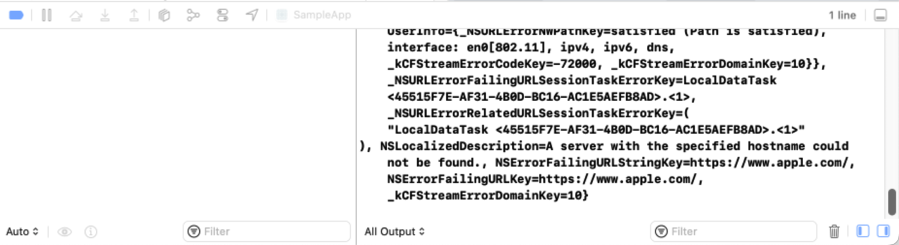
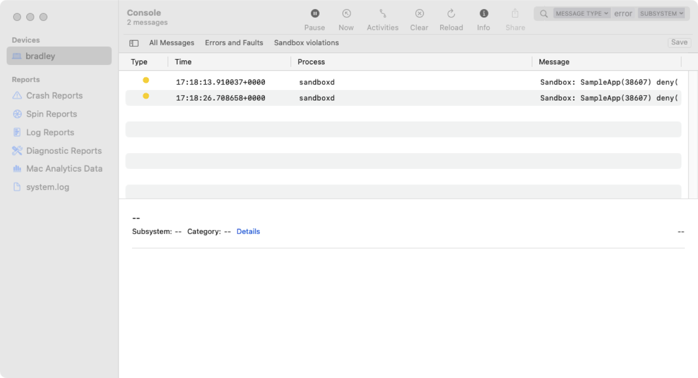

> Navigation: [Technologies](../technologies.md) · [Security](../security.md) · [App Sandbox](app-sandbox.md)

# Discovering and diagnosing App Sandbox violations

<sub>Article</sub>

Determine when your macOS app behaves incorrectly because of a sandbox violation, and fix sandbox-related issues.

## Overview

App Sandbox protects documents and system resources from malicious abuse by limiting your macOS app’s access to only capabilities you request in its entitlements file. If your app attempts to use capabilities that you didn’t request, it’ll fail to complete those operations even if you use the APIs correctly.

If you discover that your app’s failure to complete a task is due to a violation of its App Sandbox limitations, you can choose one of three approaches to resolve the issue:

- Extend the app’s capabilities to cover the attempted task, by adding a capability to the App Sandbox entitlement for the app executable.
- Distribute a separate helper tool with your app that uses the additional capability.
- Remove the code that accesses the additional capability if it’s not necessary for implementing your app’s feature set.

### Examine error output to identify where your app exceeds its privileges

If an App Sandbox constraint stops a system library from performing a task, that library may log a message to your app’s standard error stream to report the problem. To examine your app’s output, follow these steps:

1. In Xcode, run your app. Xcode automatically displays the Debug pane, shown in the figure below.
2. Reproduce the problem in your app.
3. Switch back to Xcode and check for output from your app in the Debug pane.



Output such as the following indicates that the process encountered an App Sandbox violation.

```console
2022-10-25 14:14:45.543941+0100 SampleApp[12447:550451] dnssd_clientstub ConnectToServer: connect() failed path:/var/run/mDNSResponder Socket:22 Err:-1 Errno:1 Operation not permitted
2022-10-25 14:14:45.453414+0100 SampleApp[12447:550126] [] networkd_settings_read_from_file Sandbox is preventing this process from reading networkd settings file at "/Library/Preferences/com.apple.networkd.plist", please add an exception.
2022-10-25 14:14:45.542962+0100 SampleApp[12447:550451] [] nw_resolver_can_use_dns_xpc_block_invoke Sandbox does not allow access to com.apple.dnssd.service
```

### Use Console to identify violations

You can use the Console app to discover whether a problem is due to an App Sandbox violation by following these steps:

1. Open Console.
2. Copy each of the lines below, one at a time, into the search field in the Console window.

```console
type:error
subsystem:com.apple.sandbox.reporting
category:violation
```

1. Click Save, and enter a name for the saved search.
2. Click Start Streaming.
3. Reproduce the problem in your app.
4. Switch to Console.
5. Look for a message relating to your app in the messages view, shown below.



The message names the process that violated the App Sandbox restrictions, the violating action, and provides additional information about the violation where possible. In the example below, the app’s attempt to make an outgoing network connection violates its App Sandbox restrictions.

```console
Sandbox: SampleApp(12447) deny(1) network-outbound /private/var/run/mDNSResponder
Violation: deny(1) network-outbound /private/var/run/mDNSResponder
Process: SampleApp [12447]
Path: /Users/meichen/Library/Developer/Xcode/DerivedData/SampleApp-ejawvdggzjjsyxcmimtdyrrwepff/Build/Products/Release/SampleApp.app/Contents/MacOS/SampleApp
Load Address: 0x1008f4000
Identifier: com.example.SampleApp
Version: 1 (1.0)
Code Type: arm64 (Native)
Parent Process: SampleApp [1]
Responsible: /Users/meichen/Library/Developer/Xcode/DerivedData/SampleApp-ejawvdggzjjsyxcmimtdyrrwepff/Build/Products/Release/SampleApp.app/Contents/MacOS/SampleApp
User ID: 501
[…]

Thread 0 (id: 551548):
0 libsystem_kernel.dylib 0x0000000180bfb188 __connect_nocancel + 20864 
1 libsystem_dnssd.dylib 0x000000018c242e7c DNSServiceCreateConnection + 3628 
2 Network 0x00000001871c8d8c nw_resolver_instantiate_dns_connection_for_parameters + 1203340 
3 Network 0x00000001871c6340 nw_resolver_create_dns_service_locked + 1192492 
4 Network 0x00000001871c1db0 __nw_resolver_set_update_handler_block_invoke + 1172360 
5 Network 0x00000001879479d0 nw_queue_context_async_if_needed + 9062772 
6 Network 0x00000001871c0eb0 nw_resolver_set_update_handler + 1170824 
7 Network 0x0000000187533260 -[NWConcrete_nw_endpoint_resolver startWithHandler:] + 4782368 
8 Network 0x0000000187548180 nw_endpoint_handler_path_change + 4855592 
9 Network 0x0000000187550100 nw_endpoint_handler_start + 4902092 
10 Network 0x0000000187b18758 nw_endpoint_flow_setup_protocols + 10961348 
11 Network 0x0000000187b38f1c -[NWConcrete_nw_endpoint_flow startWithHandler:] + 11096344 
12 Network 0x0000000187548180 nw_endpoint_handler_path_change + 4855592 
13 Network 0x0000000187550100 nw_endpoint_handler_start + 4902092 
14 Network 0x000000018748fb28 __nw_connection_start_block_invoke + 4113712 
15 Network 0x000000018748f1bc nw_connection_start + 4112176 
16 CFNetwork 0x00000001855d4670 ??? + 1348664 
17 CFNetwork 0x00000001855cc9a8 ??? + 1316952 
18 CFNetwork 0x00000001855cd8b4 ??? + 1319360 
19 CFNetwork 0x000000018561a5b0 ??? + 1634820 
20 CFNetwork 0x00000001855cc5f4 ??? + 1312804 
21 CFNetwork 0x00000001854b2194 ??? + 159676 
22 CFNetwork 0x0000000185619aac ??? + 1631212 
23 CFNetwork 0x0000000185619c48 ??? + 1633316 
24 libdispatch.dylib 0x0000000180aad9dc _dispatch_call_block_and_release + 10684 
25 libdispatch.dylib 0x0000000180aaf504 _dispatch_client_callout + 17648 
26 libdispatch.dylib 0x0000000180ab6bbc _dispatch_lane_serial_drain + 47388 
27 libdispatch.dylib 0x0000000180ab773c _dispatch_lane_invoke + 50568 
28 libdispatch.dylib 0x0000000180ab8a20 _dispatch_workloop_invoke + 54060 
29 libdispatch.dylib 0x0000000180ac234c _dispatch_workloop_worker_thread + 94400 
30 libsystem_pthread.dylib 0x0000000180c32100 _pthread_wqthread + 12256 
31 libsystem_pthread.dylib 0x0000000180c30e20 start_wqthread + 7704
```

The line in the Console message that starts with “Violation:” describes the app’s behavior that violated its App Sandbox restrictions. Use the backtrace to identify which thread in your app violated the App Sandbox restrictions, and locate the violating code. The backtrace is similar to a crash report, even though the system doesn’t terminate apps that violate App Sandbox restrictions. For more information on interpreting a backtrace, see [Examining the fields in a crash report](../xcode/examining-the-fields-in-a-crash-report.md).

### Extend your app’s sandbox to accommodate new features

If you’ve determined that your app needs to perform the task that leads to an App Sandbox violation, add the appropriate capability to the App Sandbox entitlement for your app in the Xcode entitlements editor. To review the available App Sandbox capabilities, see `Entitlements`.

### Move potentially vulnerable operations to a separate helper tool

By separating your app into different components that have access to distinct subsets of the required capabilities, you can balance access to operating system resources with the good practice of protecting people’s devices from malicious attacks. As an example, if your app takes camera images, processes them using unsafe memory operations, and communicates with a network service, create separate components for these three features. Separating the features makes it harder for an attacker who compromises the app through the network to gain access to someone’s camera, or to exploit the potentially unsafe processing code.

When an app that uses App Sandbox launches a helper tool directly using [Process](../foundation/process.md) or fork and exec, the helper tool inherits the same sandbox capabilities as the launching app. To enable different capabilities in the app and the helper, use one of these designs:

- An [XPC](../xpc.md) service
- A login item
- A helper app, which you can configure to run in the background by setting the [LSBackgroundOnly](../bundleresources/information-property-list/lsbackgroundonly.md) key
