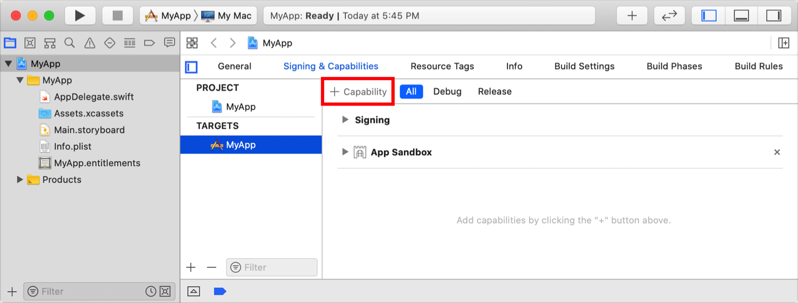
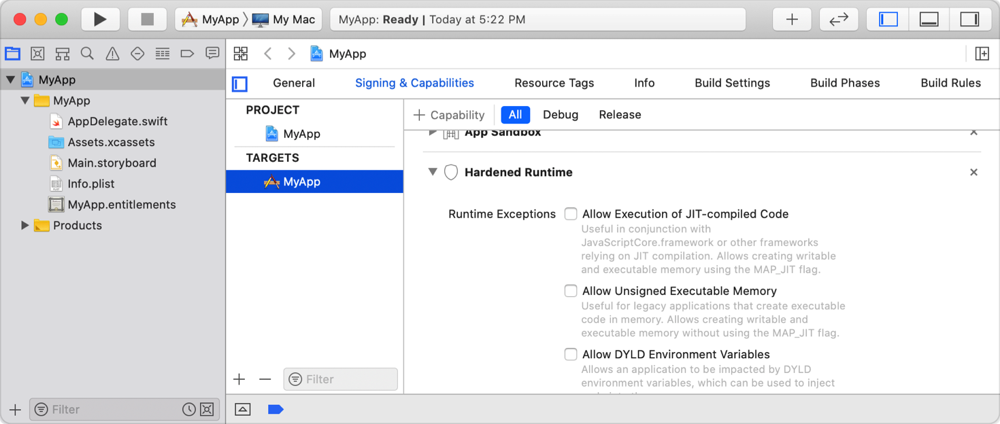

> Navigation: [Technologies](../technologies.md) · [Security](../security.md)

# Hardened Runtime

Manage security protections and resource access for your macOS apps.

## Overview

The Hardened Runtime, along with System Integrity Protection (SIP), protects the runtime integrity of your software by preventing certain classes of exploits, like code injection, dynamically linked library (DLL) hijacking, and process memory space tampering. To enable the Hardened Runtime for your app, navigate in Xcode to your target’s Signing & Capabilities information and click the + button. In the window that appears, choose Hardened Runtime.

The Hardened Runtime doesn’t affect the operation of most apps, but it does disallow certain less common capabilities, like just-in-time (JIT) compilation. If your app relies on a capability that the Hardened Runtime restricts, add an entitlement to disable an individual protection. You add an entitlement by enabling one of the runtime exceptions or access permissions listed in Xcode. Make sure to use only the entitlements that are absolutely necessary for your app’s functionality.

You add entitlements only to executables. Shared libraries, frameworks, and in-process plug-ins inherit the entitlements of their host executable.

Due to their privileged position in the system, macOS refuses to load system extensions that use Hardened Runtime exception entitlements.  There’s one exception to this general rule: macOS allows the [Allow execution of JIT-compiled code entitlement](../bundleresources/entitlements/com.apple.security.cs.allow-jit.md) in non-DEXT system extensions.

The default value of these Boolean entitlements is false. When Xcode signs your code, it includes an entitlement only if the value is true. If you’re manually signing code, follow this convention to ensure maximum compatibility. Don’t include an entitlement if the value is false.

> [!important] Important
> To upload a macOS app to be notarized, you must enable the Hardened Runtime capability. For more information about notarization, see [Notarizing macOS software before distribution](notarizing-macos-software-before-distribution.md).

## Topics

### Runtime Exceptions

- [Allow execution of JIT-compiled code entitlement](../bundleresources/entitlements/com.apple.security.cs.allow-jit.md) — A Boolean value that indicates whether the app may create writable and executable memory using the `MAP_JIT` flag.
- [Allow Unsigned Executable Memory Entitlement](../bundleresources/entitlements/com.apple.security.cs.allow-unsigned-executable-memory.md) — A Boolean value that indicates whether the app may create writable and executable memory without the restrictions imposed by using the `MAP_JIT` flag.
- [Allow DYLD environment variables entitlement](../bundleresources/entitlements/com.apple.security.cs.allow-dyld-environment-variables.md) — A Boolean value that indicates whether the app may be affected by dynamic linker environment variables, which you can use to inject code into your app’s process.
- [Disable Library Validation Entitlement](../bundleresources/entitlements/com.apple.security.cs.disable-library-validation.md) — A Boolean value that indicates whether the app loads arbitrary plug-ins or frameworks, without requiring code signing.
- [Disable Executable Memory Protection Entitlement](../bundleresources/entitlements/com.apple.security.cs.disable-executable-page-protection.md) — A Boolean value that indicates whether to disable all code signing protections while launching an app, and during its execution.
- [Debugging tool entitlement](../bundleresources/entitlements/com.apple.security.cs.debugger.md) — A Boolean value that indicates whether the app is a debugger and may attach to other processes or get task ports.

### Resource Access

- [Audio Input Entitlement](../bundleresources/entitlements/com.apple.security.device.audio-input.md) — A Boolean value that indicates whether the app may record audio using the built-in microphone and access audio input using Core Audio.
- [Camera entitlement](../bundleresources/entitlements/com.apple.security.device.camera.md) — A Boolean value that indicates whether the app may interact with the built-in and external cameras, and capture movies and still images.
- [Location entitlement](../bundleresources/entitlements/com.apple.security.personal-information.location.md) — A Boolean value that indicates whether the app may access location information from Location Services.
- [Address book entitlement](../bundleresources/entitlements/com.apple.security.personal-information.addressbook.md) — A Boolean value that indicates whether the app may have read-write access to contacts in the user’s address book.
- [Calendars entitlement](../bundleresources/entitlements/com.apple.security.personal-information.calendars.md) — A Boolean value that indicates whether the app may have read-write access to the user’s calendar.
- [Photos Library Entitlement](../bundleresources/entitlements/com.apple.security.personal-information.photos-library.md) — A Boolean value that indicates whether the app has read-write access to the user’s Photos library.
- [Apple Events Entitlement](../bundleresources/entitlements/com.apple.security.automation.apple-events.md) — A Boolean value that indicates whether the app may prompt the user for permission to send Apple events to other apps.
