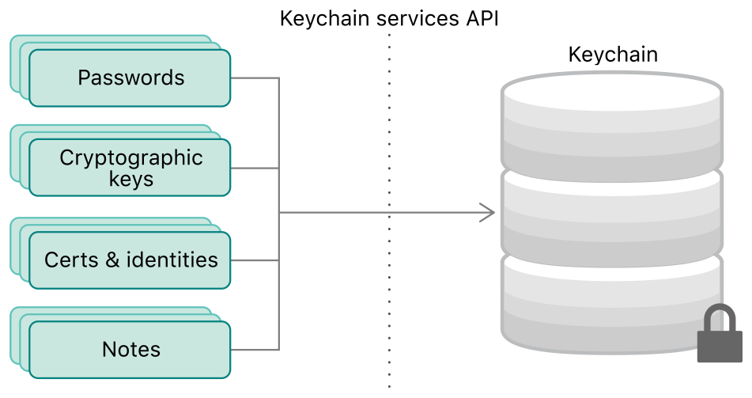

> Navigation: [Technologies](../technologies.md) · [Security](../security.md)

# Keychain services

Securely store small chunks of data on behalf of the user.

## Overview

Computer users often have small secrets that they need to store securely. For example, most people manage numerous online accounts. Remembering a complex, unique password for each is impossible, but writing them down is both insecure and tedious. Users typically respond to this situation by recycling simple passwords across many accounts, which is also insecure.

The keychain services API helps you solve this problem by giving your app a mechanism to store small bits of user data in an encrypted database called a keychain. When you securely remember the password for them, you free the user to choose a complicated one.

The keychain is not limited to passwords, as shown in Figure 1. You can store other secrets that the user explicitly cares about, such as credit card information or even short notes. You can also store items that the user needs but may not be aware of. For example, the cryptographic keys and certificates that you manage with [Certificate, Key, and Trust Services](certificate-key-and-trust-services.md) enable the user to engage in secure communications and to establish trust with other users and devices. You use the keychain to store these items as well.

Diagram showing passwords, keys, certificates, and identities all passing through the Keychain Services API to be stored securely in a keychain.

## Topics

### API components

- [Keychain items](keychain-items.md) — Embed confidential information in items that you store in a keychain.
- [Keychains](keychains.md) — Create and manage entire keychains in macOS.
- [Access Control Lists](access-control-lists.md) — Control which apps have access to keychain items in macOS.
