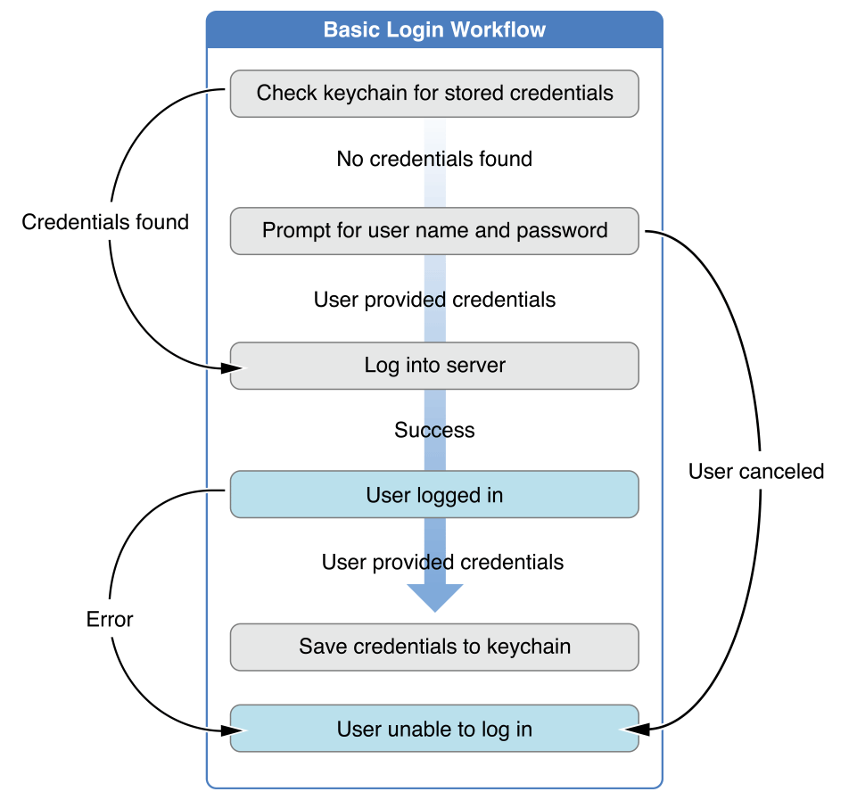
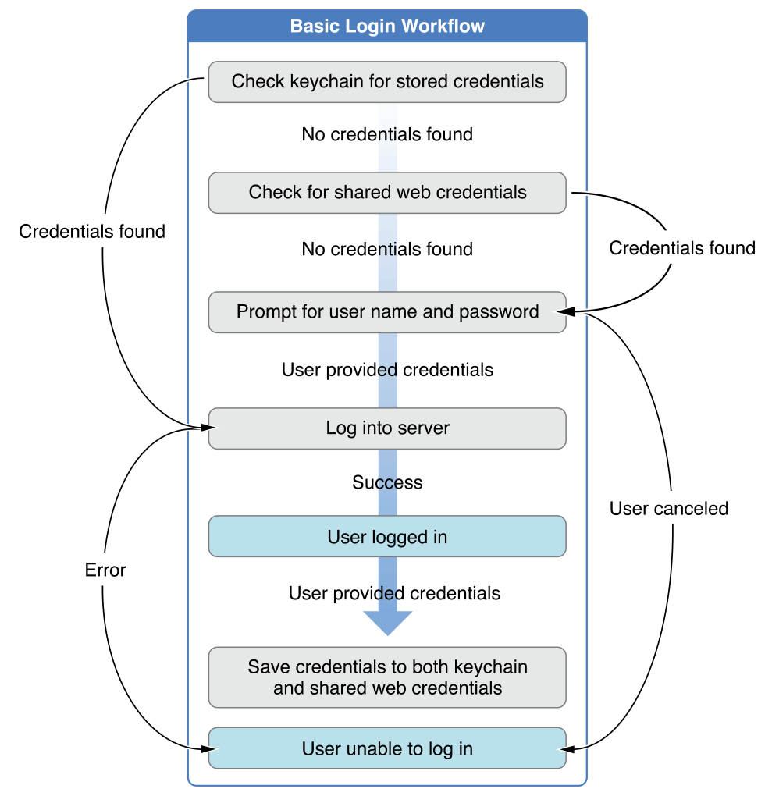

> Navigation: [Technologies](../technologies.md) · [Security](../security.md) · [Shared Web Credentials](shared-web-credentials.md)

# Managing Shared Credentials

<sub>Article</sub>

Use shared web credentials to create a seamless experience for the user.

## Overview

There are a wide range of common situations where you may want to use shared web credentials. This article covers four:

1. Logging in to a remote server
2. Creating a user account in the app
3. Changing a user’s password
4. Deleting a user’s account

### Logging In to a Remote Server

Typically, when an app needs to log in to a remote service, you start by checking for the user’s credentials in the iOS keychain. If you have current credentials for the user, you can log them in directly. If not, prompt the users for their user name and password, and then try to log them in. You will also want to save their credentials after the login is successful. This workflow is shown in [Figure 1](/documentation/security/shared_web_credentials/managing_shared_credentials#1965823).



When using shared web credentials, you add two steps to this procedure. As before, you start by checking if the user’s credentials are stored in the keychain. If you cannot find the user’s credentials, you check for shared web credentials. If you still cannot find any credentials, or if the user declines to use the shared credentials, you must prompt the user for her name and password. Try to log the user in, and if the login is successful, save the credentials to both the keychain and the shared web credentials. This ensures that the user has access to the credentials in Safari as well as within your app. This workflow is shown in [Figure 2](/documentation/security/shared_web_credentials/managing_shared_credentials#1965824).



> [!note] Remember
> Even if the system finds a match in the shared web credentials, the user can still decline to use those credentials. This will cause the check for shared web credentials to fail. Therefore, you must always have a fallback that prompts the user for their name and password.

Do not use the shared web credentials as your primary storage for secure user credentials. Instead, save the user’s credentials in the keychain, and only use the shared web credentials when you can’t find the login credentials in the keychain.

To read the user’s credentials from the shared web credentials, use the [SecRequestSharedWebCredential](<secrequestsharedwebcredential(______).md>) function:

Listing 1. Accessing shared web credentials

```objc
SecRequestSharedWebCredential(NULL, NULL, ^(CFArrayRef credentials, CFErrorRef error) {
 
    if (error != NULL) {
        // If an error occurs, handle the error here.
        [self handleError:error];
        return;
    }
 
    BOOL success = NO;
    CFStringRef server = NULL;
    CFStringRef userName = NULL;
    CFStringRef password = NULL;
 
    // If credentials are found, use them.
    if (CFArrayGetCount(credentials) > 0) {
 
        // There will only ever be one credential dictionary
        CFDictionaryRef credentialDict =
        CFArrayGetValueAtIndex(credentials, 0);
 
        server = CFDictionaryGetValue(credentialDict, kSecAttrServer);
        userName = CFDictionaryGetValue(credentialDict, kSecAttrAccount);
        password = CFDictionaryGetValue(credentialDict, kSecSharedPassword);
 
        // Attempt to log in
        success = [self logIntoServer:server user:userName password:password];
    }
 
    if (!success) {
        [self promptForUserNameAndPassword];
    } else {
        [self saveCredentialsToKeychainForServer: server user:userName password:password];
    }
});
```

> [!note] Note
> The keychain supports saving and loading a wide range of possible credential types. These types can be user name and password pairs, authentication tokens or cookies. Shared web credentials, however, are much more restrictive. You can save only user name and password pairs to the shared web credentials.

### Creating a User Account in the App

If the user can create new accounts in your app, you should save the user name and password to the shared web credentials. In this way, the user can easily access the account from Safari, as well as from within your app. You can save the user’s name and password to the shared web credentials using the [SecAddSharedWebCredential](<secaddsharedwebcredential(________).md>) function as shown.

Listing 2. Creating a user account

```objc
SecAddSharedWebCredential(domain, name, password, ^(CFErrorRef error) {
 
    if (error != NULL) {
        // Handle the error here...
        return;
    }
 
    // The credentials have been successfully saved.
 
});
```

If there are no existing credentials for this user name and domain, this method completes without prompting the user for permission.

### Changing a User’s Password

If the user changes her password in the app, you must update both the credentials stored in the keychain and in the shared web credentials. You can change a password using the [SecAddSharedWebCredential](<secaddsharedwebcredential(________).md>) function. This is exactly the same procedure used when creating a new user account (see Creating a User Account in the App, above). However, if credentials already exist for the given user name and domain, this method prompts the user for permission before making the change. The user can cancel this change.

### Deleting a User’s Account

If the user deletes her account, you should remove the credentials from both the keychain and the shared web credentials. You can remove the credentials for a given domain and user name by calling the [SecAddSharedWebCredential](<secaddsharedwebcredential(________).md>) function and passing `NULL` for the password.

Listing 3. Deleting a user account

```objc
SecAddSharedWebCredential(domain, name, NULL, ^(CFErrorRef error) {
 
    if (error != NULL) {
        // Handle the error here...
        return;
    }
 
    // The account information has been successfully deleted.
 
});
```

The system prompts the user for permission before deleting their user name and password from the shared web credentials. Users can cancel this change.

> [!note] Note
> Use [SecAddSharedWebCredential](<secaddsharedwebcredential(________).md>) to remove a user’s credentials only when the user deletes her account. Do not use this method when the user simply logs out. Passing a `NULL` password to [SecAddSharedWebCredential](<secaddsharedwebcredential(________).md>) removes the user’s credentials and prevents Safari from autocompleting her login information.
