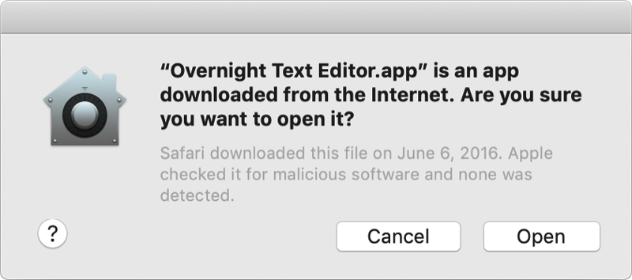
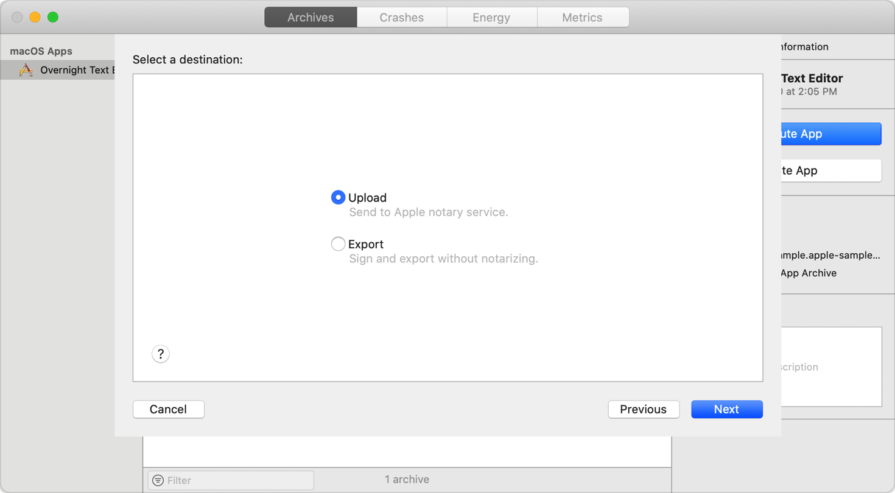

> Navigation: [Technologies](../technologies.md) · [Security](../security.md)

# Notarizing macOS software before distribution

Give users even more confidence in your macOS software by submitting it to Apple for notarization.

## Overview

> [!important] Important
> Starting November 1, 2023, the Apple notary service no longer accepts uploads from `altool` or Xcode 13 or earlier. If you notarize your Mac software with the Apple notary service using the `altool` command-line utility or Xcode 13 or earlier, you need to transition to the `notarytool` command-line utility or upgrade to Xcode 14 or later.

Notarize your macOS software to give users more confidence that the Developer ID-signed software you distribute has been checked by Apple for malicious components. Notarization of macOS software is not App Review. The Apple notary service is an automated system that scans your software for malicious content, checks for code-signing issues, and returns the results to you quickly. If there are no issues, the notary service generates a ticket for you to staple to your software; the notary service also publishes that ticket online where Gatekeeper can find it.

When the user first installs or runs your macOS software, the presence of a ticket (either online or attached to the executable) tells Gatekeeper that Apple notarized the software. Gatekeeper then places descriptive information in the initial launch dialog to help the user make an informed choice about whether to launch the app.

You can notarize several different types of software deliverables, including:

- macOS apps
- Non-app bundles, such as kernel extensions
- Disk images (UDIF format)
- Flat installer packages

Notarization also protects your users if your Developer ID signing key is exposed. The notary service maintains an audit trail of the software distributed using your signing key. If you discover unauthorized versions of your software, you can work with Apple to revoke the tickets associated with those versions.

> [!important] Important
> Beginning in macOS 10.14.5, software signed with a new Developer ID certificate and all new or updated kernel extensions must be notarized to run. Beginning in macOS 10.15, all software built after June 1, 2019, and distributed with Developer ID must be notarized. However, you aren’t required to notarize software that you distribute through the Mac App Store because the App Store submission process already includes equivalent security checks.

### Prepare your software for notarization

Apple’s notary service requires you to adopt the following protections:

- Enable code-signing for all of the executables you distribute, and ensure that executables have valid code signatures, as described in [Ensure a valid code signature](resolving-common-notarization-issues.md#Ensure-a-valid-code-signature).
- Use a “Developer ID” application, kernel extension, system extension, or installer certificate for your code-signing signature. (Don’t use a Mac Distribution, ad hoc, Apple Developer, or local development certificate.) Verify the certificate type before submitting, as described in [Use a valid Developer ID certificate](resolving-common-notarization-issues.md#Use-a-valid-Developer-ID-certificate). For more information, see [Synchronizing code signing identities with your developer account](../xcode/sharing-your-teams-signing-certificates.md).
- Enable the Hardened Runtime capability for your app and command line targets, as described in [Enable hardened runtime](https://help.apple.com/xcode/mac/current/#/devf87a2ac8f).
- Include a secure timestamp with your code-signing signature. (The Xcode distribution workflow includes a secure timestamp by default. For custom workflows, see [Include a secure timestamp](resolving-common-notarization-issues.md#Include-a-secure-timestamp).)
- Don’t include the `com.apple.security.get-task-allow` entitlement with the value set to any variation of `true`. If your software hosts third-party plug-ins and needs this entitlement to debug the plug-in in the context of a host executable, see [Avoid the get-task-allow entitlement](resolving-common-notarization-issues.md#Avoid-the-get-task-allow-entitlement).
- Link against the macOS 10.9 or later SDK, as described in [Use the macOS 10.9 SDK or later](resolving-common-notarization-issues.md#Use-the-macOS-109-SDK-or-later).
- Ensure your processes have properly-formatted XML, ASCII-encoded entitlements as described in [Ensure properly formatted entitlements](resolving-common-notarization-issues.md#Ensure-properly-formatted-entitlements).

Apple recommends that you notarize all of the software that you’ve distributed, including older releases, and even software that doesn’t meet all of these requirements or that is unsigned. Apple’s notary service uses a variety of methods, including telemetry, to determine which of the above rules to relax for preexisting software. For more information, see [Notarize your preexisting software](notarizing-macos-software-before-distribution.md#Notarize-your-preexisting-software).

> [!important] Important
> Some preexisting software might not run properly after being successfully notarized. For example, Gatekeeper might find code signing issues that a relaxed notarization process didn’t enforce. Always review the notary log for any warnings, and test your software before distribution.

### Notarize plug-ins

In macOS 10.15 and later, apps can load quarantined plug-ins — those downloaded from the internet or transferred with AirDrop — only if the plug-in is notarized. For plug-ins that aren’t notarized, the user must explicitly approve the plug-in by opening the System Preferences app and navigating to the General tab in Security & Privacy.

### Add the entitlements needed by plug-ins

When you enable the extra security enforced by the hardened runtime, as notarization requires, this impacts both your app and any plug-ins that your app hosts. Plug-ins don’t declare their own entitlements. Instead, they inherit the entitlements of the host process. Therefore, a host app must include all the entitlements that prospective plug-ins require, even when the plug-ins are notarized separately.

For example, if a plug-in employs deep integration with the host executable via C function pointer overrides, or uses a JavaScript engine for custom workflows, the host executable must declare the [Allow Unsigned Executable Memory Entitlement](../bundleresources/entitlements/com.apple.security.cs.allow-unsigned-executable-memory.md) or [Allow execution of JIT-compiled code entitlement](../bundleresources/entitlements/com.apple.security.cs.allow-jit.md), respectively. In some cases, a plug-in fails to even load if the host executable lacks the proper entitlement.

Be aware that even if your app doesn’t provide a dedicated plug-in architecture, it might still load plug-ins, like drivers for professional mirrorless cameras and legacy DSLR cameras that don’t conform to the driverless USB video device class (UVC) standard. If your app works with this kind of hardware, be sure to declare the [Disable Library Validation Entitlement](../bundleresources/entitlements/com.apple.security.cs.disable-library-validation.md) to load the corresponding plug-ins.

Also include resource access entitlements, like the Address Book or Location access entitlements, and the related purpose strings, that support your app’s plug-ins. For example, if a Print Dialog Extension (PDE) that provides fax services wants to access a user’s contact list, the host executable must declare the [Address book entitlement](../bundleresources/entitlements/com.apple.security.personal-information.addressbook.md) and include the [NSContactsUsageDescription](../bundleresources/information-property-list/nscontactsusagedescription.md) purpose string in its [Information Property List](../bundleresources/information-property-list.md) for the plug-in to operate.

For a complete list of hardened runtime entitlements, see [Hardened Runtime](hardened-runtime.md). For information about usage strings, see [Requesting access to protected resources](../uikit/requesting-access-to-protected-resources.md).

> [!important] Important
> In macOS 10.14.x, for executables using the hardened runtime, PDEs load only if the host executable has the [Disable Library Validation Entitlement](../bundleresources/entitlements/com.apple.security.cs.disable-library-validation.md). Beginning in macOS 10.15, the entitlement is no longer needed.

### Notarize your app automatically as part of the distribution process

Before distributing your app directly to customers, your Account Holder must sign the app with your Developer ID. Xcode’s Organizer window includes a workflow for generating a distributable version of your app. This workflow includes an option to notarize your macOS app automatically. To notarize your app using this workflow, do the following:

1. Open your Xcode project.
2. Create an archive of your app.
3. Choose Window \> Organizer to open the Organizer window.
4. In the Archives tab, select the archive you created.
5. Click Distribute App to view the distribution options.
6. Choose Developer ID for your method of distribution.
7. Click Next.
8. Choose Upload to send your archive to the Apple notary service.
9. Click Next.

When you click Next, Xcode uploads your archive to the notary service. When the upload is complete, the notary service begins the scanning process, which usually takes less than an hour. While the notary service scans your software, you can continue to prepare your archive for distribution. For example, you can export the archive and perform any final testing that you require prior to making your software available to customers.

When the notarization process finishes, Xcode downloads the ticket and staples it to your archive. At that point, export your archive again to receive a distributable version of your software that includes the notary ticket. For more information about how to use the Xcode UI to upload your software, see [Upload a macOS app to be notarized](https://help.apple.com/xcode/mac/current/#/dev88332a81e).

If Xcode doesn’t let you upload for notarization, be sure that you are building a macOS archive, as described in [Notarize macOS apps with external dependencies](resolving-common-notarization-issues.md#Notarize-macOS-apps-with-external-dependencies). For targets other than macOS apps, use the `notarytool` command line utility to notarize, as described in [Customizing the notarization workflow](customizing-the-notarization-workflow.md).

### Notarize your preexisting software

Notarizing your preexisting software lets Gatekeeper warn users when they try to run it. It also helps the notary service distinguish your legitimate software from variants that have been tampered with. You can notarize an existing disk image, installer package, or ZIP archive containing your app.

To notarize your preexisting software, do the following:

1. Make your active Xcode installation one that supports notarization by using the `xcode-select` command-line tool. For information about how to use this tool, see its man page, as described in [Reading UNIX Manual Pages](../os/reading-unix-manual-pages.md).
2. Upload your software to the Apple notary service, as described in [Upload your app to the notarization service](customizing-the-notarization-workflow.md#Upload-your-app-to-the-notarization-service).
3. Staple the returned ticket to your existing software, as described in [Staple the ticket to your distribution](customizing-the-notarization-workflow.md#Staple-the-ticket-to-your-distribution).

> [!note] Note
> You don’t need to rebuild or re-sign your software before submitting it for notarization, but you must use an appropriate version of Xcode to perform the notarization steps. Submit everything you’ve previously released, as well as your most recent version, to protect users who continue to use older versions of your software.

For tips on how to resolve issues that can occur during notarization, see [Resolving common notarization issues](resolving-common-notarization-issues.md).

### Add a notarization step to your build scripts

If you use an automated build system, you can integrate the notarization process into your existing build scripts. The `notarytool` and `stapler` command-line tools (included with Xcode) allow you to upload your software to the Apple notary service, and to staple the resulting ticket to your executable. Alternatively, you can interact directly with the notary service using the [Notary API](../notaryapi.md).

For information about how to incorporate notarization into your custom build scripts, see [Customizing the notarization workflow](customizing-the-notarization-workflow.md).

## Topics

### Notarization

- [Customizing the notarization workflow](customizing-the-notarization-workflow.md) — Notarize your app from the command line to handle special distribution cases.
- [Resolving common notarization issues](resolving-common-notarization-issues.md) — Handle common problems reported in the notarization log file, or that arise during ticket stapling.

## See Also

### Related Documentation

- [Notary API](../notaryapi.md) — Submit your macOS software for notarization through a web interface.
