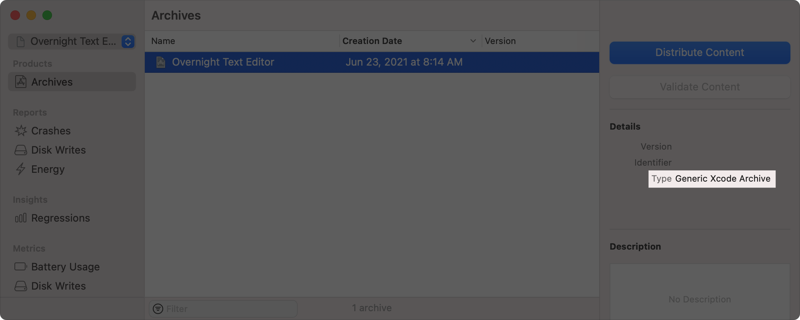
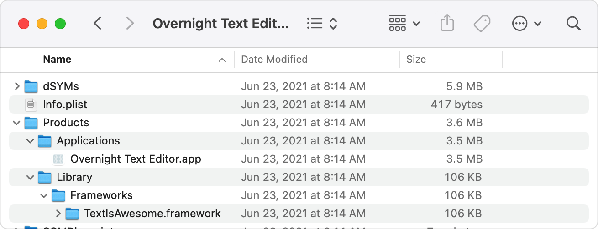
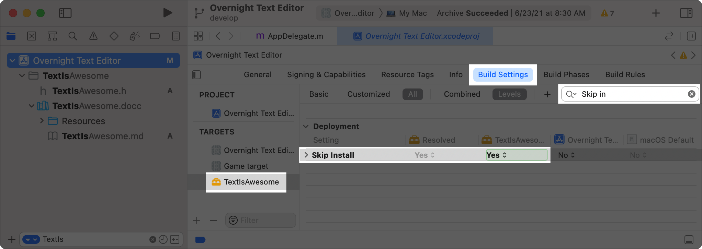

> Navigation: [Technologies](../technologies.md) · [Security](../security.md) · [Notarizing macOS software before distribution](notarizing-macos-software-before-distribution.md)

# Resolving common notarization issues

<sub>Article</sub>

Handle common problems reported in the notarization log file, or that arise during ticket stapling.

## Overview

If the Apple notary service encounters any problems while notarizing your app, it reports those errors in the log files, as described in [Check the status of your request](customizing-the-notarization-workflow.md#Check-the-status-of-your-request). Fix any problems reported by the service and notarize your app again.

> [!note] Note
> Xcode automatically resolves many issues when you use the standard app distribution UI. For information about how to use this UI, see [Notarize your app automatically as part of the distribution process](notarizing-macos-software-before-distribution.md#Notarize-your-app-automatically-as-part-of-the-distribution-process).

### Ensure a valid code signature

Before you can notarize an app, you must first code sign it. If you don’t, or if you make a modification to the bundle after signing, notarization fails with the following message:

```console
The signature of the binary is invalid.
```

To debug signing issues for anything besides an installer package, use the `codesign` utility to test the signature:

```sh
% codesign -vvv --deep --strict /path/to/binary/or/bundle
```

Use the `vvv` option to perform a verification with elevated verbosity. You use the `deep` option to ensure the utility checks nested code content. The `strict` option increases the restrictiveness of the validation to match that required by notarization. See the `codesign` man page for more information about these options and how to interpret the output.

To debug signing issues with installer packages, use the `pkgutil` utility instead:

```sh
% pkgutil --check-signature /path/to/file.pkg
```

The utility’s output includes the strings “Signed with a trusted timestamp” and “1. Developer ID Installer:” for a properly signed installer. If the signature test fails, make sure you’re using a Developer ID Installer certificate, and that you use either the `pkgutil` or `productbuild` utility during package creation, or the `productsign` command to sign an existing installer. All of these command line utilities take the `sign` option, which includes a secure timestamp by default. See the man pages of the various utilities for more information about using each.

> [!important] Important
> Apple no longer maintains the PackageMaker tool, which doesn’t support code signing. Migrate to `pkgbuild` or `productbuild`, which incorporate most of the command line options that PackageMaker supported, or use a third-party utility that wraps `pkgbuild` or `productbuild` and supports signing.

### Use a valid Developer ID certificate

You can only notarize apps that you sign with a Developer ID certificate. If you use any other certificate — like a Mac App Distribution certificate, or a self-signed certificate — notarization fails with the following message:

```console
The binary is not signed with a valid Developer ID certificate.
```

Be sure to use the correct Developer ID certificate for the given target. When code signing items like Mach-O files, disk images, bundles, apps, command line tools, photos, and so on, sign with a Developer ID Application certificate. Sign installer packages with a Developer ID Installer certificate. Although distributing kernel extensions (kexts) is discouraged, you can use a [Developer ID Application certificate](https://developer.apple.com/contact/kext) that has the kext capability to do so.

To learn about managing your signing certificates in Xcode, see [Synchronizing code signing identities with your developer account](../xcode/sharing-your-teams-signing-certificates.md).

Additionally, you can use the `spctl` utility to determine if the software to be notarized will run with the system policies currently in effect:

```sh
% spctl -vvv --assess --type exec /path/to/application
```

Add the `raw` option to generate a more detailed output in the form of a property list.

### Include a secure timestamp

By default, Xcode doesn’t include a secure timestamp as part of the app’s code signature during the build process. Instead, it adds a secure timestamp only during the archive (as of Xcode 10.2) and export workflows. If you use a custom export process, notarization might fail with the following message:

```console
The signature does not include a secure timestamp.
```

In this case, be sure to add a secure timestamp by adding the `timestamp` option to your `OTHER_CODE_SIGN_FLAGS` build setting, or by using the option directly with the `codesign` utility if you sign manually, as described in the previous section.

Generating a secure timestamp requires internet access. macOS accepts only one secure timestamp server, namely `timestamp.apple.com`, which has multiple IPv4 and IPv6 address ranges.

**IPv4**

- `17.32.213.0/24`
- `17.157.80.0/24`
- `17.179.249.0/24`

**IPv6**

- `2620:149:980:500::/64`
- `2620:149:981:603::/64`
- `2620:149:982:404::/64`

You can check if a binary has a secure timestamp with the following command:

```sh
% codesign -dvv /path/to/binary/or/bundle
```

The `dvv` option tells `codesign` to display information about the code at the given path with elevated verbosity. For a binary with a secure timestamp, the output of this command includes a `Timestamp` value with a corresponding date. Alternatively, the presence of `Signed Time` in the output indicates the binary doesn’t have a secure timestamp.

### Avoid the get-task-allow entitlement

When you create a new macOS project, Xcode automatically sets the target’s `CODE_SIGN_INJECT_BASE_ENTITLEMENTS` build setting to `YES`. This setting tells Xcode to add the `com.apple.security.get-task-allow` entitlement to your app at build time. This entitlement facilitates debugging on a system that uses System Integrity Protection (SIP) by circumventing certain security checks.

However, this poses a security risk for a shipping app, because it can allow an attacker to inject code at runtime. As a result, Xcode automatically strips the entitlement from your app when you export and sign it using the standard workflow. If you use a custom workflow and fail to remove the `com.apple.security.get-task-allow` entitlement, notarization fails with the following message:

```console
The executable requests the com.apple.security.get-task-allow entitlement.
```

To avoid receiving this error message, archive (as of Xcode 10.2) or export your app directly from Xcode, or set the `CODE_SIGN_INJECT_BASE_ENTITLEMENTS` build setting to `NO` before building your app for distribution. But only change the build setting when you’re done debugging and ready to distribute, because doing so makes it impossible to debug the binary on a system that uses System Integrity Protection.

> [!note] Note
> To enable debugging a plug-in in the context of a host executable, the host can include the `com.apple.security.get-task-allow` entitlement if it also includes the [Disable Library Validation Entitlement](../bundleresources/entitlements/com.apple.security.cs.disable-library-validation.md). Don’t disable library validation for executables that don’t host plug-ins because library validation protects them from loading untrusted code.

### Use the macOS 10.9 SDK or later

Because of significant differences in the way code signing works prior to macOS 10.9 (see [Code Signing Changes in OS X Mavericks 10.9](https://developer.apple.com/library/archive/technotes/tn2206/_index.html#//apple_ref/doc/uid/DTS40007919-CH1-TNTAG20)), notarization only works for binaries linked against macOS 10.9 or later. If you use an older SDK, notarization fails and reports an issue with the following message:

```console
The binary uses an SDK older than the 10.9 SDK.
```

Using a newer SDK doesn’t affect your binary’s compatibility with earlier versions of macOS. Instead, version compatibility depends on the app’s deployment target, as described in [Edit deployment info settings](https://help.apple.com/xcode/mac/current/#/deve69552ee5).

### Enable the hardened runtime

Enable the hardened runtime capability as described in [Enable hardened runtime (macOS)](https://help.apple.com/xcode/mac/current/#/devf87a2ac8f). This adds security restrictions to your app by default while allowing you to ask for specific exceptions as needed. If you don’t enable the hardened runtime, notarization fails and reports an issue with the following message:

```console
The executable does not have the hardened runtime enabled.
```

Hardened runtime is available in the Capabilities pane of Xcode 10 or later, but you can enable the feature manually using earlier versions of Xcode, as long as you’re on macOS 10.13.6 or later. To do this, add the following option to the `OTHER_CODE_SIGN_FLAGS` build setting:

```sh
--options=runtime
```

If you need exceptions, manually add the entitlements to your app’s entitlements file. If you enable hardened runtime manually using an earlier version of macOS, make sure that you also test your app running on macOS 10.14 or later.

### Handle stapler issues

You can resolve a few common stapler issues by upgrading your tools. In particular, if you see `error -68` on macOS 10.13.x, you can resolve the issue by upgrading to macOS 10.14 or later. Alternatively, run the following command once to clear the Valid cache:

```sh
% sudo killall -9 trustd; sudo rm /Library/Keychains/crls/valid.sqlite3
```

If you see `error -73` while using Xcode 10, you can resolve this issue by upgrading to Xcode 10.1 or later. Also, in this case, check to ensure that the disk image or flat installer package you’re notarizing is writable so you can attach the ticket to the package with the `stapler` utility.

See the `stapler` man page for a discussion of other exit codes.

### Ensure properly formatted entitlements

Command line tools and apps use entitlements to gain access to system resources and capabilities. The file that declares an app’s entitlements must be ASCII-encoded and must not include Unicode Byte Order Marks (BOMs). When using Xcode to code sign, Xcode ensures that the entitlements file is a well-formed XML property list with no extra characters. It also automatically converts entitlement files stored as binary property lists (`bplist`) into properly-formed XML properly lists.

When using a custom workflow, use the `plutil` utility to ensure proper formatting of your entitlements file. This is especially true if you manually edit the file. Validate the formatting before passing your entitlements file as an argument to the `codesign` utility. The `convert` option converts the entitlements to an XML property list, and the `lint` option verifies proper formatting:

```sh
% plutil -convert xml1 <Project_Name.entitlements>
% plutil -lint <Project_Name.entitlements>
```

After code signing — but before notarizing — you can verify your app or command line tool has a properly formed XML entitlement property list:

```sh
% codesign -d --entitlements :- <path to signed .app or command-line tool>
```

If the output of this command contains the text `bplist00`, the executable has a binary property list, which the notary service will reject with an error message like:

```console
Embedded entitlements are invalid: syntax error near line 1
```

Furthermore, starting in macOS 10.15.4, processes with malformed embedded entitlements no longer run and instead abort with a code signature validation error message:

```console
The signature could not be validated because AMFI could not load its entitlements for validation: entitlements cannot be parsed
```

### Notarize macOS apps with external dependencies

You can only notarize macOS app targets in Xcode. You can’t use Xcode to notarize an Aggregate or Build System target, even if that target ultimately produces a Mac app. For archives of unsupported target types, the Archives organizer reports a Generic Xcode Archive:



<sub>A screenshot of the Xcode archive browser window containing one archive, called Overnight Text Editor. The details pane shows that the archive has the type Generic Xcode Archive.</sub>

Even for a macOS target, the archive might be a Generic Xcode Archive if the app has dependencies with the Skip Install build setting set to `No`. This setting causes the build system to place the dependency in its final install path within the `xcarchive` file, changing what would otherwise be a macOS App Archive into a Generic Xcode Archive. The following screenshot shows the contents of an archive that has two folders inside its Products folder. The presence of the `TextIsAwesome.framework` bundle indicates that the framework target has Skip Install set to `No`.



<sub>A screenshot of a Finder window showing the contents of teh Overnight Text Editor archive bundle. The Products folder contains both an Applications folder with the app executable, and a Library folder with the TextIsAwesome framework. </sub>

To ensure that archiving your macOS app target produces a macOS App Archive, set Skip Install to `Yes` for all of your app’s dependencies. For example, you can do this for the framework by editing the target’s build settings:



<sub>A screenshot of Xcode showing the build settings for the TextIsAwesome target of the Overnight Text Editor project. The Skip Install setting is highlighted, and set to a value of Yes.</sub>

After you enable Skip Install on all dependencies, you can use the Xcode notarization interface to notarize your macOS app.
