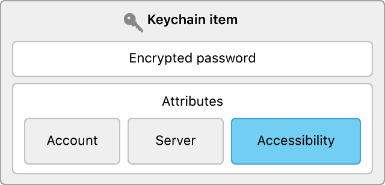
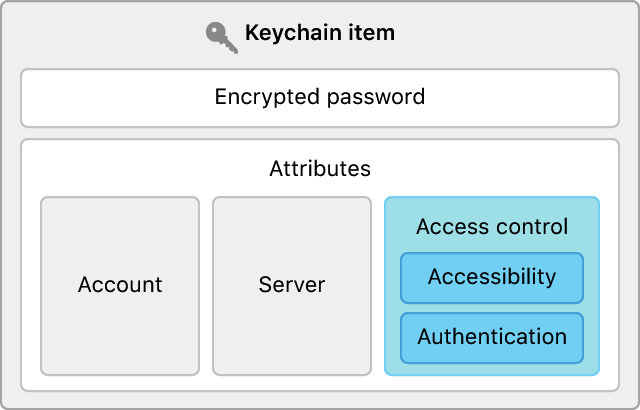

> Navigation: [Technologies](../technologies.md) · [Security](../security.md) · [Keychain services](keychain-services.md) · [Keychain items](keychain-items.md)

# Restricting keychain item accessibility

<sub>Article</sub>

Set the conditions under which an app can access a keychain item such as a password.

## Overview

When you use keychain services to store user secrets, the framework’s default behavior provides a reasonable trade-off between security and accessibility. However, in some cases, you might want to make different choices.

For example, by default, you can only access keychain items when the device is unlocked. However, a device not protected by a passcode is always unlocked, so you might want to restrict access further and insist that an item can only be accessed from a device protected by a passcode. Alternatively, you can relax access restrictions to be able to access an item from a background process when the device is locked.

Keychain services offers ways to manage the accessibility of individual keychain items according the state of the device, combined with inputs from the user.

### Control access based on device state

You control an app’s access to a keychain item relative to the state of a device by setting the item’s [kSecAttrAccessible](ksecattraccessible.md) attribute when you create the item. See [Adding a password to the keychain](adding-a-password-to-the-keychain.md) for a general discussion of how to create an item.



<sub>Block diagram showing the components of a keychain item, including both data and attributes, highlighting the accessibility attribute.</sub>

Choose a value for the accessibility attribute from the list under the [Accessibility Values](item-attribute-keys-and-values.md#Accessibility-Values) topic. For example, a query dictionary used to create an item that replicates the default accessibility would be:

```swift
var query: [String: Any] = [kSecClass as String: kSecClassInternetPassword,
                            kSecAttrAccount as String: account,
                            kSecAttrServer as String: server,
                            kSecAttrAccessible as String: kSecAttrAccessibleWhenUnlocked,
                            kSecValueData as String: password]
```

The [kSecAttrAccessible](ksecattraccessible.md) attribute enables you to control item availability relative to the lock state of the device. It also lets you specify eligibility for restoration to a new device. If the attribute ends with the string `ThisDeviceOnly`, the item can be restored to the same device that created a backup, but it isn’t migrated when restoring another device’s backup data.

In order of decreasing restrictiveness, the choices are:

- ****When Passcode Set**** — If the user hasn’t set a passcode, you can’t store an item with this setting. If the user removes the passcode from a device, any items with this setting are automatically deleted from the keychain. You can only access items with this setting if the device is unlocked. Use this setting if your app only needs access to items while running in the foreground.
- ****When Unlocked**** — Items with this setting are only accessible when the device is unlocked. A device without a passcode is considered to always be unlocked. This is the default accessibility when you don’t otherwise specify a setting.
- ****After First Unlock**** — This condition becomes true once the user unlocks the device for the first time after a restart, or if the device does not have a passcode. It remains true until the device restarts again. Use this level of accessibility when your app needs to access the item while running in the background.
- ****Always**** — The item is always accessible, regardless of the locked state of the device. This option isn’t recommended.

Always use the most restrictive option that makes sense for your app. For extremely sensitive data that you never want stored in iCloud, you might choose [kSecAttrAccessibleWhenPasscodeSetThisDeviceOnly](ksecattraccessiblewhenpasscodesetthisdeviceonly.md).

### Demand user presence

Allowing access only when the device is unlocked (the default) may not be secure enough in all cases. If your app provides direct control over a bank account, you can check for the presence of the authorized user at the very last minute before retrieving login credentials from the keychain. This helps secure the account even if the user hands the device in an unlocked state to someone else.

Impose this restriction by supplying a [SecAccessControl](secaccesscontrol.md) instance as the value for the [kSecAttrAccessControl](ksecattraccesscontrol.md) attribute when creating a keychain item.



<sub>Block diagram showing the components of a keychain item, including both data and attributes, highlighting the access control attribute.</sub>

Create the access control instance with a call to the [SecAccessControlCreateWithFlags](<secaccesscontrolcreatewithflags(________).md>) method:

```swift
var error: NSError?
let access = SecAccessControlCreateWithFlags(NULL,  // Use the default allocator.
                                             kSecAttrAccessibleWhenUnlocked,
                                             kSecAccessControlUserPresence,
                                             &error);
```

This method takes two distinct access control inputs. The first is an accessibility setting of the same kind you can alternatively set directly with the [kSecAttrAccessible](ksecattraccessible.md) attribute, as described in the previous section. You don’t need to set the accessible attribute directly if you set it as part of the access control attribute instead.

The second input is an access control flag that’s the bitwise `OR` of one or more options given in [SecAccessControlCreateFlags](secaccesscontrolcreateflags.md). You use these options to require the user to demonstrate their presence. You can specifically require biometrics — like Touch ID or Face ID — or a passcode, but you typically use the [kSecAccessControlUserPresence](secaccesscontrolcreateflags/userpresence.md) option, as shown in the preceding code snippet, to let the system choose a mechanism, depending on the current situation.

After preparing the access control instance, include it in the add query:

```swift
var query: [String: Any] = [kSecClass as String: kSecClassInternetPassword,
                            kSecAttrAccount as String: account,
                            kSecAttrServer as String: server,
                            kSecAttrAccessControl as String: access,
                            kSecValueData as String: password]
```

### Require a password

In addition to requiring a particular device state and user presence, you can require an application-specific password. This is distinct from the passcode that unlocks the device: It specifically guards a particular keychain item.

Do this by including the [kSecAccessControlApplicationPassword](secaccesscontrolcreateflags/applicationpassword.md) option when defining access control flags:

```swift
let access = SecAccessControlCreateWithFlags(NULL,  // Use the default allocator.
                                             kSecAttrAccessibleWhenPasscodeSet,
                                             kSecAccessControlBiometryAny
                                               | kSecAccessControlApplicationPassword,
                                             &error);
```

When you add this flag, the system prompts the user for a password when creating the item, and then again before retrieving it. The item can only be retrieved if the user successfully enters the password, independent of satisfying any other conditions.
