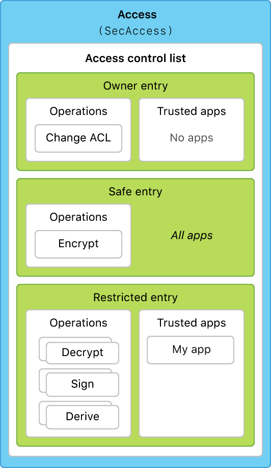

> Navigation: [Technologies](../technologies.md) · [Security](../security.md)

# SecAccessCreate(_:_:_:)

<sub>Function</sub>

Creates a new access instance associated with a given protected keychain item.

> [!warning] Deprecated
> SecKeychain is deprecated

<sub>macOS</sub>

```swift
func SecAccessCreate(_ descriptor: CFString, _ trustedlist: CFArray?, _ accessRef: UnsafeMutablePointer<SecAccess?>) -> OSStatus
```

## Parameters

- `descriptor` — The name of the keychain item as it should appear in security dialogs, such as when an untrusted app tries to gain access to the item and the system prompts the user for permission. Use a name that gives users enough information to make a decision about this item. If you only store one item, a simple description like “Server password” might be sufficient. If you store many similar items, you might need to be more specific. This isn’t necessarily the name that appears in the Keychain Access app.

- `trustedlist` — An array of [SecTrustedApplication](sectrustedapplication.md) instances specifying which apps should be allowed to access the item for restricted operations without triggering confirmation dialogs. Use `nil` to trust only the calling app. Use an empty array to indicate no apps are trusted.

- `accessRef` — On return, points to the new access instance. In Objective-C, call [CFRelease](../corefoundation/cfrelease.md) to release this instance when you are finished using it.

## Return Value

[errSecSuccess](errsecsuccess.md) on success, or another status result on failure. See [Security Framework Result Codes](security-framework-result-codes.md) for all possible status results.

## Discussion

Use this method to create a default access instance containing three ACL entries. If you don’t explicitly create and set an access instance when you create a protected keychain item, keychain services uses a default access like this one.



<sub>Diagram showing the contents of the default access instance, including three entries, each with specific operations and trusted apps.</sub>

- **Owner entry.** Determines who can modify the access instance, because it contains the [kSecACLAuthorizationChangeACL](ksecaclauthorizationchangeacl.md) authorization. The owner entry’s list of trusted apps is empty, so the user is always prompted for permission if someone tries to change the access instance. All access instances must have exactly one owner entry, so this item can’t be removed, although you can modify it.
- **Safe entry.** Applies to operations not considered secure, namely encrypting data. This ACL entry trusts all apps by default, because its array of trusted apps is set to `nil`.
- **Restricted entry.** Applies to operations that are considered sensitive, such as decrypting, signing, deriving keys, and exporting keys. The method applies the list of apps given in the `trustedlist` parameter to this entry. If you set `trustedlist` to `nil`, the list of trusted apps contains only the calling app.

### Retrieving and Modifying ACL Entries

After you (or keychain services) create the access instance, you can retrieve all its ACL entries using the [SecAccessCopyACLList](<secaccesscopyacllist(____).md>) method. You can then modify any of these entries using the [SecACLSetContents](<secaclsetcontents(________).md>) method, or modify the operations for which an ACL entry is used using the [SecACLUpdateAuthorizations](<secaclupdateauthorizations(____).md>) method. You can also create additional ACL entries using the [SecACLCreateWithSimpleContents](<secaclcreatewithsimplecontents(__________).md>) method. Because an ACL is always associated with an access instance, when you modify an entry or create a new one, you’re implicitly modifying the access instance as well.

You then apply the fully configured access instance to a keychain item by setting it as the item’s [kSecAttrAccess](ksecattraccess.md) attribute. See [Keychain items](keychain-items.md) for details about creating and modifying keychain items.
