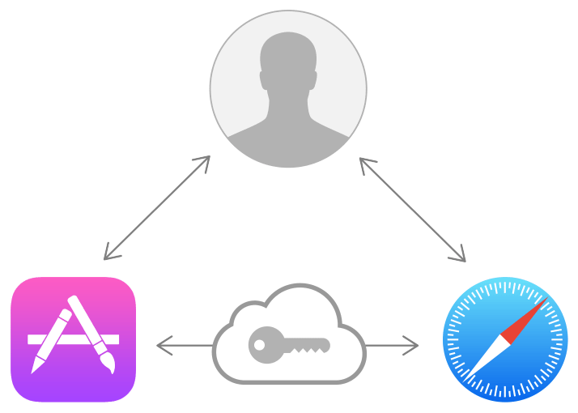

> Navigation: [Technologies](../technologies.md) · [Security](../security.md)

# Shared Web Credentials

API Collection

Share credentials between iOS apps and their website counterparts.

## Overview

The `Security.SecSharedCredentials` API provides functions for storing and requesting shared password-based credentials. Users often save their username and password in their iCloud keychain when logging into websites in Safari. Later, they may run a native app from the same developer to access the same account. With shared web credentials, the app can access the credentials stored for the website instead of requiring the user to reenter a username and password. Users can also create new accounts, update passwords, or delete their accounts from within the app. These changes are then saved and used by Safari.

> [!note] Note
> Accessing shared web credentials requires permission from the app, the website, and the user.

## Topics

### First Steps

- [Supporting associated domains](../xcode/supporting-associated-domains.md) — Connect your app and a website to provide both a native app and a browser experience.
- [Managing Shared Credentials](managing-shared-credentials.md) — Use shared web credentials to create a seamless experience for the user.

### Password Sharing

- [SecAddSharedWebCredential](<secaddsharedwebcredential(________).md>) — Asynchronously stores (or updates) a shared password for a website. _(deprecated)_
- [SecRequestSharedWebCredential](<secrequestsharedwebcredential(______).md>) — Asynchronously obtains one or more shared passwords for a website. _(deprecated)_
- [SecCreateSharedWebCredentialPassword](<seccreatesharedwebcredentialpassword().md>) — Returns a randomly generated password.
- [kSecSharedPassword](ksecsharedpassword.md) — A dictionary key whose value is the shared password.
