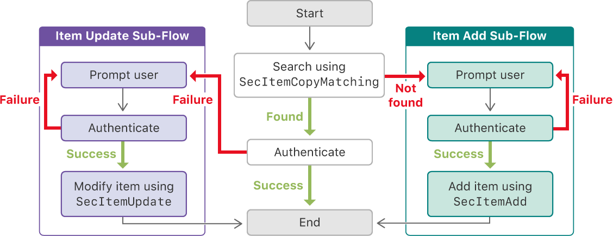

> Navigation: [Technologies](../technologies.md) · [Security](../security.md) · [Keychain services](keychain-services.md) · [Keychain items](keychain-items.md)

# Using the keychain to manage user secrets

Relieve the user of remembering small secrets by storing them in the keychain.

## Overview

Apps often need access to sensitive user data such as passwords, but keeping the data secure can come at a cost: If you store a data without encrypting it, you create a security risk. If instead you repeatedly prompt the user, you produce a bad user experience—one that typically causes the user to create simple passwords or else write them down.

Keychain services helps solve this problem by providing easy access to encrypted storage. Your app uses the keychain, along with minimal user interaction, to provide a good user experience. For example, consider a process like the one depicted in Figure 1 for storing an Internet password.

A flow diagram that depicts a process for using a keychain item when possible to authenticate against a server, and prompting the user when the keychain item is not found or is out of date.

### Involve the User When Needed

The first time an app needs credentials, no password is stored in the keychain. Here, the app prompts the user, as shown in the right branch of the diagram.

After the user has provided credentials that successfully authenticate, the app stores them using a call to the [SecItemAdd](<secitemadd(____).md>) function. The app now continues with its regular network access. Later, when the server requires reauthentication, the app can retrieve the credentials from the keychain instead of bothering the user.

For additional information about how to add items to the keychain, see [Adding a password to the keychain](adding-a-password-to-the-keychain.md).

### Avoid Bothering the User in the Common Case

The most common path through the diagram is the central one, which requires no user interaction. Here, a secure network resource requires periodic reauthentication, for example, because the user relaunches an app after having been away for a while.

In response, the app searches the keychain for the password, using the [SecItemCopyMatching](<secitemcopymatching(____).md>) function. If the password is found and the app successfully uses it to authenticate, it’s free to continue without involving the user.

For details about conducting a search, see [Searching for keychain items](searching-for-keychain-items.md).

### Handle Changes Gracefully

Occasionally, the user changes credentials outside the scope of the app. For example, you might offer a web interface to the same service that allows the user to change or reset their password. In this situation, a subsequent keychain item search in the app produces an out-of-date password that fails to authenticate. The left branch of the flow diagram handles this scenario. As with the right branch, the app prompts the user for new credentials. But in this case the app uses a call to the [SecItemUpdate](<secitemupdate(____).md>) function to modify the existing stored value after validating the new credentials.

The user might also decide to disconnect entirely from the network service. In response, your app should “forget” the corresponding credentials, along with performing any other actions required to log out. Use the [SecItemDelete](<secitemdelete(__).md>) function to remove the password from the keychain entirely.

For a discussion about changing and removing existing items, see [Updating and deleting keychain items](updating-and-deleting-keychain-items.md) .

## Topics

### Item Creation and Modification

- [Adding a password to the keychain](adding-a-password-to-the-keychain.md) — Add network credentials to the keychain on behalf of the user.
- [Searching for keychain items](searching-for-keychain-items.md) — Find keychain items based on search criteria that you specify.
- [Updating and deleting keychain items](updating-and-deleting-keychain-items.md) — Modify items in the keychain when the user’s data changes.

### Item Access

- [Sharing access to keychain items among a collection of apps](sharing-access-to-keychain-items-among-a-collection-of-apps.md) — Enable apps to share keychain items with each other by adding the apps to an access group.
- [Restricting keychain item accessibility](restricting-keychain-item-accessibility.md) — Set the conditions under which an app can access a keychain item such as a password.
