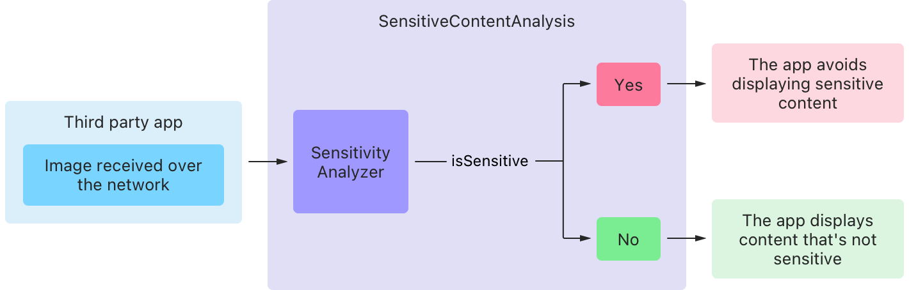
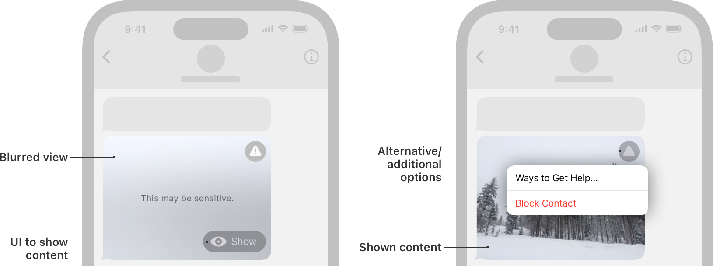

> Navigation: [Technologies](technologies.md)

# Sensitive Content Analysis

Framework

Provide a safer experience in your app by detecting and alerting people to sensitive content in images and videos before displaying them.

## Overview

The Sensitive Content Analysis framework enables an app to check content for nudity and other sensitive material. In iOS and macOS, the Sensitive Content Warning user preference or the Communication Safety parental control in Screen Time offer people the option to indicate their desire to guard against unexpected or unwanted exposure to images that contain sensitive content. Provide people with the experience they request in these settings by using Sensitive Content Analysis to check for sensitive content before displaying it.

Consider situations in which your app acquires externally sourced images or video, and use this framework to check if the media is sensitive. For example, a messaging app can check each image it receives from a contact. A classroom app can evaluate uploads from personal devices to a shared location for classwork submission or other classroom activities. And a video-conferencing app can analyze the video streams of all participants, live on a call.

A flowchart that progresses from left to right. The chart has three areas. The left area contains the label Third party app, with text that indicates the app receives an image over a network. An arrow flows to the right from this area to a box that contains the label Sensitivity Analyzer, which resides in the center. The overall central area of the flowchart is the labeled Sensitive Content Analysis. An arrow flows from the Sensitivity Analyzer box to two other boxes within the center that contain the labels Yes, and No, respectively. Text on the arrow itself reads Is Sensitive, which represents the condition on which the chart’s flow branches. An arrow flows to the right of the Yes box to the right section of the chart, which contains two boxes. The top box contains text that reads: The app avoids displaying sensitive content. A second arrow flows to the right of the No box to another box that reads: The app displays content that’s not sensitive. 

### Intervene when content is sensitive

If the framework determines that some media contains sensitive content, call the person’s attention to the issue and avoid displaying the media until the person decides what to do. For example, the following image depicts Messages in iOS 17 as a potentially explicit image arrives. The user interface blurs the image and:

- Displays the flagged content, if the person chooses.
- Offers a menu of additional actions, such as blocking the contact.

An image of two iPhones side by side that display the Messages app. The phone on the left renders a view of an image that the user received in a conversation. A callout points to the image and contains the text Blurred view. Text referring to the blurred image reads: This may be sensitive. The view contains a button with the text Show and a callout that reads: UI to show content. The phone on the right displays the same conversation in Messages with a detailed image in the view. A callout extends from the detailed image that reads: Shown content. The view contains a button with a warning triangle, from which a callout extends with text that reads: Alternative / additional options.

## Topics

### Setup

- [Detecting sensitive content in media and providing intervention options](sensitivecontentanalysis/detecting-nudity-in-media-and-providing-intervention-options.md) — Alert people before displaying images or video that might be sensitive.

### Authorization

- [com.apple.developer.sensitivecontentanalysis.client](bundleresources/entitlements/com.apple.developer.sensitivecontentanalysis.client.md) — A code-signing entitlement that enables an app to detect nudity in images and video.

### Image and video file analysis

- [SCSensitivityAnalyzer](sensitivecontentanalysis/scsensitivityanalyzer.md) — An object that analyzes media for sensitive content.
- [SCSensitivityAnalysisPolicy](sensitivecontentanalysis/scsensitivityanalysispolicy.md) — Configurations that represent the way the framework checks for sensitive content and how the app responds.

### Video stream analysis

- [SCVideoStreamAnalyzer](sensitivecontentanalysis/scvideostreamanalyzer.md) — An object that monitors a stream of video by analyzing frames for sensitive content.

### Analysis results

- [SCSensitivityAnalysis](sensitivecontentanalysis/scsensitivityanalysis.md) — An object that indicates whether sensitive content is present and includes intervention guidance.

### Testing

- [Testing your app’s response to sensitive media](sensitivecontentanalysis/testing-your-app-s-response-to-sensitive-media.md) — Trigger your app’s intervention flow by using a special QR code and profile that Apple provides for testing.
