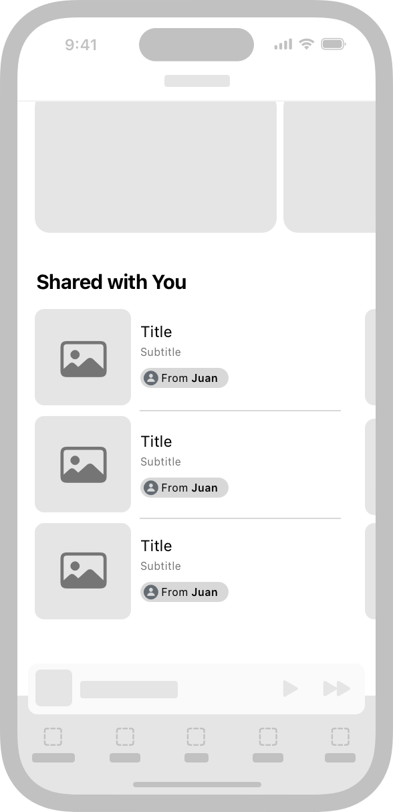

> Navigation: [Technologies](technologies.md)

# Shared with You

Technology

Surface shared content and collaborate in your app.

## Overview

Access and view content shared from Messages across the system and continue the messaging experience without leaving your app. Incorporate Shared with You to make it easier for people to access content shared through conversations or notifications.

An image of an iPhone. In the middle of the screen is a Shared with You shelf with three list items arranged vertically. Each list item has a gray rectangle with text next to it. All three rows have Title as the title and Subtitle as the subtitle. Below the subtitle in all three rows is an oval button with the title From Juan.

Support a Shared with You shelf in your app to visually represent shared items with an [SWAttributionView](sharedwithyou/swattributionview.md) that the system renders. Securely share universal links that your app accesses using the [SWHighlight](sharedwithyou/swhighlight.md) class. For information on getting started, see [Making your app content shareable](sharedwithyou/making-your-app-content-shareable.md).

> [!note] Related sessions from WWDC22
> Session 10094: [Add Shared with You to your app](https://developer.apple.com/videos/play/wwdc2022/10094)

## Topics

### Frameworks

- [Shared with You Core](sharedwithyoucore.md) — Integrate custom collaboration with Messages, Mail, and FaceTime.

### Shared content

- [Making your app content shareable](sharedwithyou/making-your-app-content-shareable.md) — Add support for universal links and a Shared with You shelf to support shared content in your app.
- [Shared content interactions](sharedwithyou/shared-content-interactions.md) — Use highlights and attribution views to manage participants and trigger events for shared content.

### Collaboration

- [Adding shared content collaboration to your app](sharedwithyou/adding-shared-content-collaboration-to-your-app.md) — Manage shared content collaboration in your app using CloudKit and iCloud Drive.
- [Adding custom collaboration to your app](sharedwithyou/adding-custom-collaboration-to-your-app.md) — Integrate your custom collaboration app with Messages.
- [Collaboration views](sharedwithyou/collaboration-views.md) — Create and customize a collaboration view to manage the shared content actions.

### Framework versions

- [Version number](sharedwithyou/version-number.md)
- [Version string](sharedwithyou/version-string.md)

### Macros

- [Macros](sharedwithyou/macros.md)

### Variables

- [SWCopyRepresentationTypeIdentifier](sharedwithyou/swcopyrepresentationtypeidentifier.md) _(beta)_
