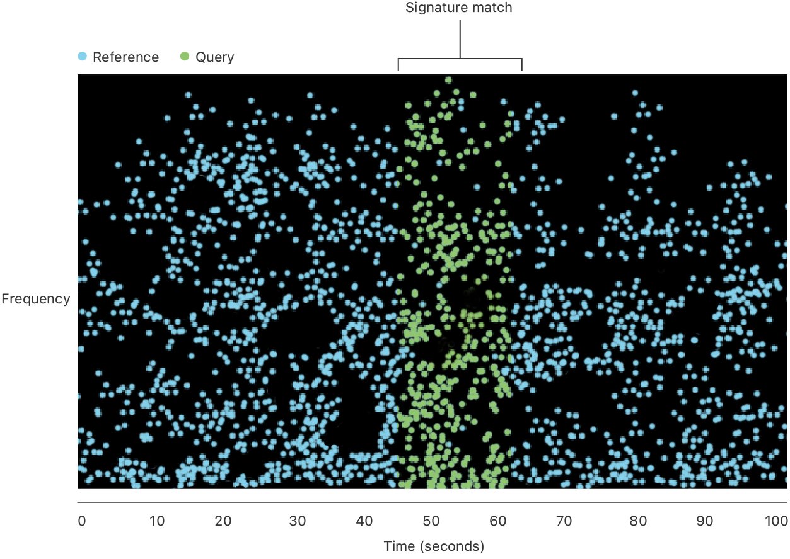

> Navigation: [Technologies](technologies.md)

# ShazamKit

Framework

Find information about a specific audio recording when a segment of it’s part of captured sound in the Shazam catalog or your custom catalog.

## Overview

ShazamKit uses the unique acoustic _signature_ of an audio recording to find a match. This signature captures the time-frequency distribution of the audio signal energy, and is much smaller than the original audio. It’s also a one-way conversion, so it’s not possible to convert the signature back to the recording.

ShazamKit generates a _reference signature_ for each searchable full audio recording. A _catalog_ stores the reference signatures and their associated metadata, or _media items_.

Searching for a match compares a _query signature_, which ShazamKit generates for captured audio, with the reference signatures in the catalog. Matches occur when the query signature sufficiently matches a part of a reference signature. Matches can occur even when the captured audio is noisy, such as with a partial recording of background music playing in a restaurant.

The figure below illustrates matching a query signature with the reference signature in the catalog. The information for a match includes the timecode in the reference recording that matches the start of the query.

For example, the Shazam app converts the sound stream from a device’s microphone into a query signature and searches for a match in the Shazam music catalog. The match includes the metadata for the reference signature, such as the song title, artist name, and other details.

You can create a custom catalog with your own reference signatures and their associated metadata. For example, the catalog for a virtual learning app might contain reference signatures for teaching videos, and the associated metadata that includes the timecodes for questions. Using ShazamKit, the app identifies the current question by the timecode for the match, and can offer choices for a possible answer. If the student skips forward or backward in the video, the app updates according to the sound of what the student is watching.

## Topics

### Match audio

- [SHSession](shazamkit/shsession.md) — An object that matches a specific audio recording when a segment of that recording is part of captured sound in the Shazam catalog or your custom catalog.
- [SHManagedSession](shazamkit/shmanagedsession.md) — An object that records and matches a recording with captured sound in the Shazam catalog or your custom catalog.
- [SHSessionDelegate](shazamkit/shsessiondelegate.md) — Methods that the session calls with the result of a match request.
- [SHMatch](shazamkit/shmatch.md) — An object that represents the catalog media items that match a query.
- [SHMatchedMediaItem](shazamkit/shmatchedmediaitem.md) — An object that represents the metadata for a matched reference signature.
- [SHMediaItem](shazamkit/shmediaitem.md) — An object that represents the metadata for a reference signature.

### Create a signature from audio

- [SHSignature](shazamkit/shsignature.md) — An object that contains the opaque data and other information for a signature.
- [SHSignatureGenerator](shazamkit/shsignaturegenerator.md) — An object for converting audio data into a signature.

### Create a custom audio catalog

- [Building a Custom Catalog and Matching Audio](shazamkit/building-a-custom-catalog-and-matching-audio.md) — Display lesson content that’s synchronized to a learning video by matching the audio to a custom reference signature and associated metadata.
- [ShazamKit Dance Finder with Managed Session](shazamkit/shazamkit-dance-finder-with-managed-session.md) — Find a video of dance moves for a specific song by matching the audio to a custom catalog, and show a history of recognized songs.
- [SHCustomCatalog](shazamkit/shcustomcatalog.md) — An object for storing the reference signatures for custom audio recordings and their associated metadata.
- [SHCatalog](shazamkit/shcatalog.md) — An abstract base class for storing reference signatures and their associated metadata.

### Update the user’s Shazam library

- [SHLibrary](shazamkit/shlibrary.md) — An object that represents a user’s synced Shazam library.
- [SHMediaLibrary](shazamkit/shmedialibrary.md) — An object that represents the user’s Shazam library. _(deprecated)_

### Shazam errors

- [SHError](shazamkit/sherror.md) — An error type that you create, or the system creates, to indicate problems with a catalog, match attempt, or signature, or when saving to a user’s Shazam library.

### Reference

- [ShazamKit Enumerations](shazamkit/shazamkit-enumerations.md)
- [ShazamKit Constants](shazamkit/shazamkit-constants.md)
