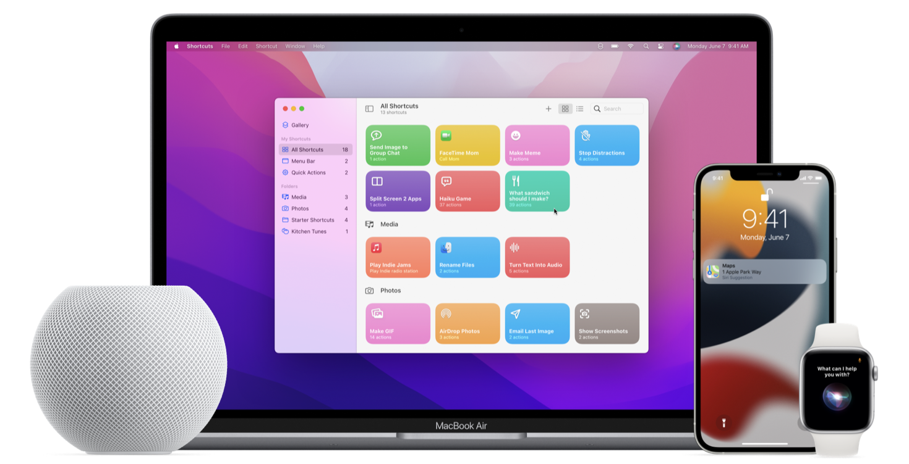

> Navigation: [Technologies](technologies.md)

# SiriKit

Technology

Empower users to interact with their devices through voice, intelligent suggestions, and personalized workflows.

## Overview

> [!note] Note
> SiriKit, Intents, and IntentsUI frameworks continue to provide legacy support for Shortcuts actions, widget configuration, and most existing Siri interactions. To implement modern support for these features and integrate your app with Apple Intelligence and Siri AI, use the [App Intents](appintents.md) framework.

For SiriKit, use the standard intents that the system provides to empower actions users already ask Siri to do, such as playing music or sending a text message. You can also offer your app’s unique capabilities throughout the system by designing custom intents. For more details about defining custom intents, see [Adding User Interactivity with Siri Shortcuts and the Shortcuts App](sirikit/adding-user-interactivity-with-siri-shortcuts-and-the-shortcuts-app.md).

A collection of devices, including a MacBook Air, an iPhone, an Apple Watch, and a HomePod mini. The devices display user interactions that SiriKit enables. On the MacBook Air, the Shortcuts app is open with a collection of shortcuts in the All Shortcuts section. The iPhone displays a Siri Suggestion with the Maps icon. The Apple Watch displays the Siri animation and the words “What can I help you with?”

You can process intents directly in your app, or in an Intents app extension. For guidance on setting up an app extension and sharing information between your app and extension, see [Structuring Your Code to Support App Extensions](sirikit/structuring-your-code-to-support-app-extensions.md).

To display branding or other customized content in Siri and Maps after you fulfill a person’s request, create a custom view controller in an IntentsUI app extension. See [Creating an Intents UI Extension](sirikit/creating-an-intents-ui-extension.md) for more details.

> [!important] Important
> With a person’s permission, an installed health research app that uses [SensorKit](sensorkit.md) entitlements may collect Face Metrics data while your SiriKit app is in use. To prevent SensorKit from collecting Face Metrics data while your app is in use, you can set the [SRResearchDataGeneration](bundleresources/information-property-list/srresearchdatageneration.md) information property list key to `NO`.

## Topics

### Frameworks

- [Intents](intents.md) — Empower people to customize interactions for your app on their device.
- [IntentsUI](intentsui.md) — Customize content in the interface for Siri and Maps.

### Sample code

- [Adding Shortcuts for Wind Down](sirikit/adding-shortcuts-for-wind-down.md) — Reveal your app’s shortcuts inside the Health app.
- [Booking Rides with SiriKit](sirikit/booking-rides-with-sirikit.md) — Add Intents extensions to your app to handle requests to book rides using Siri and Maps.
- [Handling Payment Requests with SiriKit](sirikit/handling-payment-requests-with-sirikit.md) — Add an Intent Extension to your app to handle money transfer requests with Siri.
- [Handling Workout Requests with SiriKit](sirikit/handling-workout-requests-with-sirikit.md) — Add an Intent Extension to your app that handles requests to control workouts with Siri.
- [Integrating Your App with Siri Event Suggestions](sirikit/integrating-your-app-with-siri-event-suggestions.md) — Donate reservations and provide quick access to event details throughout the system.
- [Managing Audio with SiriKit](sirikit/managing-audio-with-sirikit.md) — Control audio playback and handle requests to add media using SiriKit Media Intents.
- [Providing Hands-Free App Control with Intents](sirikit/providing-hands-free-app-control-with-intents.md) — Resolve, confirm, and handle intents without an extension.
- [Soup Chef: Accelerating App Interactions with Shortcuts](sirikit/soup-chef-accelerating-app-interactions-with-shortcuts.md) — Make it easy for people to use Siri with your app by providing shortcuts to your app’s actions.
- [Soup Chef with App Intents: Migrating custom intents](sirikit/soup-chef-with-app-intents-migrating-custom-intents.md) — Integrating App Intents to provide your appʼs actions to Siri and Shortcuts.

### Articles

- [Adding User Interactivity with Siri Shortcuts and the Shortcuts App](sirikit/adding-user-interactivity-with-siri-shortcuts-and-the-shortcuts-app.md) — Add custom intents and parameters to help users interact more quickly and effectively with Siri and the Shortcuts app.
- [Defining Relevant Shortcuts for the Siri Watch Face](sirikit/defining-relevant-shortcuts-for-the-siri-watch-face.md) — Inform Siri when your app’s shortcuts may be useful to the user.
- [Deleting Donated Shortcuts](sirikit/deleting-donated-shortcuts.md) — Remove your donations from Siri.
- [Dispatching intents to handlers](sirikit/dispatching-intents-to-handlers.md) — Provide SiriKit with an intent handler capable of handling a specific intent.
- [Improving Siri Media Interactions and App Selection](sirikit/improving-siri-media-interactions-and-app-selection.md) — Fine-tune voice controls and improve Siri Suggestions by sharing app capabilities, customized names, and listening habits with the system.
- [Improving interactions between Siri and your messaging app](sirikit/improving-interactions-between-siri-and-your-messaging-app.md) — Donate app-specific content, use Siri’s contact suggestions, and adopt the latest platform features to create a more consistent messaging experience.
- [Registering Custom Vocabulary with SiriKit](sirikit/registering-custom-vocabulary-with-sirikit.md) — Register your app’s custom terminology, and provide sample phrases for how to use your app with Siri.
- [Confirming the Details of an Intent](sirikit/confirming-the-details-of-an-intent.md) — Perform final validation of the intent parameters and verify that your services are ready to fulfill the intent.
- [Handling an Intent](sirikit/handling-an-intent.md) — Fulfill the intent and provide feedback to SiriKit about what you did.
- [Resolving the Parameters of an Intent](sirikit/resolving-the-parameters-of-an-intent.md) — Validate the parameters of an intent and make sure that you have the information you need to continue.
- [Generating a List of Ride Options](sirikit/generating-a-list-of-ride-options.md) — Generate ride options for Maps to display to the user.
- [Handling the Ride-Booking Intents](sirikit/handling-the-ride-booking-intents.md) — Support the different intent-handling sequences for booking rides with Shortcuts or Maps.
- [Donating Reservations](sirikit/donating-reservations.md) — Inform Siri of reservations made from your app.
- [Specifying Synonyms for Your App Name](sirikit/specifying-synonyms-for-your-app-name.md) — Provide alternative names for your app that are more familiar or easier for users to speak.
- [Intent Phrases](sirikit/intent-phrases.md) — The keys that you include in your global vocabulary file to show how users engage your app from Siri.
- [Localizing Your Vocabulary for Chinese Dialects](sirikit/localizing-your-vocabulary-for-chinese-dialects.md) — Apply emphasis markers to your pronunciation tips to assist Siri with Chinese dialects.
- [Parameter Vocabularies](sirikit/parameter-vocabularies.md) — The keys you include in your global vocabulary file to describe app-specific terms.
- [Offering Actions in the Shortcuts App](sirikit/offering-actions-in-the-shortcuts-app.md) — Suggest shortcuts users may want to add to Siri or combine with other actions in their own shortcuts.
- [Creating an Intents App Extension](sirikit/creating-an-intents-app-extension.md) — Add and configure an Intents app extension in your Xcode project.
- [Requesting Authorization to Use Siri](sirikit/requesting-authorization-to-use-siri.md) — Request permission from the user for Siri and Maps to communicate with your app or Intents app extension.
- [Structuring Your Code to Support App Extensions](sirikit/structuring-your-code-to-support-app-extensions.md) — Move your back-end services to a private framework so your app and app extensions can use them.
- [Providing Live Status Updates](sirikit/providing-live-status-updates.md) — Provide regular updates to Maps about the status of a booked ride.
- [Donating Shortcuts](sirikit/donating-shortcuts.md) — Tell Siri about shortcuts to actions that the user performed in your app.
- [Configuring the View Controller for Your Custom Interface](sirikit/configuring-the-view-controller-for-your-custom-interface.md) — Configure your view controller to replace or augment the default interface in Siri or Maps.
- [Configuring Your Intents UI App Extension Target](sirikit/configuring-your-intents-ui-app-extension-target.md) — Configure your Xcode project to include an Intents UI app extension that you use to customize the Siri and Maps interfaces.
