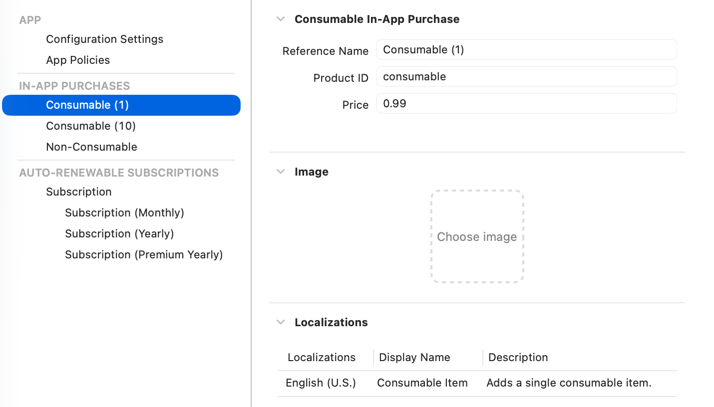
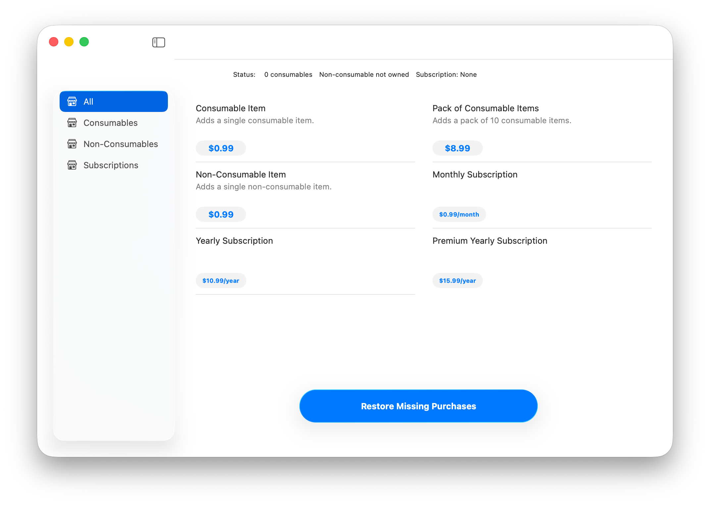
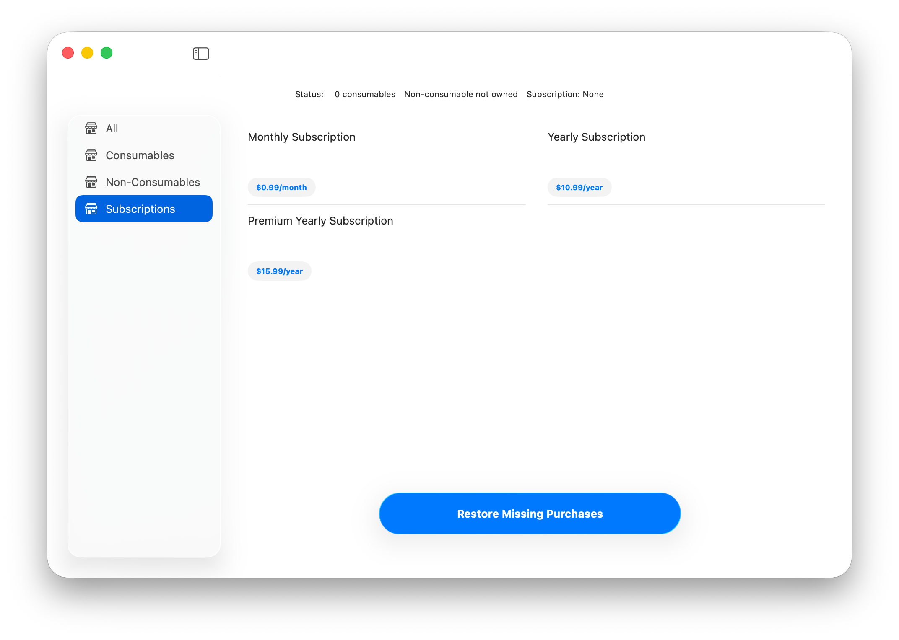

> Navigation: [Technologies](../technologies.md) · [StoreKit](../storekit.md)

# Getting started with In-App Purchase using StoreKit views

<sub>Article</sub>

Set up an in-app store using SwiftUI and StoreKit views.

## Overview

StoreKit provides a streamlined system for building basic In-App Purchase (IAP) capabilities that allow you to provide purchases in your app and process transactions using simple SwiftUI views. You can use this capability to build a basic store with default styling, or you can customize your store’s experience using the full, expressive capabilities of SwiftUI.

## Choose your product types

StoreKit supports the following product types, and StoreKit views can display all of them without any custom programming:

- **Consumables** — Content such as lives or gems in a game. After purchase, consumable content depletes as people use it, and people can purchase it again.
- **Non-consumables** — Content such as premium features in an app. Purchased non-consumable content doesn’t expire or deplete.
- **Auto-renewable subscriptions** — Recurring access to virtual content, services, and premium features in your app on an ongoing basis. An auto-renewable subscription continues to automatically renew at the end of each subscription period until people choose to cancel it.
- **Non-renewing subscriptions** — Access to a service or content that lasts for a limited time, like access to an in-game battle pass. People purchase a non-renewing subscription each time they want to extend their access to the service or content.

## Prototype your in-app store offline

With StoreKit, you can create a file that allows you to prototype and test your In-App Purchase code in Xcode without needing to set up products in App Store Connect. Xcode calls this a StoreKit local configuration; to create a local configuration file, follow these steps:

1. Open your app’s Xcode project.
2. Create the local StoreKit configuration by selecting File \> New \> File From Template.
3. In the sheet that appears, enter _storekit_ in the Filter search field.
4. Click the StoreKit Configuration File, then click Next.
5. In the dialog, enter a name for the file, for example `LocalConfiguration.storekit`. Leave the configuration sync checkbox unchecked and click Next.
6. Select a location for your file in your app’s project, then click Create to save the file.

For more information about setting up a local configuration file, see [Setting up StoreKit Testing in Xcode](../xcode/setting-up-storekit-testing-in-xcode.md).

This local configuration file allows you to experiment with product IDs and various purchase types offline. To use the product IDs in a published app, create the same product IDs in App Store Connect after you finish prototyping.

## Choose IDs for your products

In your app, define products that someone can buy, in order to prototype your store. Choose descriptive product IDs that are easy for you to read and understand. In this example, the product IDs describe the product type they represent.

Although you could write product IDs in your code as an array of strings, defining an enumeration whose raw value is a string can help make your code easier to read. For example, when you add a new product, any `switch` that handles product IDs but omits the new product produces a compile-time error.

```swift
enum ProductID: String {
    case consumable = "consumable"
    case consumablePack = "consumable_pack"

    case nonconsumable = "nonconsumable"

    case subscriptionMonthly = "subscription_monthly"
    case subscriptionYearly = "subscription_yearly"
    case subscriptionPremiumYearly = "premium_subscription_yearly"
}
```

> [!note] Note
> In a production app, consider fetching the list of product IDs programmatically — either from App Store Connect, or from your own server. This approach lets you enable and disable products without recompiling your app. For more information, see [Configure In-App Purchase settings](https://developer.apple.com/help/app-store-connect/configure-in-app-purchase-settings/overview-for-configuring-in-app-purchases).

## Monitor transactions in your app

StoreKit provides several asynchronous sequences that provide your app with information and updates. For example, the class below checks [unfinished](transaction/unfinished.md) and [currentEntitlements](transaction/currententitlements.md) at startup, and continues to check [updates](transaction/updates.md) in the background while the app is running.

```swift
import Foundation
import Observation
import StoreKit

@MainActor
@Observable
final class Store {
    private let defaultsKey = "com.example.consumable count"
    private let nonConsumableDefaultsKey = "com.example.nonconsumable"

    public var consumableCount: Int {
        willSet {
            UserDefaults.standard.set(newValue, forKey: defaultsKey)
        }
    }
    public var boughtNonConsumable: Bool = false
    public var activeSubscription: String? = nil

    init() {
        self.consumableCount = UserDefaults.standard.integer(forKey: defaultsKey)  // Returns 0 on first app launch.

        // Because the tasks below capture 'self' in their closures, this object must be fully initialized before this point.
        Task(priority: .background) {
            // Finish any unfinished transactions -- for example, if the app was terminated before finishing a transaction.
            for await verificationResult in Transaction.unfinished {
                await handle(updatedTransaction: verificationResult)
            }

            // Fetch current entitlements for all product types except consumables.
            for await verificationResult in Transaction.currentEntitlements {
                await handle(updatedTransaction: verificationResult)
            }
        }
        Task(priority: .background) {
            for await verificationResult in Transaction.updates {
                await handle(updatedTransaction: verificationResult)
            }
        }
    }
}
```

The `handle(updatedTransaction:)` method handles new verification results from all three sources of updates, to provide access to newly purchased content. For example, this work could include allocating consumable in-game coins, or delivering an in-game object.

```swift
private func handle(updatedTransaction verificationResult: VerificationResult<Transaction>) async {
    // The code below handles only verified transactions; handle unverified transactions based on your business model.
    guard case .verified(let transaction) = verificationResult else { return }

    if let _ = transaction.revocationDate {
        // Remove access to the product identified by `transaction.productID`.
        // `Transaction.revocationReason` provides details about the revoked transaction.
        guard let productID = ProductID(rawValue: transaction.productID) else {
            print("Unexpected product: \(transaction.productID).")
            return
        }

        switch productID {
        case .consumable:
            consumableCount -= 1
        case .consumablePack:
            consumableCount -= 10
        case .nonconsumable:
            boughtNonConsumable = false
        case .subscriptionMonthly, .subscriptionYearly, .subscriptionPremiumYearly:
            // In an app that supports Family Sharing, there might be another entitlement that still provides access to the subscription.
            activeSubscription = nil
        }
        await transaction.finish()
        return
    } else if let expirationDate = transaction.expirationDate, expirationDate < Date() {
        // In an app that supports Family Sharing, there might be another entitlement that still provides access to the subscription.
        activeSubscription = nil
        return
    } else {
        // Provide access to the product identified by transaction.productID.
        guard let productID = ProductID(rawValue: transaction.productID) else {
            print("Unexpected product: \(transaction.productID).")
            return
        }
        print("transaction ID \(transaction.id), product ID \(transaction.productID)")
        switch productID {
        case .consumable:
            consumableCount += 1
        case .consumablePack:
            consumableCount += 10
        case .nonconsumable:
            boughtNonConsumable = true
        case .subscriptionMonthly, .subscriptionYearly, .subscriptionPremiumYearly:
            // In an app that supports Family Sharing, there might be another entitlement that already provides access to the subscription.
            activeSubscription = transaction.productID
        }
        await transaction.finish()
        return
    }
}
```

## Define products in the local StoreKit configuration file

Before moving on to the views that display these products, define these products in the local configuration file you created earlier.

To create the local products, follow these steps:

1. In Xcode, open the local StoreKit configuration file you created earlier.
2. In the lower left corner click the plus (+) button; select the kind of product to add.
3. Edit the new product name, product ID string, price, and other properties.
4. Repeat steps 2 and 3 with additional product ID strings, and product types as needed.



<sub>A screenshot of the StoreKitWorkflows app showing a view the StoreKit local configuration editor and some of the properties available to edit.</sub>

## Create SwiftUI views that display your products

After completing the local configuration, you can show all of your products on one page with a simple, compact SwiftUI view.

```swift
import StoreKit
import SwiftUI

struct AllProductsView: View {
    // Your app's data store.
    @Environment(Store.self) private var store: Store

    var body: some View {
        @Bindable var store = store
        VStack {
            // ProductID.all is an array of your product ID strings.
            StoreView(ids: ProductID.all)
                .storeButton(.hidden, for: .cancellation)
                .storeButton(.visible, for: .restorePurchases)
        }
        .padding()
    }
}
```

Here, the `StoreView` view from StoreKit constructs a page and lays out a grid that contains each product, as shown in the following screenshot:



To show a specific subset of your available products, use the same view structure, but change the list of product IDs you provide to the `StoreView()`. So, change `store.allProductIDs` to another array of product IDs. For example, the `subscriptionProductIDs` array contains only subscription purchase types, so replace `store.allProductIDs` with the `subscriptionProductIDs` array to show subscriptions as shown here.



For more information on StoreKit Testing in Xcode, see [Setting up StoreKit Testing in Xcode](https://developer.apple.com/documentation/xcode/setting-up-storekit-testing-in-xcode/). For more information on the presentation of In-App purchase products, see Human Interface Guidelines \> [In-App Purchase](https://developer.apple.com/design/human-interface-guidelines/in-app-purchase). For more information on creating products in App Store Connect, see [Configure In-App Purchase settings](https://developer.apple.com/help/app-store-connect/configure-in-app-purchase-settings/overview-for-configuring-in-app-purchases).

## See Also

### In-App Purchase

- [In-App Purchase](in-app-purchase.md) — Offer content and services in your app across Apple platforms using a Swift-based interface.
- [Understanding StoreKit workflows](understanding-storekit-workflows.md) — Implement an in-app store with several product types, using StoreKit views.
