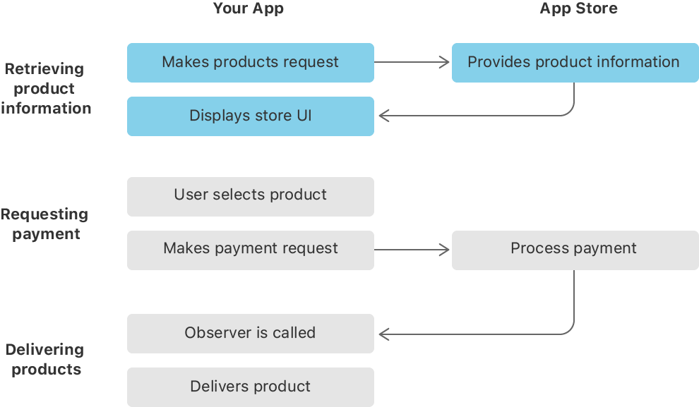

> Navigation: [Technologies](../technologies.md) · [StoreKit](../storekit.md) · [In-App Purchase](in-app-purchase.md) · [Original API for In-App Purchase](original-api-for-in-app-purchase.md)

# Loading in-app product identifiers

<sub>Article</sub>

Load the unique identifiers for your in-app products to retrieve product information from the App Store.

## Overview

Implementing an in-app purchase flow consists of three stages. In the first stage, your app retrieves product information. Then your app requests payment when the user selects a product in your app’s store. Finally, your app delivers the product.



<sub>A flowchart depicting the three stages of the in-app purchase process between your app and the App Store. First, your app makes a request for a product, the App Store provides that product information, and your app displays it. Next, the user selects a product, your app makes a payment request, and the App Store processes the payment. Finally, the App Store calls your app’s transaction queue observer, and your app delivers the purchased product. The first stage, retrieving product information, is highlighted.</sub>

To begin the purchase process, your app needs the product identifiers so it can retrieve information about the products from the App Store and present its store UI to the user. Every product you sell in your app has a unique product identifier. You provide this value in App Store Connect when you create a new in-app purchase product (see [Create in-app purchases](https://help.apple.com/app-store-connect/#/devae49fb316) for more information). Your app uses these product identifiers to fetch information about products available for sale in the App Store, such as pricing, and to submit payment requests when users purchase those products.

There are several strategies for storing a list of product identifiers in your app, such as embedding them in the app bundle or storing them on your server. You can then retrieve the product identifiers by reading them locally in the app bundle or fetching them from your server. Choose the method that best serves your app’s needs.

> [!note] Note
> There’s no runtime mechanism to fetch a list of the configured products in App Store Connect for a particular app. You’re responsible for managing your app’s list of products and providing that information to your app.

### Retrieve product IDs from the app bundle

Embed the product identifiers in your app bundle if:

- Your app has a fixed list of in-app purchase products. For example, apps with an in-app purchase to remove ads or unlock functionality can embed the product identifier list in the app bundle.
- You expect users to update the app to see new in-app purchase products.
- The app or product doesn’t require a server.

Include a property list file in your app bundle containing an array of product identifiers, such as the following:

```xml
<?xml version="1.0" encoding="UTF-8"?>
<!DOCTYPE plist PUBLIC "-//Apple//DTD PLIST 1.0//EN"
 "http://www.apple.com/DTDs/PropertyList-1.0.dtd">
<plist version="1.0">
<array>
    <string>com.example.level1</string>
    <string>com.example.level2</string>
    <string>com.example.rocket_car</string>
</array>
</plist>
```

To get product identifiers from the property list, locate the file in the app bundle and read it.

**Swift**

```swift
guard let url = Bundle.main.url(forResource: "product_ids", withExtension: "plist") else { fatalError("Unable to resolve url for in the bundle.") }
do {
    let data = try Data(contentsOf: url)
    let productIdentifiers = try PropertyListSerialization.propertyList(from: data, options: .mutableContainersAndLeaves, format: nil) as? [String]
} catch let error as NSError {
    print("\(error.localizedDescription)")
}
```

**Objective-C**

```objc
NSURL *url = [[NSBundle mainBundle] URLForResource:@"product_ids"
                                     withExtension:@"plist"];
NSArray *productIdentifiers = [NSArray arrayWithContentsOfURL:url];
```

### Retrieve product IDs from your server

Store the product identifiers on your server if:

- You update the list of in-app products frequently, without updating your app. For example, games that support additional levels or characters can fetch the product identifiers list from your server.
- The products consist of delivered content.
- Your app or product requires a server.

Host a JSON file on your server with the product identifiers. For example, the following JSON file contains three product IDs:

```xml
[
    "com.example.level1",
    "com.example.level2",
    "com.example.rocket_car"
]
```

To get product identifiers from your server, fetch and read the JSON file.

**Swift**

```swift
func fetchProductIdentifiers(from url: URL) {
    DispatchQueue.global(qos: .default).async {
        do {
            let jsonData = try Data(contentsOf: url)
            let identifiers = try JSONSerialization.jsonObject(with: jsonData, options: []) as? [String]

            guard let productIdentifiers = identifiers else {fatalError("Identifiers are not of type String.")}

            DispatchQueue.main.async {
                self.delegate?.display(products: productIdentifiers) 
            }

        } catch let error as NSError {
            print("\(error.localizedDescription)")
        }
    }
}
```

**Objective-C**

```objc
- (void)fetchProductIdentifiersFromURL:(NSURL *)url delegate:(id)delegate
{
    dispatch_queue_t global_queue =
        dispatch_get_global_queue(DISPATCH_QUEUE_PRIORITY_DEFAULT, 0);
    dispatch_async(global_queue, ^{
        NSError *err;
        NSData *jsonData = [NSData dataWithContentsOfURL:url
                                                 options:NULL
                                                   error:&err];
        if (!jsonData) { /* Handle the error. */ }

        NSArray *productIdentifiers = [NSJSONSerialization
            JSONObjectWithData:jsonData options:NULL error:&err];
        if (!productIdentifiers) { /* Handle the error. */ }

        dispatch_queue_t main_queue = dispatch_get_main_queue();
        dispatch_async(main_queue, ^{
            [delegate displayProducts:productIdentifiers]; // Custom method.
        });
    });
}
```

Consider versioning the JSON file so future versions of your app can change its structure without breaking older versions of your app. For example, you might name the file that uses the old structure `products_v1.json` and the file that uses a new structure `products_v2.json`. This is especially useful if your JSON file is more complex than the simple array in the example.

To ensure that your app remains responsive, use a background thread to download the JSON file and extract the list of product identifiers. To minimize the data that transfers, use standard HTTP caching mechanisms, such as the `Last-Modified` and `If-Modified-Since` headers.

After loading all in-app product identifiers, pass them into the product information request to the App Store. For details on obtaining product information, see [Fetching product information from the App Store](fetching-product-information-from-the-app-store.md).

## See Also

### Product information

- [Fetching product information from the App Store](fetching-product-information-from-the-app-store.md) — Retrieve up-to-date information about the products for sale in your app to display to your customers.
- [SKProductsRequest](skproductsrequest.md) — An object that can retrieve localized information from the App Store about a specified list of products. _(deprecated)_
- [SKProductsResponse](skproductsresponse.md) — An App Store response to a request for information about a list of products. _(deprecated)_
- [SKProduct](skproduct.md) — Information about a registered product in App Store Connect. _(deprecated)_
