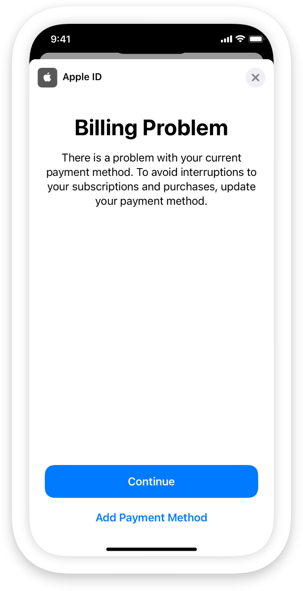

> Navigation: [Technologies](../../../technologies.md) · [StoreKit](../../../storekit.md) · [Message](../../message.md) · [Reason](../reason-swift.struct.md)

# billingIssue

<sub>Type Property</sub>

A message the App Store sends that informs people of a billing problem and enables them to update billing information.

<sub>iOS, iPadOS, Mac Catalyst, visionOS</sub>

```swift
static let billingIssue: Message.Reason
```

## Discussion

If an auto-renewable subscription fails to renew due to a billing issue, the subscription enters a billing retry state, and the App Store sends a message with the [billingIssue](billingissue.md) reason.

When a billing issue is in effect, StoreKit displays a Billing Problem message sheet when your app launches, or when your app asks to display it.



<sub>An image of an iPhone with the Billing Problem message sheet displayed. The sheet has the following elements: at the top left, an Apple logo and the text “Apple ID”, at the top right, an X icon that dismisses the sheet, and a title at the top that reads “Billing Problem”. Below the title, the text of the message sheet reads: “There is a problem with your current payment method. To avoid interruptions to your subscriptions and purchases, update your payment method.” At the bottom, the sheet has a Continue button and a link with the text “Add Payment Method”. </sub>

The sheet informs people of the billing issue, and displays an in-app sheet to enable them to correct the issue without leaving your app. Note that people can also resolve billing issues outside of your app by navigating to the manage payments section in Apple Account settings. For more information, see [support.apple.com](https://support.apple.com/en-us/HT213276).

Apple attempts to renew the subscription during the billing retry period, up to 60 days. During this period, the App Store sends the [billingIssue](billingissue.md) message in the following intervals:

| Billing retry interval | Message frequency |
|---|---|
| Days 1–3 | Every 24 hours |
| Days 4–16 | Every 72 hours |
| Days 17–30 | Every 96 hours |
| Days 31–60 | Every 120 hours |

The App Store stops sending further messages when the user resolves the billing issue, cancels the subscription, or when the billing retry period ends. StoreKit ensures that the sheet appears only if the message is applicable when your app calls [display(in:)](<../display(in_).md>) or [DisplayMessageAction](../../displaymessageaction.md).

For more information about the billing retry state, see [isInBillingRetry](../../product/subscriptioninfo/renewalinfo/isinbillingretry.md) in  [RenewalInfo](../../product/subscriptioninfo/renewalinfo.md).

### Test the message in the sandbox environment

You can simulate billing issues in the sandbox environment to test how the system presents the [billingIssue](billingissue.md) message in your app, and how your app handles it if you choose to delay or suppress its presentation. For more information, including step-by-step test cases, see [Testing failing subscription renewals and In-App Purchases](../../testing-failing-subscription-renewals-and-in-app-purchases.md).

## See Also

### Getting the message reasons

- [generic](generic.md) — A message the App Store sends for a generic reason.
- [priceIncreaseConsent](priceincreaseconsent.md) — A message the App Store sends when you increase the price of an auto-renewable subscription and the price increase requires the customer’s consent.
- [winBackOffer](winbackoffer.md) — A message the App Store sends when the customer is eligible for a win-back offer that you configure in App Store Connect.
