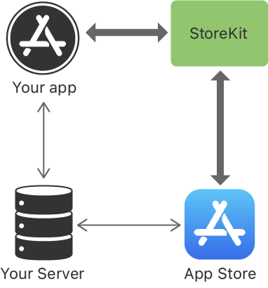

> Navigation: [Technologies](../technologies.md) · [StoreKit](../storekit.md) · [In-App Purchase](in-app-purchase.md)

# Original API for In-App Purchase

API Collection

Offer additional content and services in your app using the Original In-App Purchase API.

## Overview

The In-App Purchase APIs, including the original API and the Swift-based [In-App Purchase](in-app-purchase.md) API, allow you to offer customers the opportunity to purchase in-app content and features. Customers can make the purchases within your app, and find your promoted products on the App Store.

The StoreKit framework connects to the App Store on your app’s behalf to prompt for, and securely process, payments. The framework then notifies your app, which delivers the purchased products. To validate purchases, you can verify receipts on your server with the App Store or on the device. For auto-renewable subscriptions, the App Store can also notify your server of key subscription events.

A diagram of the interactions between StoreKit, your app, the App Store, and your server that occur during a transaction.

For more information about In-App Purchases, including configuration, testing, marketing, and more, see [In-App Purchase](https://developer.apple.com/in-app-purchase/).

### Configure In-App Purchases in App Store Connect

To use the In-App Purchase API, you need to configure the products in App Store Connect. As you develop your app, you can add or remove products and refine or reconfigure existing products. For more information, see [Configure In-App Purchase settings](https://developer.apple.com/help/app-store-connect/configure-in-app-purchase-settings/overview-for-configuring-in-app-purchases).

You can also offer apps and In-App Purchases that run on multiple platforms as a single purchase. For more information about universal purchase, see [App Store Connect Help](https://help.apple.com/app-store-connect/#/dev2cd126805).

### Understand product types

There are four In-App Purchase types you can offer:

- _Consumables_ are a type that are depleted after one use. Customers can purchase them multiple times.
- _Non-consumables_ are a type that customers purchase once. They don’t expire. Non-consumable In-App Purchases can offer Family Sharing.
- _Auto-renewable subscriptions_ to services or content are a type that customers purchase once and that renew automatically on a recurring basis until customers decide to cancel. Auto-renewable subscriptions can offer Family Sharing.
- _Non-renewing subscriptions_ to services or content provide access over a limited duration and don’t renew automatically. Customers need to purchase a new subscription after it concludes if they want to retain access.

You can sync and restore non-consumables and auto-renewable subscriptions across devices using StoreKit. When a customer purchases an auto-renewable or non-renewing subscription, your app is responsible for making it available across all the person’s devices, and for restoring past purchases.

## Topics

### Essentials

- [Setting up the transaction observer for the payment queue](setting-up-the-transaction-observer-for-the-payment-queue.md) — Enable your app to receive and handle transactions by adding an observer.
- [Offering, completing, and restoring in-app purchases](offering-completing-and-restoring-in-app-purchases.md) — Fetch, display, purchase, validate, and finish transactions in your app.
- [SKPaymentQueue](skpaymentqueue.md) — A queue of payment transactions for the App Store to process. _(deprecated)_
- [SKPaymentTransactionObserver](skpaymenttransactionobserver.md) — A set of methods that process transactions, unlock purchased functionality, and continue promoted In-App Purchases. _(deprecated)_
- [SKPaymentQueueDelegate](skpaymentqueuedelegate.md) — The protocol that provides information needed to complete transactions. _(deprecated)_
- [SKRequest](skrequest.md) — An abstract class that represents a request to the App Store. _(deprecated)_

### Product information

- [Loading in-app product identifiers](loading-in-app-product-identifiers.md) — Load the unique identifiers for your in-app products to retrieve product information from the App Store.
- [Fetching product information from the App Store](fetching-product-information-from-the-app-store.md) — Retrieve up-to-date information about the products for sale in your app to display to your customers.
- [SKProductsRequest](skproductsrequest.md) — An object that can retrieve localized information from the App Store about a specified list of products. _(deprecated)_
- [SKProductsResponse](skproductsresponse.md) — An App Store response to a request for information about a list of products. _(deprecated)_
- [SKProduct](skproduct.md) — Information about a registered product in App Store Connect. _(deprecated)_

### Storefronts

- [SKStorefront](skstorefront.md) — An object containing the location and unique identifier of an Apple App Store storefront. _(deprecated)_

### Purchases

- [Requesting a payment from the App Store](requesting-a-payment-from-the-app-store.md) — Submit a payment request to the App Store when a customer selects a product to buy.
- [Processing a transaction](processing-a-transaction.md) — Register a transaction queue observer to get and handle transaction updates from the App Store.
- [SKPayment](skpayment.md) — A request to the App Store to process payment for additional functionality that your app offers. _(deprecated)_
- [SKMutablePayment](skmutablepayment.md) — A mutable request to the App Store to process payment for additional functionality that your app offers. _(deprecated)_
- [SKPaymentTransaction](skpaymenttransaction.md) — An object in the payment queue. _(deprecated)_

### Purchase validation

- [Choosing a receipt validation technique](choosing-a-receipt-validation-technique.md) — Select the type of receipt validation, on the device or on your server, that works for your app.
- [Validating receipts with the App Store](validating-receipts-with-the-app-store.md) — Verify transactions with the App Store on a secure server.
- [appStoreReceiptURL](../foundation/bundle/appstorereceipturl.md) — The file URL for the bundle’s App Store receipt. _(deprecated)_
- [SKReceiptRefreshRequest](skreceiptrefreshrequest.md) — A request to the App Store to get the app receipt, which represents the customer’s transactions with your app. _(deprecated)_

### Content delivery

- [Unlocking purchased content](unlocking-purchased-content.md) — Deliver content to the customer after validating the purchase.
- [Persisting a purchase](persisting-a-purchase.md) — Keep a persistent record of a purchase to continue making the product available as needed.
- [Finishing a transaction](finishing-a-transaction.md) — Finish the transaction to complete the purchase process.
- [SKDownload](skdownload.md) — Downloadable content associated with a product. _(deprecated)_

### Refunds

- [Handling refund notifications](handling-refund-notifications.md) — Respond to notifications about customer refunds for consumable, non-consumable, and non-renewing subscription products.
- [Testing refund requests](testing-refund-requests.md) — Test your app’s implementation of refund requests, and your app’s and server’s handling of approved and declined refunds.

### Providing access to previously purchased products

- [Restoring purchased products](restoring-purchased-products.md) — Give customers functionality that restores their purchases in your app to maintain access to purchased content.
- [SKReceiptRefreshRequest](skreceiptrefreshrequest.md) — A request to the App Store to get the app receipt, which represents the customer’s transactions with your app. _(deprecated)_
- [SKRequest](skrequest.md) — An abstract class that represents a request to the App Store. _(deprecated)_
- [SKPaymentTransaction](skpaymenttransaction.md) — An object in the payment queue. _(deprecated)_
- [SKTerminateForInvalidReceipt](<skterminateforinvalidreceipt().md>) — Terminates an app if the license to use the app has expired.

### Family Sharing

- [Supporting Family Sharing in your app](supporting-family-sharing-in-your-app.md) — Provide service to share subscriptions and non-consumable products to family members.
- [isFamilyShareable](skproduct/isfamilyshareable.md) — A Boolean value that indicates whether the product is available for Family Sharing in App Store Connect. _(deprecated)_
- [- paymentQueue:didRevokeEntitlementsForProductIdentifiers:](<skpaymenttransactionobserver/paymentqueue(__didrevokeentitlementsforproductidentifiers_).md>) — Tells an observer that the customer is no longer entitled to one or more Family Sharing purchases. _(deprecated)_

### Subscriptions

- [Subscriptions and offers](subscriptions-and-offers.md) — Offer customers additional time-based content and services through purchases they make within your app.

### Promotions

- [Promoting In-App Purchases](promoting-in-app-purchases.md) — Show promoted In-App Purchases on your product page and handle purchases that customers initiate on the App Store.
- [Testing promoted In-App Purchases](testing-promoted-in-app-purchases.md) — Test your In-App Purchases before making your app available in the App Store.
- [SKProductStorePromotionController](skproductstorepromotioncontroller.md) — A product promotion controller for customizing the order and visibility of In-App Purchases per device. _(deprecated)_

### Testing In-App Purchases

- [Testing at all stages of development with Xcode and the sandbox](testing-at-all-stages-of-development-with-xcode-and-the-sandbox.md) — Verify your implementation of In-App Purchases by testing your code throughout its development.
- [Setting up StoreKit Testing in Xcode](../xcode/setting-up-storekit-testing-in-xcode.md) — Prepare your test environment to test in-app purchases with data you configure locally.
- [Testing In-App Purchases in Xcode](testing-in-app-purchases-in-xcode.md) — Use locally configured product data to test and debug your In-App Purchases implementation.
- [Testing In-App Purchases with sandbox](testing-in-app-purchases-with-sandbox.md) — Test your implementation of In-App Purchases using real product information and server-to-server transactions in the sandbox environment.

### Errors

- [Handling errors](handling-errors.md) — Determine the underlying cause of errors that result from StoreKit requests.
- [Code](skerror/code.md) — Error codes for StoreKit errors.
- [SKError](skerror.md) — StoreKit error descriptions, codes, and domains.
- [SKErrorDomain](skerrordomain.md) — The error domain name for StoreKit errors.

## See Also

### Deprecated

- [Choosing a StoreKit API for In-App Purchases](choosing-a-storekit-api-for-in-app-purchases.md) — Use the latest API to support In-App Purchases in new or existing apps, or the original API to support In-App Purchases in earlier operating systems.
