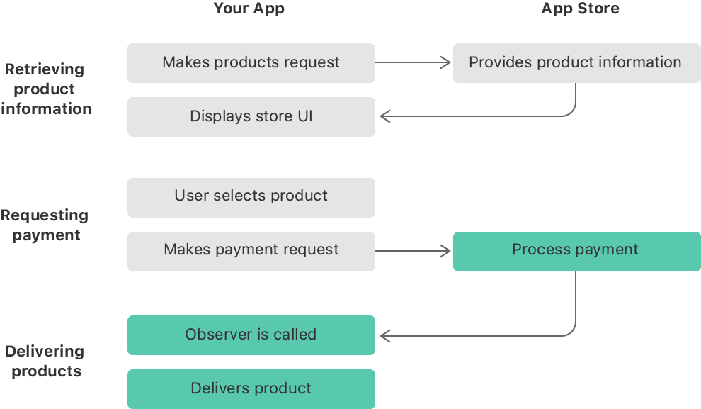

> Navigation: [Technologies](../technologies.md) · [StoreKit](../storekit.md) · [In-App Purchase](in-app-purchase.md) · [Original API for In-App Purchase](original-api-for-in-app-purchase.md)

# Processing a transaction

<sub>Article</sub>

Register a transaction queue observer to get and handle transaction updates from the App Store.

## Overview

Implementing an in-app purchase flow consists of three stages. In the first stage, your app retrieves product information. Then your app requests payment when the user selects a product in your app’s store. Finally, your app delivers the product.

The App Store calls the transaction queue observer after it processes the payment request. Your app then records information about the purchase for future launches, downloads the purchased content, and marks the transaction as finished.



<sub>A flowchart depicting the three stages of the in-app purchase process between your app and the App Store. First, your app makes a request for a product, the App Store provides that product information, and your app displays it. Next, the user selects a product, your app makes a payment request, and the App Store processes the payment. Finally, the App Store calls your app’s transaction queue observer, and your app delivers the purchased product. The third stage, delivering products, is highlighted.</sub>

### Monitor transactions in the queue

The transaction queue plays a central role in letting your app communicate with the App Store through the StoreKit framework. You add work to the queue that the App Store needs to act on, such as a payment request for processing. When the transaction’s state changes, such as when a payment request succeeds, StoreKit calls the app’s transaction queue observer. You decide which class acts as the observer. In very small apps, you might handle all the StoreKit logic in the app delegate, including observing the transaction queue. In most apps, however, you create a separate class that handles this observer logic, along with the rest of your app’s store logic. The observer needs to conform to the [SKPaymentTransactionObserver](skpaymenttransactionobserver.md) protocol.

By adding an observer, your app doesn’t need to constantly poll the status of its active transactions. Your app uses the transaction queue for payment requests, to download Apple-hosted content, and to determine when subscriptions renew.

It’s important to register a transaction queue observer as soon as your app launches, as the code shows below. For more guidance, see [Setting up the transaction observer for the payment queue](setting-up-the-transaction-observer-for-the-payment-queue.md).

**Swift**

```swift
func application(_ application: UIApplication, didFinishLaunchingWithOptions launchOptions: [UIApplication.LaunchOptionsKey: Any]?) -> Bool {
    /* ... */
    SKPaymentQueue.default().add(observer)
    return true
}
```

**Objective-C**

```objc
- (BOOL)application:(UIApplication *)application
 didFinishLaunchingWithOptions:(NSDictionary *)launchOptions
{
    /* ... */

    [[SKPaymentQueue defaultQueue] addTransactionObserver:observer];
}
```

Make sure that the observer is ready to handle a transaction at any time, not only after you add a transaction to the queue. For example, if a user buys something in your app just before entering a tunnel, your app may not be able to deliver the purchased content if there isn’t a network connection. The next time your app launches, StoreKit calls your transaction queue observer again so your app can handle the transaction and deliver the purchased content. Similarly, if your app fails to mark a transaction as finished, StoreKit calls the observer every time your app launches until the transaction finishes.

Implement the [- paymentQueue:updatedTransactions:](<skpaymenttransactionobserver/paymentqueue(__updatedtransactions_).md>) method on your transaction queue observer. StoreKit calls this method when the status of a transaction changes, such as when a payment request has been processed. The transaction status tells you what action your app needs to perform, as described in the table below:

| Status | Action to take in your app |
|---|---|
| [SKPaymentTransactionStatePurchasing](skpaymenttransactionstate/purchasing.md) | Update your UI to reflect the in-progress status, and wait for StoreKit to call the method again. |
| [SKPaymentTransactionStateDeferred](skpaymenttransactionstate/deferred.md) | Update your UI to reflect the deferred status, and wait for StoreKit to call the method again. |
| [SKPaymentTransactionStateFailed](skpaymenttransactionstate/failed.md) | Use the value of the `error` property to present a message to the user. For a list of error constants, see [SKErrorDomain](skerrordomain.md). |
| [SKPaymentTransactionStatePurchased](skpaymenttransactionstate/purchased.md) | Provide the purchased functionality, typically by unlocking features or delivering content. |
| [SKPaymentTransactionStateRestored](skpaymenttransactionstate/restored.md) | Restore the previously purchased functionality. |

Transactions in the queue can change state in any order. Your app needs to be ready to work on any active transaction at any time. Act on every transaction according to its transaction state, as in this example:

**Swift**

```swift
func paymentQueue(_ queue: SKPaymentQueue, updatedTransactions transactions: [SKPaymentTransaction]) {
     for transaction in transactions {
     switch transaction.transactionState {
          // Call the appropriate custom method for the transaction state.
     case .purchasing: showTransactionAsInProgress(transaction, deferred: false)
     case .deferred: showTransactionAsInProgress(transaction, deferred: true)
     case .failed: failedTransaction(transaction)
          case .purchased: completeTransaction(transaction)
     case .restored: restoreTransaction(transaction)
          // For debugging purposes.
     @unknown default: print("Unexpected transaction state \(transaction.transactionState)")
    }
     }
}
```

**Objective-C**

```objc
- (void)paymentQueue:(SKPaymentQueue *)queue
 updatedTransactions:(NSArray *)transactions
{
    for (SKPaymentTransaction *transaction in transactions) {
        switch (transaction.transactionState) {
            // Call the appropriate custom method for the transaction state.
            case SKPaymentTransactionStatePurchasing:
                [self showTransactionAsInProgress:transaction deferred:NO];
                break;
            case SKPaymentTransactionStateDeferred:
                [self showTransactionAsInProgress:transaction deferred:YES];
                break;
            case SKPaymentTransactionStateFailed:
                [self failedTransaction:transaction];
                break;
            case SKPaymentTransactionStatePurchased:
                [self completeTransaction:transaction];
                break;
            case SKPaymentTransactionStateRestored:
                [self restoreTransaction:transaction];
                break;
            default:
                // For debugging
                NSLog(@"Unexpected transaction state %@", @(transaction.transactionState));
                break;
        }
    }
}
```

### Update the app’s UI to reflect transaction changes

To keep your user interface up to date while waiting, the transaction queue observer can implement optional methods from the [SKPaymentTransactionObserver](skpaymenttransactionobserver.md) protocol as follows:

- StoreKit calls the [- paymentQueue:removedTransactions:](<skpaymenttransactionobserver/paymentqueue(__removedtransactions_).md>) method when it removes transactions from the queue. In your implementation of this method, remove the corresponding items from your app’s UI.
- StoreKit calls the [- paymentQueueRestoreCompletedTransactionsFinished:](<skpaymenttransactionobserver/paymentqueuerestorecompletedtransactionsfinished(__).md>) or [- paymentQueue:restoreCompletedTransactionsFailedWithError:](<skpaymenttransactionobserver/paymentqueue(__restorecompletedtransactionsfailedwitherror_).md>) methods when it finishes restoring transactions, depending on whether there is an error. In your implementation of these methods, update your app’s UI to reflect the success or failure.

For successfully processed transactions, validate the receipt associated with the transaction to verify the items the user purchased, and unlock content accordingly. For more information on validating receipts serverside, see [Validating receipts with the App Store](validating-receipts-with-the-app-store.md).

## See Also

### Purchases

- [Requesting a payment from the App Store](requesting-a-payment-from-the-app-store.md) — Submit a payment request to the App Store when a customer selects a product to buy.
- [SKPayment](skpayment.md) — A request to the App Store to process payment for additional functionality that your app offers. _(deprecated)_
- [SKMutablePayment](skmutablepayment.md) — A mutable request to the App Store to process payment for additional functionality that your app offers. _(deprecated)_
- [SKPaymentTransaction](skpaymenttransaction.md) — An object in the payment queue. _(deprecated)_
