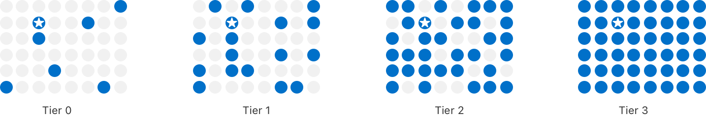

> Navigation: [Technologies](../technologies.md) · [StoreKit](../storekit.md) · [Ad network attribution](ad-network-attribution.md) · [SKAdNetwork](skadnetwork.md)

# Receiving postbacks in multiple conversion windows

Article

Learn about the data that postbacks may contain in each conversion window.

## Overview

SKAdNetwork supports three conversion windows that may result in up to three postbacks for a winning ad attribution. The conversion window begins when the user first launches the app. The first conversion window spans days 0 to 2; the second window spans days 3 to 7; and the third window spans days 8 to 35. Apps can update conversion values during all three time-windows.

To be eligible to receive multiple postbacks, all participants need to meet the following conditions:

- The ad network needs to sign the ad using SKAdNetwork 4 or later.
- The advertised app needs to call [+ updatePostbackConversionValue:coarseValue:lockWindow:completionHandler:](<skadnetwork/updatepostbackconversionvalue(__coarsevalue_lockwindow_completionhandler_).md>) or [+ updatePostbackConversionValue:coarseValue:completionHandler:](<skadnetwork/updatepostbackconversionvalue(__coarsevalue_completionhandler_).md>)to update the conversion values during each conversion window.

You may receive a single postback in the following cases:

- If the app’s postback data tier is Tier 0, the system sends only the first postback.
- Nonwinning ad attributions receive only the first postback.
- For ads signed using SKAdNetwork 3 or earlier, you receive only one winning postback.

### Lock conversion values to receive postbacks sooner

By default, the system waits until the end of a conversion window to get the final conversion value. Apps can continue to update the conversion value until the end of the conversion window. When the conversion window ends, the system prepares the postback and sends it after a random delay, as the following diagram shows:

A timeline that shows the first conversion window spans days 0 to 2, the second window spans days 3 to 7, and the third window spans days 8 to 35. At the end of the first conversion window, the system sends the postback 24 to 48 hours later. At the end of the second conversion window, the system sends the postback 24 to 144 hours later. At the end of the third conversion window, the system sends the postback 24 to 144 hours later.

The random delay is 24–48 hours for the first postback, and 24–144 hours for the second and third postbacks.

The [+ updatePostbackConversionValue:coarseValue:lockWindow:completionHandler:](<skadnetwork/updatepostbackconversionvalue(__coarsevalue_lockwindow_completionhandler_).md>) method provides an option for you to lock in and finalize a conversion value before the conversion window ends. You may choose to lock the conversion value in any or all conversion windows. The diagram below shows an app that locks the conversion value during the second conversion window:

A timeline that shows the first conversion window spans days 0 to 2, and the system sends the postback 24 to 48 hours later. The second conversion window spans days 3 to 7, but the app locks the conversion update before the window ends and the system sends the postback 24 to 144 hours after the lock. The remainder of the second conversion window is unavailable for further conversion value updates. The third window spans days 8 to 35, and the system accepts conversion value updates starting on day 8. At the end of the third conversion window, the system sends the postback 24 to 144 hours later.

After receiving a locked conversion value, the system immediately prepares the postback and ignores any further conversion value updates in the same conversion window. The system sends the postbacks after the same random delay following the locked conversion: a 24–48-hour delay for the first postback, and a 24–144-hour delay for the second and third postbacks. The system ignores further updates to the conversion value for the remaining time in the same conversion window.

> [!note] Note
> The earliest you may receive the first postback is unchanged from version 3 to version 4: the total delay is 24–48 hours after the app updates its final conversion value.

- In version 3, the app finalizes the conversion value when a 24-hour timer expires after the last conversion value update. Then, the device sends the postback after a random 0–24 hour delay, making the earliest postback 24–48 hours after the app sets the final conversion value.
- In version 4, the app may finalize the conversion value by locking it. Then, the device sends the postback after a random 24–48 hour delay.

As a result, both version 3 and 4 have a total delay of 24–48 hours to receive the first postback after the app finalizes the conversion value.

### Receive the highest level of data that ensures crowd anonymity

To maintain users’ privacy and ensure crowd anonymity, the device may limit the data that SKAdNetwork sends in postbacks. Apple determines a postback data tier that it assigns to each app download. The following diagram depicts the relationship between the tiers and relative crowd sizes. It’s for illustrative purposes only.

A diagram of four six-by-eight grids labeled Tier 0, Tier 1, Tier 2, and Tier 3. Each grid has one star on it that represents the app, and blue circles that represent the crowd. Tier 0 has six circles.Tier 1 has 16 circles, representing a larger crowd. Tier 2 has more circles than Tier 1. Tier 3 has circles that fill the entire grid, representing the largest crowd.

The postback data tier takes into account the crowd size associated with the app or domain displaying the ad, the advertised app, the country the advertised app was installed in, and the hierarchical source identifier that the ad network provides. The system computes the postback data tier for the two-, three-, and four-digit hierarchical source identifiers. It selects the source identifier with the highest postback data tier. If multiple source identifiers share the highest postback data tier, the system selects the source identifier with the most digits. If the highest postback data tier is Tier 1 or Tier 0, the system selects the two-digit source identifier.

The postback data tier affects the following fields in the postback, which may be present or absent, or may contain a limited number of digits:

- `source-identifier`, the hierarchical source identifier that may include two, three, or four digits
- `conversion-value`, a fine-grained conversion value available only in the first postback
- `coarse-conversion-value`, a coarse conversion value, which the system sends instead of the `conversion-value` in lower postback data tiers, and in the second and third postbacks
- `source-app-id` for ads that display in apps, or `source-domain` for attributable web ads
- `country-code`, an optional field representing the country the app was installed in. The system adds this field if the crowd size for a particular country is Tier 3.

The remaining postback data fields aren’t dependent on the postback date tier and appear in all postbacks, based on the SKAdNetwork version of the postback.``

### Receive the first postback

The first conversion window ends two days after the user first launches the app. The system prepares the postback after the conversion window ends, unless you use a lock. If you use a lock, the system prepares the first postback when the app calls [+ updatePostbackConversionValue:coarseValue:lockWindow:completionHandler:](<skadnetwork/updatepostbackconversionvalue(__coarsevalue_lockwindow_completionhandler_).md>) with the lock in an enabled state. The system then sends the postback after a random 24–48-hour delay.

The postback data tier determines the data you receive in the first postback, as follows:

For ads in Tier 3, the first postback contains:

- `source-identifier`, the hierarchical source identifier with two, three, or four digits
- `conversion-value`, the fine-grained conversion value, if the app provides one
- `source-app-id` for ads that display in apps, or `source-domain` for attributable web ads
- `country-code`, an optional field representing the country the app was installed in. The system adds this field if the crowd size for a particular country is Tier 3.

For ads in Tier 2, the first postback contains:

- `source-identifier`, the hierarchical source identifier with two, three, or four digits
- `conversion-value`, the fine-grained conversion value, if the app provides one

For ads in Tier 1, the first postback contains:

- `source-identifier`, the hierarchical source identifier with two digits
- `coarse-conversion-value`, a coarse value, if the app provides one

For ads in Tier 0, the first postback contains the `source-identifier`, the hierarchical source identifier, with two digits.

### Receive the second and third postbacks

The second conversion window ends seven days after the user first launches the app, and the third conversion window ends after 35 days. The system prepares the second and third postbacks after their conversion windows end, and sends them after a random 24–144-hour delay.

If you use a lock with the second or third conversion value updates, the system prepares the postback when you call [+ updatePostbackConversionValue:coarseValue:lockWindow:completionHandler:](<skadnetwork/updatepostbackconversionvalue(__coarsevalue_lockwindow_completionhandler_).md>) with the lock in an enabled state. The system sends the postback after a random 24–144-hour delay.

The postback data tier determines the data you receive in the postbacks, as follows:

For ads in Tier 1, Tier 2, and Tier 3, the second and third postbacks contain:

- `source-identifier`, the hierarchical source identifier with two digits
- `coarse-conversion-value`, the coarse conversion value, if the app provides one

For ads in Tier 0, the system doesn’t send a second or third postback.

Ads signed with version 4 and later are eligible for second and third postbacks after a winning ad impression. Ads signed with version 3 and earlier are eligible for one winning postback.

## See Also

### Essentials

- [Signing and providing ads](signing-and-providing-ads.md) — Advertise apps by signing and providing StoreKit-rendered ads, view-through ads, or attributable web ads.
- [Receiving ad attributions and postbacks](receiving-ad-attributions-and-postbacks.md) — Learn about timeframes and priorities for ad impressions that result in ad attributions, and how additional impressions qualify for postbacks.
- [SKAdNetwork release notes](skadnetwork-release-notes.md) — Learn about the features in each SKAdNetwork version.
