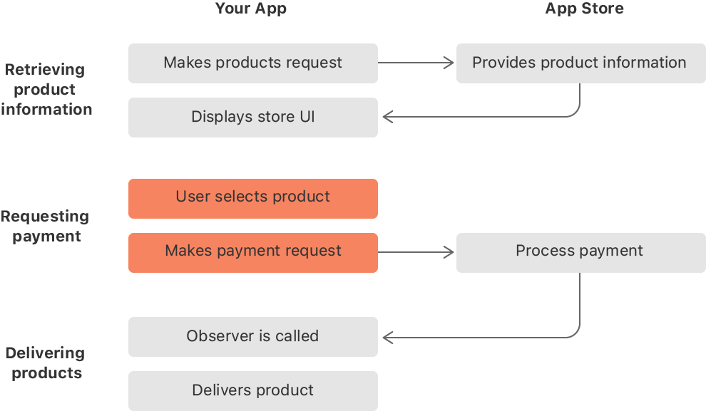

> Navigation: [Technologies](../technologies.md) · [StoreKit](../storekit.md) · [In-App Purchase](in-app-purchase.md) · [Original API for In-App Purchase](original-api-for-in-app-purchase.md)

# Requesting a payment from the App Store

<sub>Article</sub>

Submit a payment request to the App Store when a customer selects a product to buy.

## Overview

After you present your app’s store UI, users can make purchases from within your app. When the user chooses a product, your app creates and submits a payment request to the App Store.

Implementing an in-app purchase flow consists of three stages. In the first stage, your app retrieves product information. Then your app requests payment when the user selects a product in your app’s store. Finally, your app delivers the products.



<sub>A flowchart depicting the three stages of the in-app purchase process between your app and the App Store. First, your app makes a request for a product, the App Store provides that product information, and your app displays it. Next, the user selects a product, your app makes a payment request, and the App Store processes the payment. Finally, the App Store calls your app’s transaction queue observer, and your app delivers the purchased product. The second stage, requesting payment, is highlighted.</sub>

### Create a payment request

When the user selects a product to buy, create a payment request using the corresponding [SKProduct](skproduct.md) object and set the quantity if needed, as the code below shows. The product object comes from the array of products that your app’s products request returns, as described in [Fetching product information from the App Store](fetching-product-information-from-the-app-store.md).

**Swift**

```swift
// Use the corresponding SKProduct object that returns in the array from SKProductsRequest.
let payment = SKMutablePayment(product: product)
payment.quantity = 2
```

**Objective-C**

```objc
SKProduct *product = <# Product returned by a products request. #>;
SKMutablePayment *payment = [SKMutablePayment paymentWithProduct:product];
payment.quantity = 2;
```

### Submit a payment request

Submit your payment request to the App Store by adding it to the payment queue. If you add a payment object to the queue more than once, the system submits it to the App Store multiple times, charging the user and requiring your app to deliver the product each time.

**Swift**

```swift
SKPaymentQueue.default().add(payment)
```

**Objective-C**

```objc
[[SKPaymentQueue defaultQueue] addPayment:payment];
```

For each payment request your app submits, it receives a corresponding transaction to process. For more information about transactions and the payment queue, see [Processing a transaction](processing-a-transaction.md).

For auto-renewable subscriptions, you may submit a payment request with a subscription offer for users you determine eligible to receive an offer. For more information, see [Implementing promotional offers in your app](implementing-promotional-offers-in-your-app.md).

## See Also

### Purchases

- [Processing a transaction](processing-a-transaction.md) — Register a transaction queue observer to get and handle transaction updates from the App Store.
- [SKPayment](skpayment.md) — A request to the App Store to process payment for additional functionality that your app offers. _(deprecated)_
- [SKMutablePayment](skmutablepayment.md) — A mutable request to the App Store to process payment for additional functionality that your app offers. _(deprecated)_
- [SKPaymentTransaction](skpaymenttransaction.md) — An object in the payment queue. _(deprecated)_
