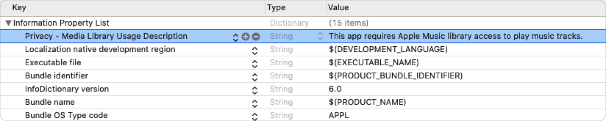

> Navigation: [Technologies](../technologies.md) · [StoreKit](../storekit.md) · [SKCloudServiceController](skcloudservicecontroller.md)

# Requesting Access to Apple Music Library

<sub>Article</sub>

Prompt the customer to authorize access to Apple Music library.

## Overview

Your app must obtain permission from the customer before accessing Apple Music Library.

### Provide a Purpose String in Info.plist

Provide a purpose string or usage description that describes how your app intends to use the user’s iCloud Music library or Apple Music catalog. Add the [NSAppleMusicUsageDescription](../bundleresources/information-property-list/nsapplemusicusagedescription.md) key to your app’s Info.plist. Set its value to a string that explains why your app needs access to Apple Music library. The system displays the string to the user when prompting them for authorization.



> [!important] Important
> This key is required for apps that access the user’s music library. Apps crash when the key is absent.

See [Requesting access to protected resources](../uikit/requesting-access-to-protected-resources.md) for more details.

### Request Authorization

The user determines whether apps can play items from the Apple Music catalog or add tracks to their iCloud Music library. They can grant or deny access when your app requests authorization. Because the user can change your app’s authorization status in Settings \> Privacy \> Media and Apple Music, be sure to call [SKCloudServiceController](skcloudservicecontroller.md)’s [+ authorizationStatus](<skcloudservicecontroller/authorizationstatus().md>) before attempting to access their Apple Music library.

**Swift**

```swift
guard SKCloudServiceController.authorizationStatus() == .notDetermined else { return }
```

**Objective-C**

```objc
SKCloudServiceAuthorizationStatus status = ([SKCloudServiceController authorizationStatus] == SKCloudServiceAuthorizationStatusNotDetermined);
```

If the authorization status i`s` [SKCloudServiceAuthorizationStatusNotDetermined](skcloudserviceauthorizationstatus/notdetermined.md), call [SKCloudServiceController](skcloudservicecontroller.md)’s [+ requestAuthorization:](<skcloudservicecontroller/requestauthorization(__).md>) to prompt the user for access.

**Swift**

```swift
SKCloudServiceController.requestAuthorization {(status: SKCloudServiceAuthorizationStatus) in
    switch status {
    case .denied, .restricted: disableAppleMusicBasedFeatures()
    case .authorized: enableAppleMusicBasedFeatures()
    default: break
    }
}
```

**Objective-C**

```objc
[SKCloudServiceController requestAuthorization:^(SKCloudServiceAuthorizationStatus status) {
    switch (status) {
        case SKCloudServiceAuthorizationStatusDenied:
        case SKCloudServiceAuthorizationStatusRestricted: [self disableAppleMusicBasedFeatures];
            break;
        case SKCloudServiceAuthorizationStatusAuthorized: [self enableAppleMusicBasedFeatures];
            break;
        default: break;
    }
}];

```

The system remembers the user’s answer so that subsequent calls to [+ requestAuthorization:](<skcloudservicecontroller/requestauthorization(__).md>) don’t prompt them again.

## See Also

### Getting authorization to access the Music library

- [+ authorizationStatus](<skcloudservicecontroller/authorizationstatus().md>) — Returns the type of authorization the customer has for accessing the Music library on the device. _(deprecated)_
- [+ requestAuthorization:](<skcloudservicecontroller/requestauthorization(__).md>) — Asks the customer for permission to access the Music library on the device. _(deprecated)_
- [SKCloudServiceAuthorizationStatus](skcloudserviceauthorizationstatus.md) — Constants that indicate the type of authorization the customer has for accessing the Music library. _(deprecated)_
