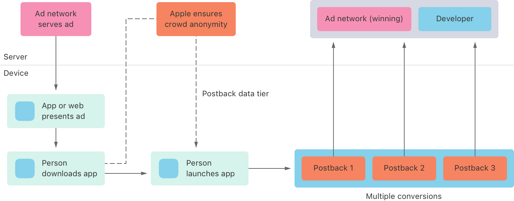
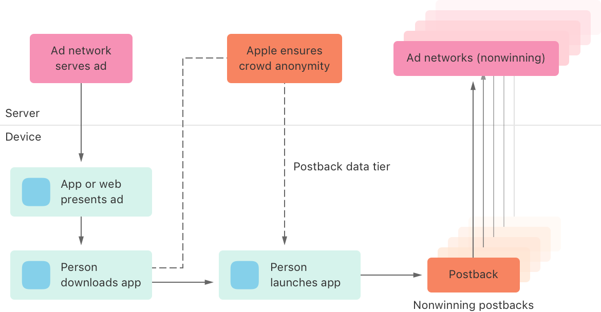

> Navigation: [Technologies](../technologies.md) · [StoreKit](../storekit.md)

# SKAdNetwork

<sub>Class</sub>

A class that validates advertisement-driven app installations.

<sub>iOS, iPadOS, Mac Catalyst</sub>

```swift
class SKAdNetwork
```

## Overview

> [!important] Important
> Use [AdAttributionKit](../adattributionkit.md) for app ad campaigns on the App Store and alternative marketplaces. See the [ad attribution developer support page](https://developer.apple.com/app-store/ad-attribution/) for information on how AdAttributionKit helps advertisers measure the success of ad campaigns while helping maintain user privacy. For information on interoperability between SKAdNetwork and AdAttributionKit, see [Understanding AdAttributionKit and SKAdNetwork interoperability](../adattributionkit/adattributionkit-skadnetwork-interoperability.md).

The ad network API helps advertisers measure the success of ad campaigns while maintaining user privacy. The API involves three participants:

- _Ad networks_ that sign ads and receive install-validation postbacks after ads result in conversions
- _Source apps_ that display ads from the ad networks, or websites that display the ads in Safari
- _Advertised apps_ that update conversion values as people engage with the app

Ad networks register with Apple to get an ad network ID and to use the API. Developers configure their apps to accept attributable ads from ad networks, and to receive copies of winning postbacks. For information about setup, see [Registering an ad network](registering-an-ad-network.md), [Configuring a source app](configuring-a-source-app.md), and [Configuring an advertised app](configuring-an-advertised-app.md). For information about displaying ads in Safari, see [SKAdNetwork for Web Ads](../skadnetworkforwebads.md).

The following diagram shows the path of an ad impression that wins ad attribution. The ad network serves an ad that an app or Safari web page displays. A user taps the ad and downloads the advertised app.



Apple determines a postback data tier for the app download, and the device uses the tier later to determine the level of detail the postback can contain to ensure crowd anonymity. For more information about the postback contents and the data tiers, see [Receiving postbacks in multiple conversion windows](receiving-postbacks-in-multiple-conversion-windows.md).

If the user launches the app within an attribution time-window, the ad impression is eligible for install-attribution postbacks. As the user engages with the app, the app updates the conversion value. Starting in iOS 16.1, apps can update conversion values during three conversion windows, which results in up to three postbacks for an ad signed using version 4. The system sends the postbacks to the ad network, and to the app’s developer if they opt in to receive postbacks.

Devices send install-validation postbacks to multiple ad networks that sign their ads using version 3 or later.

- One ad network receives a postback with a `did-win` parameter value of `true` for the ad impression that wins the ad attribution.
- Up to five other ad networks receive a postback with a `did-win` parameter value of `false` if their ad impressions qualify for the attribution, but don’t win.

The following diagram shows the path of ad impressions that qualify for, but don’t win, the ad attribution. Up to five ad networks receive a single nonwinning postback.



For more information about receiving ad attributions, including time-window details and other constraints, see [Receiving ad attributions and postbacks](receiving-ad-attributions-and-postbacks.md).

The information in the postback that Apple cryptographically signs doesn’t include user- or device-specific data. It may include values from the ad network and the advertised app if providing those values meets Apple’s privacy threshold. For more information about postback values and postback data tiers, see [Receiving postbacks in multiple conversion windows](receiving-postbacks-in-multiple-conversion-windows.md). For more information about the contents of postbacks for each SKAdNetwork version, see [Verifying an install-validation postback](verifying-an-install-validation-postback.md).

### Presenting ads, updating conversion values, and receiving attribution

Each participant has specific responsibilities when using the ad network APIs to present ads and receive attribution.

The ad network’s responsibilities are to:

- Register and provide its ad network identifier to developers. See [Registering an ad network](registering-an-ad-network.md).
- Serve signed ads to the source app. See [Signing and providing ads](signing-and-providing-ads.md).
- Serve signed ads for display in Safari web pages. See the [SKAdNetwork for Web Ads](../skadnetworkforwebads.md) API.
- Receive install-validation postbacks at the URL it establishes during registration.
- Verify the postbacks. See [Verifying an install-validation postback](verifying-an-install-validation-postback.md).

The source app’s responsibilities are to:

- Add the ad network identifiers to its `Info.plist` file. See [Configuring a source app](configuring-a-source-app.md).
- Display ads that the ad network signs. See [Signing and providing ads](signing-and-providing-ads.md).

The advertised app’s responsibilities are to:

- Register an app installation by updating the conversion value when the user first launches the app by calling one of the conversion updating methods, such as [+ updatePostbackConversionValue:coarseValue:lockWindow:completionHandler:](<skadnetwork/updatepostbackconversionvalue(__coarsevalue_lockwindow_completionhandler_).md>).
- Optionally, continue to update the conversion value as the user engages with the app, by calling one of the conversion updating methods, such as [+ updatePostbackConversionValue:coarseValue:lockWindow:completionHandler:](<skadnetwork/updatepostbackconversionvalue(__coarsevalue_lockwindow_completionhandler_).md>).
- Optionally, specify a server URL in its `Info.plist` file to receive a copy of the winning install-validation postback. See [Configuring an advertised app](configuring-an-advertised-app.md).

Apple designs SKAdNetwork APIs to maintain user privacy. Apps don’t need to use [App Tracking Transparency](../apptrackingtransparency.md) before calling SKAdNetwork APIs, and can call these APIs regardless of their tracking authorization status. For more information about privacy, see [User Privacy and Data Use](https://developer.apple.com/app-store/user-privacy-and-data-use/).

> [!note] Note
> The SKAdNetwork APIs have no effect, return empty strings, or return values that indicate unavailability when you call the APIs from a compatible iPad or iPhone app running in macOS or visionOS, from a Mac app built with Mac Catalyst, or from an App Clip’s code. For more information about App Clips, see [App Clips](../appclip.md).

## Relationships

- **Inherits From**: [NSObject](../objectivec/nsobject-swift.class.md)

- **Conforms To**: [CVarArg](../swift/cvararg.md), [CustomDebugStringConvertible](../swift/customdebugstringconvertible.md), [CustomStringConvertible](../swift/customstringconvertible.md), [Equatable](../swift/equatable.md), [Hashable](../swift/hashable.md), [NSObjectProtocol](../objectivec/nsobjectprotocol.md)

## Topics

### Essentials

- [Signing and providing ads](signing-and-providing-ads.md) — Advertise apps by signing and providing StoreKit-rendered ads, view-through ads, or attributable web ads.
- [Receiving ad attributions and postbacks](receiving-ad-attributions-and-postbacks.md) — Learn about timeframes and priorities for ad impressions that result in ad attributions, and how additional impressions qualify for postbacks.
- [Receiving postbacks in multiple conversion windows](receiving-postbacks-in-multiple-conversion-windows.md) — Learn about the data that postbacks may contain in each conversion window.
- [SKAdNetwork release notes](skadnetwork-release-notes.md) — Learn about the features in each SKAdNetwork version.

### Registering ad networks and configuring apps

- [Registering an ad network](registering-an-ad-network.md) — Use the install-validation APIs for your ad campaigns after registering your ad network with Apple.
- [Configuring a source app](configuring-a-source-app.md) — Set up a source app to participate in ad campaigns.
- [Configuring an advertised app](configuring-an-advertised-app.md) — Prepare an advertised app to participate in ad campaigns.
- [SKAdNetworkItems](../bundleresources/information-property-list/skadnetworkitems.md) — An array of dictionaries containing a list of ad network IDs.
- [NSAdvertisingAttributionReportEndpoint](../bundleresources/information-property-list/nsadvertisingattributionreportendpoint.md) — The URL where Private Click Measurement and SKAdNetwork send attribution information.

### Signing StoreKit-rendered ads

- [Generating the signature to validate StoreKit-rendered ads](generating-the-signature-to-validate-storekit-rendered-ads.md) — Initiate install validation by displaying a StoreKit-rendered ad with signed parameters.
- [Ad network install-validation keys](ad-network-install-validation-keys.md) — Specify key values that validate and associate an app installation with an ad campaign.

### Signing view-through ads

- [Generating the signature to validate view-through ads](generating-the-signature-to-validate-view-through-ads.md) — Initiate install validation by displaying a view-through ad with signed parameters.
- [SKAdImpression](skadimpression.md) — A class that defines an ad impression for a view-through ad.
- [+ startImpression:completionHandler:](<skadnetwork/startimpression(__completionhandler_).md>) — Indicates that your app is presenting a view-through ad to the user.
- [+ endImpression:completionHandler:](<skadnetwork/endimpression(__completionhandler_).md>) — Indicates that your app is no longer presenting a view-through ad to the user.

### Providing conversion information

- [+ updatePostbackConversionValue:coarseValue:lockWindow:completionHandler:](<skadnetwork/updatepostbackconversionvalue(__coarsevalue_lockwindow_completionhandler_).md>) — Updates the fine and coarse conversion values and indicates whether to send the postback before the conversion window ends, and calls a completion handler if the update fails.
- [+ updatePostbackConversionValue:coarseValue:completionHandler:](<skadnetwork/updatepostbackconversionvalue(__coarsevalue_completionhandler_).md>) — Updates the fine and coarse conversion values, and calls a completion handler if the update fails.
- [CoarseConversionValue](skadnetwork/coarseconversionvalue.md) — Coarse values to use for updating conversion values.
- [+ updatePostbackConversionValue:completionHandler:](<skadnetwork/updatepostbackconversionvalue(__completionhandler_).md>) — Verifies the first launch of an advertised app and, on subsequent calls, updates the conversion value or calls a completion handler if the update fails.

### Verifying postbacks

- [Verifying an install-validation postback](verifying-an-install-validation-postback.md) — Ensure the validity of a postback you receive after an ad conversion by verifying its cryptographic signature.
- [Identifying the parameters in install-validation postbacks](identifying-the-parameters-in-install-validation-postbacks.md) — Learn about the postback parameters in all SKAdNetwork versions.

### Testing ad attributions and postbacks

- [Testing ad attributions with a downloaded profile](testing-ad-attributions-with-a-downloaded-profile.md) — Reduce the time-window for ad attributions and inspect postbacks using a proxy during testing.
- [Testing and validating ad impression signatures and postbacks for SKAdNetwork](../storekittest/testing-and-validating-ad-impression-signatures-and-postbacks-for-skadnetwork.md) — Validate your ad impressions and test your postbacks by creating unit tests using the StoreKit Test framework.

### Deprecated

- [+ registerAppForAdNetworkAttribution](<skadnetwork/registerappforadnetworkattribution().md>) — Verifies the first launch of an app installed as a result of an ad. _(deprecated)_
- [+ updateConversionValue:](<skadnetwork/updateconversionvalue(__).md>) — Updates the conversion value and verifies the first launch of an app installed as a result of an ad. _(deprecated)_

## See Also

### Ad impressions and installation validations

- [Understanding AdAttributionKit and SKAdNetwork interoperability](../adattributionkit/adattributionkit-skadnetwork-interoperability.md) — Learn how attribution APIs interact to deliver ad impressions.
- [SKAdImpression](skadimpression.md) — A class that defines an ad impression for a view-through ad.
