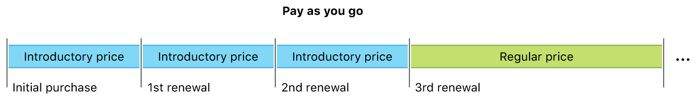

> Navigation: [Technologies](../../../technologies.md) · [StoreKit](../../../storekit.md) · [SKProductDiscount](../../skproductdiscount.md) · [PaymentMode](../paymentmode-swift.enum.md)

# SKProductDiscount.PaymentMode.payAsYouGo

<sub>Case</sub>

A constant that indicates a product discount that applies over a single billing period or multiple billing periods.

> [!warning] Deprecated
> Use Product.SubscriptionOffer.PaymentMode.

<sub>iOS, iPadOS, Mac Catalyst, macOS, tvOS, visionOS, watchOS</sub>

```swift
case payAsYouGo
```

## Discussion

With a pay as you go payment mode, users pay the discounted price at each billing period during the discount period.



## See Also

### Discount Price Payment Modes

- [SKProductDiscountPaymentModePayUpFront](payupfront.md) — A constant that indicates that the system applies the product discount up front. _(deprecated)_
- [SKProductDiscountPaymentModeFreeTrial](freetrial.md) — A constant that indicates that the payment mode is a free trial. _(deprecated)_
