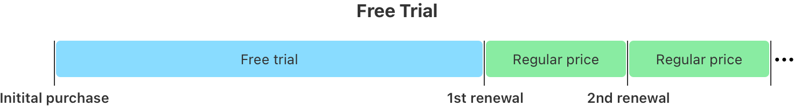
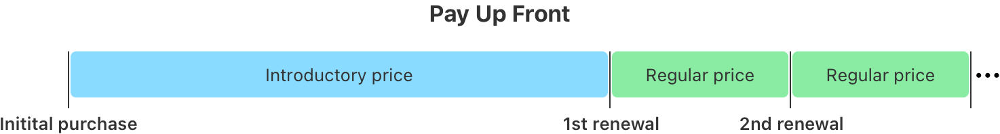

> Navigation: [Technologies](../../../technologies.md) · [StoreKit](../../../storekit.md) · [Transaction](../../transaction.md) · [Offer](../offer-swift.struct.md)

# Transaction.Offer.PaymentMode

<sub>Structure</sub>

The payment modes for offers that apply to a transaction.

<sub>iOS, iPadOS, Mac Catalyst, macOS, tvOS, visionOS, watchOS</sub>

```swift
struct PaymentMode
```

## Overview

If your app supports offers and the customer redeems an offer, the transaction contains the information in the [offer](../offer-swift.property.md) parameter. The payment modes include the subscription payment modes as in the [PaymentMode](../../product/subscriptionoffer/paymentmode-swift.struct.md) structure, and the [oneTime](paymentmode-swift.struct/onetime.md) mode that applies to consumables, non-consumables, and non-renewing subscriptions.

The following images describe payment modes for auto-renewable subscriptions.



<sub>A timeline titled “Free Trial” that is divided into three sections. The first section, which has a different timespan than the remaining sections, starts with the initial purchase and is the free trial period. The second section is labeled “first renewal”, and is at the regular price. The third section is labeled  “second renewal”, and is also at the regular price. Three dots at the end of the timeline indicate the pattern continues with renewals at the regular price.</sub>


<sub>A timeline titled “Pay As You Go” that is divided into four sections. The first three sections, labeled “Introductory price” each have equal timespan, and the fourth section, labeled “Regular price” has a different timespan. The first three sections represent the initial purchase, first renewal, and second renewal, respectively.  The fourth section is the third renewal, at the regular price. Three dots at the end of the timeline indicate the pattern continues with renewals at the regular price.</sub>



<sub>A timeline titled “Pay Up Front” that is divided into three sections. The first section, labeled “Introductory price” has a different timespan than the following sections, labelled “Regular price”. The timeline starts with the initial purchase at the introductory price, followed by the first renewal and second renewals, both at the regular price. Three dots at the end of the timeline indicate the pattern continues with renewals at the regular price.</sub>

For more information about payment modes, see [In-app purchase and subscriptions pricing and availability](https://developer.apple.com/help/app-store-connect/reference/in-app-purchase-and-subscriptions-pricing-and-availability).

## Relationships

- **Conforms To**: [Equatable](../../../swift/equatable.md), [Hashable](../../../swift/hashable.md), [RawRepresentable](../../../swift/rawrepresentable.md), [Sendable](../../../swift/sendable.md), [SendableMetatype](../../../swift/sendablemetatype.md)

## Topics

### Getting payment modes

- [freeTrial](paymentmode-swift.struct/freetrial.md) — A payment mode of a product discount that indicates a free trial.
- [payAsYouGo](paymentmode-swift.struct/payasyougo.md) — A payment mode of a product discount that applies over a single billing period or multiple billing periods.
- [payUpFront](paymentmode-swift.struct/payupfront.md) — A payment mode of a product discount that applies the discount up front.
- [oneTime](paymentmode-swift.struct/onetime.md) — A payment mode for a consumable, non-consumable, or non-renewing subscription offer that indicates a one-time purchase.

## See Also

### Getting offer details

- [id](id.md) — A string that identifies an offer that applies to the transaction.
- [type](type.md) — The type of offer that applies to the transaction.
- [OfferType](../offertype-swift.struct.md) — The types of offers that apply to a transaction.
- [paymentMode](paymentmode-swift.property.md) — The payment mode for a subscription offer on an auto-renewable subscription that applies to the transaction.
- [period](period.md) — The duration of the offer applied to a transaction.
