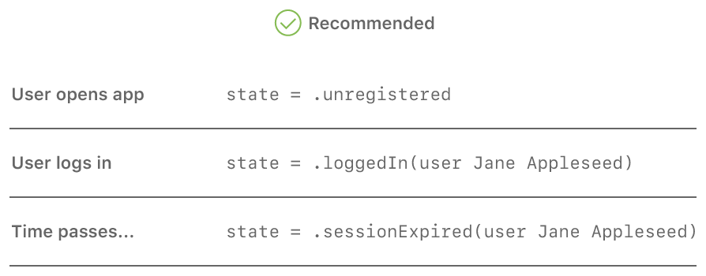

> Navigation: [Technologies](../technologies.md) · [Swift](../swift.md)

# Maintaining State in Your Apps

<sub>Article</sub>

Use enumerations to capture and track the state of your app.

## Overview

Effectively managing state, the bits of data that keep track of how the app is being used at the moment, is an important part of a developing your app. Because enumerations define a finite number of states, and can bundle associated values with each individual state, you can use them to model the state of your app and its internal processes.

### Use an Enumeration to Capture State

Consider an app that requires a user to log into an account. When the app is first opened, the user is unknown, so the state of the app could be called _unregistered_. After the user has registered or logged into an account, the state is _logged in_. After some time of inactivity, the user’s session may expire, leaving the app in a _session expired_ state.

You can use an enumeration to specify the exact states needed for your app. This approach defines an `App` class with a nested `State` enumeration that includes only the specific states you need:

```swift
class App {
    enum State {
        case unregistered
        case loggedIn(User)
        case sessionExpired(User)
    }

    var state: State = .unregistered

    // ...
}
```

In this model, each state is represented by a case with a matching name. The `loggedIn` and `sessionExpired` cases include the user as an associated value, while the `unregistered` case doesn’t include an associated value. When you update your app’s state, there’s a single variable, `state`, to modify, no matter what the transition.



### Don’t Spread State Across Multiple Variables

It’s also possible to model an app’s state by using individual variables in combination to hold the state and the required data, which is not recommended.

In this model, the app defines two variables: an optional `user` that stores user information, and a Boolean value named `sessionExpired`. The `user` variable is `nil` when the user not logged in and has a value once the user logs in. The `sessionExpired` variable begins as `false` and is set to `true` if the session expires. The three states are captured by different combinations of the two variables.

Using this approach is prone to mistakes for a few reasons, in ways that can lead to bugs and make it harder to reason about your code:

- For every change in state, you need to provide updates for both `user` and `sessionExpired` in tandem.
- If a future change to the app requires an additional state, you need to update an additional variable at every existing change in state.
- The two variables have an unused combination—it’s possible to set the `user` to `nil` and `sessionExpired` to `true`, even though that doesn’t have a corresponding state.

## See Also

### Data Flow and Control Flow

- [Preventing Timing Problems When Using Closures](preventing-timing-problems-when-using-closures.md) — Understand how different API calls to your closures can affect your app.
