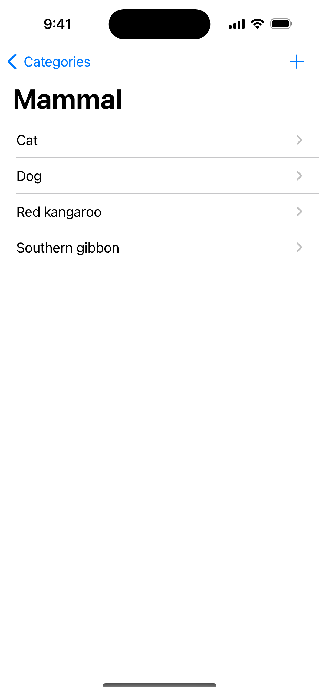
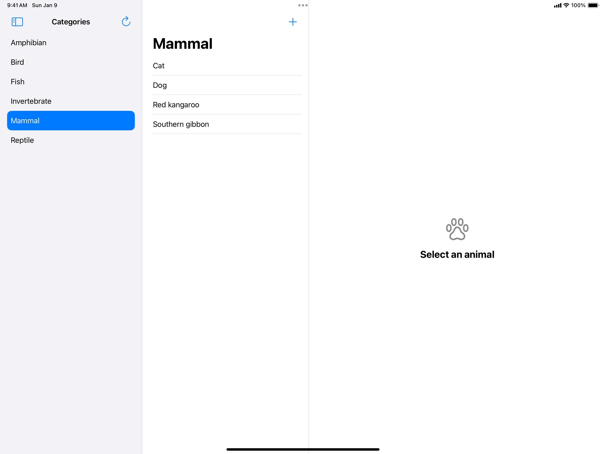
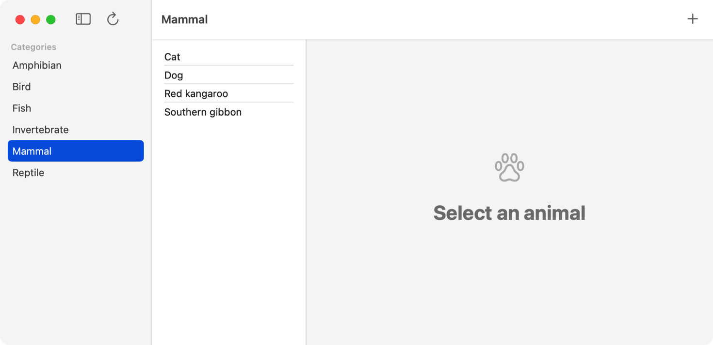
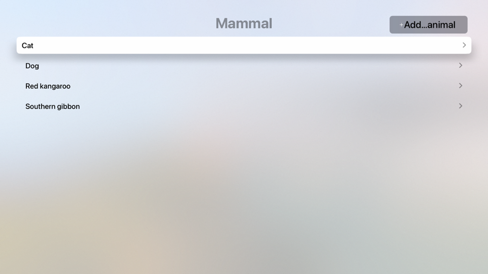

> Navigation: [Technologies](../technologies.md) · [SwiftData](../swiftdata.md)

# Defining data relationships with enumerations and model classes

<sub>Sample Code</sub>

Create relationships for static and dynamic data stored in your app.

## Overview

There are two ways to define data relationships in your app: using enumerations and using the [Relationship(_:deleteRule:minimumModelCount:maximumModelCount:originalName:inverse:hashModifier:)](<relationship(__deleterule_minimummodelcount_maximummodelcount_originalname_inverse_hashmodifier_).md>) macro in a model class. Which one to use depends on the unique circumstances of your app. This article explains how to apply both approaches to the sample [SwiftUI](../swiftui.md) app that persist data using SwiftData.

### Relate a model class to static data

Enumerations are a convenient way to form relationships between a model class and static data — data that the app defines and doesn’t change. To define the static data, create an enumeration and ensure it conforms to the [Codable](../swift/codable.md) protocol. SwiftData requires this conformance to persist any data that is of the enumeration type. The following code, for example, declares a `Codable` conforming enumeration that specify the animal type based on their diets:

```swift
extension Animal {
    enum Diet: String, CaseIterable, Codable {
        case herbivorous = "Herbivore"
        case carnivorous = "Carnivore"
        case omnivorous = "Omnivore"
    }
}
```

The `Animal` model class declares the property `diet` as a type of `Diet`. Because this property is non-optional, its value must be set to one of the `Diet` cases: `herbivore`, `carnivore`, and `ominvore`.

```swift
@Model
final class Animal {
    var name: String
    var diet: Diet
    var category: AnimalCategory?
    
    init(name: String, diet: Diet) {
        self.name = name
        self.diet = diet
    }
}
```

A person using the sample app can set the diet of an animal by choosing one of the available `Diet` cases from a [Picker](../swiftui/picker.md); for example:

```swift
Picker("Diet", selection: $selectedDiet) {
    ForEach(Animal.Diet.allCases, id: \.self) { diet in
        Text(diet.rawValue).tag(diet)
    }
}
```

To learn more about how the sample app saves data changes, see [Adding and editing persistent data in your app](adding-and-editing-persistent-data-in-your-app.md).

### Relate a model class to dynamic data

If the related data is dynamic and unknown to the app — data that comes from an external source such as someone using the app or a remote server — then form a relationship between two model classes instead of a class and enumeration. For instance, the dynamic data in the sample app includes animals and animal categories. An animal can belong to no more than one animal category, and a category can contain zero, one, or more animals.

**iOS**



**iPadOS**



<sub>A screenshot of the sample app running in iPadOS, showing a three-column user interface. The first column shows a list of categories with Mammal highlighted as the selected category. The second column shows the list of animals that are in the Mammal category. The third column shows an animal paw print icon. Under the icon is the text, Select an animal.</sub>

**macOS**



<sub>A screenshot of the sample app running in macOS, showing a three-column user interface. The first column shows a list of categories with Mammal highlighted as the selected category. The second column shows the list of animals that are in the Mammal category. The third column shows an animal paw print icon. Under the icon is the text, Select an animal.</sub>

**tvOS**



<sub>A screenshot of the sample app running in tvOS, showing the list of animals that are in the Mammal category. The first animal, cat, is highlighted.</sub>

To declare this relationship, the `AnimalCategory` class defines the property `animals`, which represents the animals contained in the category. The class also applies the [Relationship(_:deleteRule:minimumModelCount:maximumModelCount:originalName:inverse:hashModifier:)](<relationship(__deleterule_minimummodelcount_maximummodelcount_originalname_inverse_hashmodifier_).md>) macro to the `animals` property. This macro defines the relationship between the `AnimalCategory` and `Animal` model classes.

```swift
@Model
final class AnimalCategory {
    @Attribute(.unique) var name: String
    // `.cascade` tells SwiftData to delete all animals contained in the 
    // category when deleting it.
    @Relationship(deleteRule: .cascade, inverse: \Animal.category)
    var animals = [Animal]()
    
    init(name: String) {
        self.name = name
    }
}
```

Set the parameter values of this macro to configure the relationship. For example, the `deleteRule` parameter specifies how SwiftData handles related data during delete operations. The `inverse` parameter is a key path to the store property, `category`, declared in the related model class, `Animal`. The inverse parameter forms the relationship between the two classes, `AnimalCategory` and `Animal`, and the `category` property declared in `Animal` provides a reference to an animal category.

### Set a relationship’s delete rule

The `deleteRule` parameter specifies how SwiftData handles delete operations with regards to the related data. The [Schema.Relationship.DeleteRule.cascade](schema/relationship/deleterule-swift.enum/cascade.md) delete rule tells SwiftData to delete all related data when deleting the primary object. For example, deleting an `AnimalCategory` in the sample app causes SwiftData to also delete all animals contained in that category.

```swift
@Relationship(deleteRule: .cascade, inverse: \Animal.category)
var animals = [Animal]()
```

If you don’t want to delete the animals within a category, you can use the [Schema.Relationship.DeleteRule.nullify](schema/relationship/deleterule-swift.enum/nullify.md) delete rule. This rule tells SwiftData to set the animal’s `category` property to `nil` for each animal contained in the animal category when deleting the category. Because the default value for the `deleteRule` parameter is `nullify`, you can create the relationship without explicitly specifying the delete rule, like so:

```swift
@Relationship(inverse: \Animal.category)
var animals = [Animal]()
```

For a complete list of delete rules, see [DeleteRule](schema/relationship/deleterule-swift.enum.md).

### Create a model container

Whether your data model includes relationships, you must always create a model container for your app when using SwiftData. The sample app creates a model container using the [modelContainer(for:inMemory:isAutosaveEnabled:isUndoEnabled:onSetup:)](<../swiftui/view/modelcontainer(for_inmemory_isautosaveenabled_isundoenabled_onsetup_)-18hhy.md>) modifier, passing in the model type `AnimalCategory.self`:

```swift
@main
struct SwiftDataAnimalsApp: App {
    var body: some Scene {
        WindowGroup() {
            ContentView()
        }
        .modelContainer(for: AnimalCategory.self)
    }
}
```

SwiftData uses the model type to construct the schema that determines the structure of the persistent storage area. The schema also includes all related types that form the object graph of the provided model type. For instance, `AnimalCategory` is a root model type of an object graph. `AnimalCategory` contains a relationship to the model type `Animal`, which means that the schema includes `Animal` along with `AnimalCategory`. If `Animal` had a relationship to another model type, the schema would also include that type.

If your app defines multiple root model types, use the
[modelContainer(for:inMemory:isAutosaveEnabled:isUndoEnabled:onSetup:)](<../swiftui/view/modelcontainer(for_inmemory_isautosaveenabled_isundoenabled_onsetup_)-8oc48.md>) modifier, passing in an array that contains each root model type used in your app.

## See Also

### Model definition

- [Model()](<model().md>) — Converts a Swift class into a stored model that’s managed by SwiftData.
- [Attribute(_:originalName:hashModifier:)](<attribute(__originalname_hashmodifier_).md>) — Specifies the custom behavior that SwiftData applies to the annotated property when managing the owning class.
- [Unique(_:)](<unique(__).md>) — Specifies the key-paths that SwiftData uses to enforce the uniqueness of model instances.
- [Index(_:)](<index(__)-74ia2.md>) — Specifies the key-paths that SwiftData uses to create one or more binary indices for the associated model.
- [Index(_:)](<index(__)-7d4z0.md>) — Specifies the key-paths that SwiftData uses to create one or more indicies for the associated model, where each index is either binary or R-tree.
- [Relationship(_:deleteRule:minimumModelCount:maximumModelCount:originalName:inverse:hashModifier:)](<relationship(__deleterule_minimummodelcount_maximummodelcount_originalname_inverse_hashmodifier_).md>) — Specifies the options that SwiftData needs to manage the annotated property as a relationship between two models.
- [Transient()](<transient().md>) — Tells SwiftData not to persist the annotated property when managing the owning class.

## Download

- [SwiftDataAnimals.zip](https://docs-assets.developer.apple.com/published/f84bac78ac34/SwiftDataAnimals.zip)
