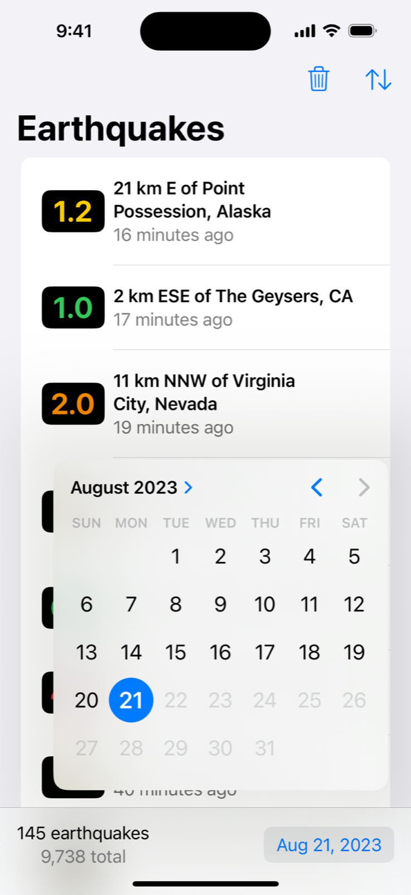
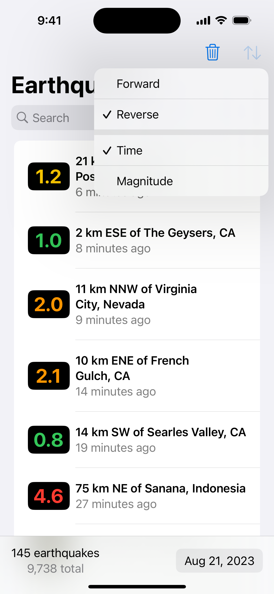
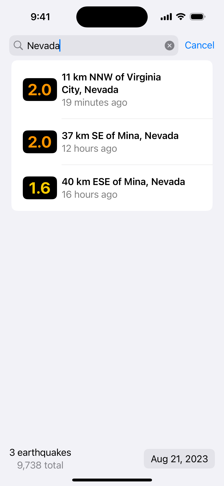
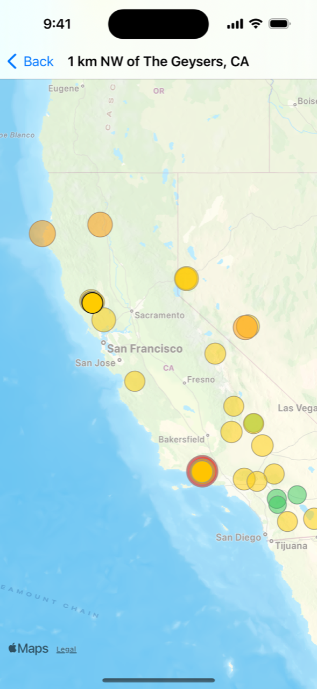

> Navigation: [Technologies](../technologies.md) · [SwiftData](../swiftdata.md)

# Filtering and sorting persistent data

<sub>Sample Code</sub>

Manage data store presentation using predicates and dynamic queries.

## Overview

This sample app displays a list of earthquakes, showing the time, location, and size of each earthquake. To help people visualize the list, the app also pinpoints each earthquake on a map. You can select an earthquake in the list to highlight it on the map.

The app uses SwiftData to store and manage the earthquake data, and relies on dynamic queries to present the data in different ways. For example, people can select which day’s earthquakes to display, sort the earthquakes by magnitude or time in forward or reverse order, and filter by location name.



<sub>A screenshot of the sample app running on an iPhone 14 Pro. The app's list view shows a list of earthquakes. Text in the bottom toolbar on the left indicates that there are 145 earthquakes in the list out of 9,738 total stored earthquakes. A date picker in the bottom toolbar on the right is activate and displays a calendar for selecting a date. The date August 21, 2023 is currently highlighted in the date picker's calendar. The top toolbar has a sort button and a trash button.</sub>



<sub>A screenshot of the sample app running on an iPhone 14 Pro. The app's list view shows a list of earthquakes. Text in the bottom toolbar on the left indicates that there are 145 earthquakes in the list out of 9,738 total stored earthquakes. A date picker in the bottom toolbar on the right is inactivate and displays the date August 21, 2023. A sort button in the top toolbar on the right is selected and displays a popover with the items Forward, Reverse, Time, and Magnitude. The items Reverse and Time both have a checkmark. The top toolbar also has a trash button.</sub>



<sub>A screenshot of the sample app running on an iPhone 14 Pro. The app's list view shows a list of 3 earthquakes. Text in the bottom toolbar on the left indicates that there are three earthquakes in the list out of 9,738 total stored earthquakes. A date picker in the bottom toolbar on the right is inactivate and displays the date August 21, 2023. A search field appears at the top of the display and contains the text Nevada. All of the items visible in the list have the text Nevada in their location names.</sub>

> [!note] Note
> To learn how the app retrieves and stores earthquake data, see [Maintaining a local copy of server data](maintaining-a-local-copy-of-server-data.md).

### Read the entire collection with a simple query

The app’s `ContentView` fetches a complete list of earthquakes by applying the [Query](query.md) macro to its `quakes` property:

```swift
@Query private var quakes: [Quake]
```

The query macro injects code that keeps the array of earthquake instances synchronized with items in the data store. The view uses this list of earthquakes to configure the navigation bar based on the selected earthquake. For example, it sets the title and subtitle in macOS:

```swift
.navigationTitle(quakes[selectedId]?.location.name ?? "Earthquakes")
.navigationSubtitle(quakes[selectedId]?.fullDate ?? "")
```

The above code relies on a subscript method that the app defines in an extension of [Array](../swift/array.md):

```swift
extension Array where Element: Quake {
    subscript(id: Quake.ID?) -> Quake? {
        first { $0.id == id }
    }
}
```

The subscript definition relies on the fact that model objects — types attributed with the [Model()](<model().md>) macro, like `Quake` — automatically conform to the [Identifiable](../swift/identifiable.md) protocol, which means that each earthquake instance has a unique `id` parameter. When someone selects an earthquake in the list or map view, the app sets `selectedId` to the selected earthquake’s identifier.

### Add a sort parameter to order data

The map view draws circles to represent quakes at particular locations, using a size for the circle that corresponds to the earthquake’s magnitude. To keep the circles visible when several overlap, `MapView` sorts its query by magnitude so that the map draws larger circles behind smaller ones.



It introduces the sorting by adding parameters to the query macro:

```swift
@Query(sort: \Quake.magnitude, order: .reverse)
private var quakes: [Quake]
```

The output of this query drives the generation of the map content builder’s `QuakeMarker` instances, and always appears in the desired order:

```swift
Map(selection: $selectedIdMap) {
    ForEach(quakes) { quake in
        QuakeMarker(
            quake: quake,
            selected: quake.id == selectedId)
    }
}
```

> [!note] Note
> The app binds `selectedIdMap` to the map’s selection input and manually synchronizes this with the main `selectedId` value that’s used elsewhere in code. Keeping separate selection values enables the app to detect changes driven from the map and then scroll the list to match.

### Define a filter using a predicate

To ensure that the app’s interface remains approachable, the app limits how many earthquakes it displays based on:

- **A date** — To avoid overwhelming the map with too many markers, the app displays only one day’s worth of earthquakes at a time. People can choose which day to view.
- **A location name** — To enable people to focus on specific earthquakes, people can enter text in a search field that the app matches against earthquake location names.

To implement this filtering, the app defines a static method that returns a [Predicate](../foundation/predicate.md) that takes into account both a search date and search text:

```swift
static func predicate(
    searchText: String,
    searchDate: Date
) -> Predicate<Quake> {
    let calendar = Calendar.autoupdatingCurrent
    let start = calendar.startOfDay(for: searchDate)
    let end = calendar.date(byAdding: .init(day: 1), to: start) ?? start

    return #Predicate<Quake> { quake in
        (searchText.isEmpty || quake.location.name.contains(searchText))
        &&
        (quake.time > start && quake.time < end)
    }
}
```

The app applies this predicate to the queries it creates dynamically, as the next section describes. By defining the predicate once in a central location, queries in multiple views can use it. This makes it easy to synchronize related views, like the list and map views, when the views have distinct queries.

### Update a query dynamically

When someone selects a new date or changes the search text, the app needs to update the query to match. The map view achieves this by providing an initializer with `searchDate` and `searchText` inputs, and rebuilding the stored query using those values:

```swift
init(
    selectedId: Binding<Quake.ID?>,
    selectedIdMap: Binding<Quake.ID?>,
    searchDate: Date = .now,
    searchText: String = ""
) {
    _selectedId = selectedId
    _selectedIdMap = selectedIdMap

    _quakes = Query(
        filter: Quake.predicate(
            searchText: searchText,
            searchDate: searchDate),
        sort: \.magnitude,
        order: .reverse
    )
}
```

Because these values are inputs to the view’s initializer, SwiftUI reevaluates the initializer to produce a new query whenever either value changes. This in turn updates the appearance of the view.

The earthquake list view does something similar, although in this case it takes sort configuration inputs as well:

```swift
init(
    selectedId: Binding<Quake.ID?>,
    selectedIdMap: Binding<Quake.ID?>,
    
    searchText: String = "",
    searchDate: Date = .now,
    sortParameter: SortParameter = .time,
    sortOrder: SortOrder = .reverse
) {
    _selectedId = selectedId
    _selectedIdMap = selectedIdMap

    let predicate = Quake.predicate(searchText: searchText, searchDate: searchDate)
    switch sortParameter {
    case .time: _quakes = Query(filter: predicate, sort: \.time, order: sortOrder)
    case .magnitude: _quakes = Query(filter: predicate, sort: \.magnitude, order: sortOrder)
    }
}
```

These two initializers have different sorting constraints to match the needs of their respective appearances, but they use the same predicate to ensure that the set of quakes that appears in the list always matches the set that appears on the map.

## See Also

### Model fetch

- [Query()](<query().md>) — Fetches all instances of the attached model type.
- [Additional query macros](additionalquerymacros.md) — Supplementary macros that enable you to narrow query results and tell SwiftData how to sort, order, and section those results.
- [Query](query.md) — A type that fetches models using the specified criteria, and manages those models so they remain in sync with the underlying data.
- [FetchDescriptor](fetchdescriptor.md) — A type that describes the criteria, sort order, and any additional configuration to use when performing a fetch.

## Download

- [SwiftDataLocalDataCacheSample.zip](https://docs-assets.developer.apple.com/published/5e964e0daa88/SwiftDataLocalDataCacheSample.zip)
