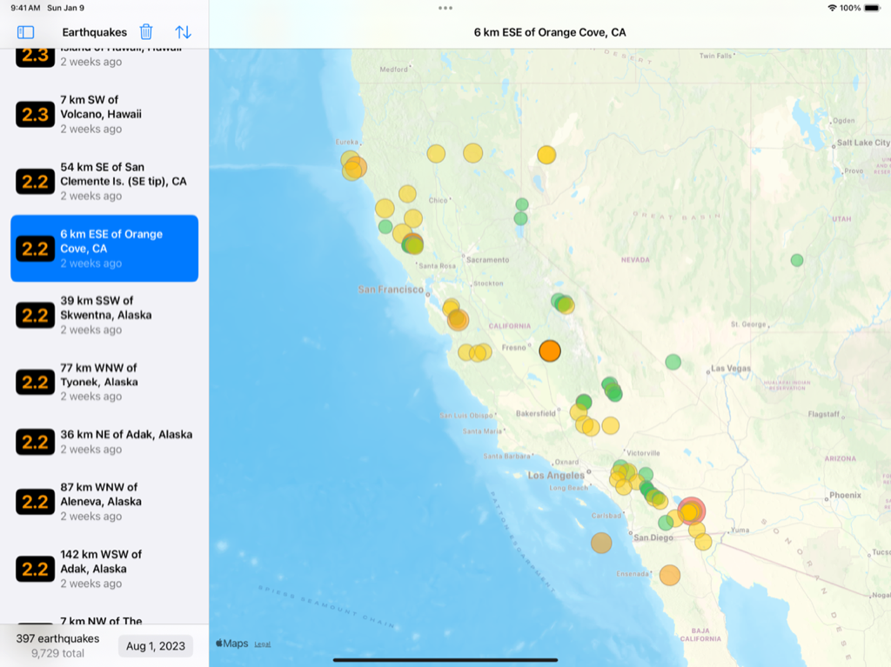

> Navigation: [Technologies](../technologies.md) · [SwiftData](../swiftdata.md)

# Maintaining a local copy of server data

<sub>Sample Code</sub>

Create and update a persistent store to cache read-only network data.

## Overview

This sample app displays a list that contains a day’s worth of earthquakes, showing their time, location, and size. To help people visualize the list, the app also pinpoints each earthquake on a map. You can select an earthquake in the list to highlight it on the map.



<sub>A screenshot of the sample app on an iPad. The sidebar shows a list of earthquakes. An earthquake with magnitude 2.2 in Orange Cove, California is selected. The detail view shows a map centered on California with small multicolored circles scattered around to mark earthquake locations. One circle in the center of the map's visible region is highlighted.</sub>

The app downloads earthquake data from the network under the following assumptions:

- **Earthquake data is read-only** — The app doesn’t need to synchronize local and remote changes. The server is always the source of truth.
- **New earthquakes happen on a regular basis** — The app needs to provide a way to get an initial list of earthquakes and to periodically refresh that list.
- **Existing earthquake records can change** — For example, the reported magnitude of an earthquake might change as additional measurements become available. The app needs to distinguish between new earthquakes and updates to previously downloaded ones.

The app uses SwiftData to persistently store the data that it downloads. By caching the data locally, the app reduces its need to access the server. SwiftData also makes it easy for the app to manage updates when downloading new data.

> [!note] Note
> To learn how the app manages data presentation with queries and predicates, see [Filtering and sorting persistent data](filtering-and-sorting-persistent-data.md).

### Define the app’s data model

The app represents the information it needs for its interface by defining a `Quake` class. The class definition includes the [Model()](<model().md>) macro to tell the system to store the data persistently using SwiftData:

```swift
import SwiftData

@Model
class Quake {
    @Attribute(.unique) var code: String
    var magnitude: Double
    var time: Date
    var location: Location
}
```

The model includes the following fields:

- **A unique code** — By including the [Attribute(_:originalName:hashModifier:)](<attribute(__originalname_hashmodifier_).md>) macro with the [unique](schema/attribute/option/unique.md) property option, the app ensures that SwiftData stores only one earthquake with a particular value for this field.
- **A magnitude** — The size of the earthquake.
- **A timestamp** — The moment in time when the earthquake happened, stored as a [Date](../foundation/date.md) instance.
- **A location** — A custom `Location` instance that contains a location name and map coordinates:

  ```swift
  struct Location: Codable {
      var name: String
      var longitude: Double
      var latitude: Double
  }
  ```

The `Quake` model can embed a location instance because the `Location` structure conforms to the [Codable](../swift/codable.md) protocol.

### Model the server data

The app loads data from a U.S. Geological Survey (USGS) server, which provides earthquake data in [GeoJSON](https://earthquake.usgs.gov/earthquakes/feed/v1.0/geojson.php) format. To interpret this data, the app defines a `GeoFeatureCollection` structure with property names that match the names of relevant JSON properties:

```swift
struct GeoFeatureCollection: Decodable {
    let features: [Feature]

    struct Feature: Decodable {
        let properties: Properties
        let geometry: Geometry
        
        struct Properties: Decodable {
            let mag: Double
            let place: String
            let time: Date
            let code: String
        }

        struct Geometry: Decodable {
            let coordinates: [Double]
        }
    }
}
```

The structure and its substructures include elements relevant to this app, namely magnitude, time, and location information. They omit many other fields that the server provides because the app doesn’t need them. The structure also conforms to the [Decodable](../swift/decodable.md) protocol so the app can use the structure to decode the downloaded data.

### Download data from the server

To retrieve data, the app defines a `fetchFeatures()` method that uses a [URLSession](../foundation/urlsession.md) to store the earthquake JSON in a `data` property:

```swift
let session = URLSession.shared
guard let (data, response) = try? await session.data(from: url),
      let httpResponse = response as? HTTPURLResponse,
      httpResponse.statusCode == 200
else {
    throw DownloadError.missingData
}
```

The method then parses the data with a [JSONDecoder](../foundation/jsondecoder.md) instance, according to the definition provided by the decodable `GeoFeatureCollection` structure:

```swift
do {
    let jsonDecoder = JSONDecoder()
    jsonDecoder.dateDecodingStrategy = .millisecondsSince1970
    return try jsonDecoder.decode(GeoFeatureCollection.self, from: data)
} catch {
    throw DownloadError.wrongDataFormat(error: error)
}
```

For other examples of decoding JSON data, see [Using JSON with custom types](../foundation/using-json-with-custom-types.md).

### Translate server data into model data

After retrieving a collection of features, the app interprets each feature as an earthquake. The `Quake` class defines a convenience initializer that creates a new earthquake from a feature instance:

```swift
convenience init(from feature: GeoFeatureCollection.Feature) {
    self.init(
        code: feature.properties.code,
        magnitude: feature.properties.mag,
        time: feature.properties.time,
        name: feature.properties.place,
        longitude: feature.geometry.coordinates[0],
        latitude: feature.geometry.coordinates[1]
    )
}
```

This enables the app to translate the data from a format that the server provides to a format that’s convenient for the app. For example, the initializer converts longitude and latitude coordinates that appear as anonymous elements in the feature’s `geometry.coordinates` array into named parameters.

### Insert or update new earthquake data

As the app creates new earthquake instances, it persistently stores any that have a magnitude greater than zero by calling the model context’s [insert(_:)](<modelcontext/insert(__).md>) method for each one:

```swift
for feature in featureCollection.features {
    let quake = Quake(from: feature)

    if quake.magnitude > 0 {
        modelContext.insert(quake)
    }
}
```

The app runs this loop for both the initial download and later refresh operations. When the app saves the changes — which happens automatically in this case because the context’s [autosaveEnabled](modelcontext/autosaveenabled.md) property has the default value of `true` — SwiftData checks if the specified earthquake’s `code` parameter matches the code of an earthquake that’s already in the store. If so, the framework updates the stored earthquake’s other parameters using the values in the specified one. Otherwise, the framework adds a new earthquake to the store.

The insert method works for both creating and updating earthquake model instances because the model indicates that the `code` parameter is unique. This relies on the fact that the server ensures a unique, stable code for each earthquake event.

## See Also

### Model storage

- [DefaultStore](defaultstore.md) — A data store that uses Core Data as its undelying storage mechanism.
- [DataStore](datastore.md) — An interface that enables SwiftData to read and write model data without knowledge of the underlying storage mechanism.
- [DataStoreBatching](datastorebatching.md) — An interface that enables a custom data store to support batch requests.
- [HistoryProviding](historyproviding.md) — An interface that enables a custom data store to provide the history of changes for its persisted models.
- [Building a document-based app using SwiftData](../swiftui/building-a-document-based-app-using-swiftdata.md) — Code along with the WWDC presenter to transform an app with SwiftData.
- [ModelDocument](modeldocument.md) — A document type that uses SwiftData to manage its storage.

## Download

- [SwiftDataLocalDataCacheSample.zip](https://docs-assets.developer.apple.com/published/5e964e0daa88/SwiftDataLocalDataCacheSample.zip)
