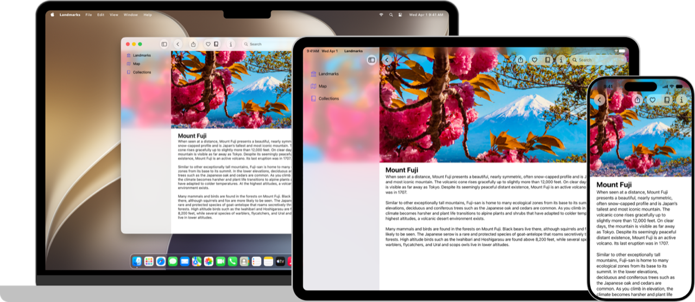

> Navigation: [Technologies](technologies.md)

# SwiftUI

Framework

Declare the user interface and behavior for your app on every platform.

## Overview

SwiftUI provides views, controls, and layout structures for declaring your app’s user interface. The framework provides event handlers for delivering taps, gestures, and other types of input to your app, and tools to manage the flow of data from your app’s models down to the views and controls that users see and interact with.

Define your app structure using the [App](swiftui/app.md) protocol, and populate it with scenes that contain the views that make up your app’s user interface. Create your own custom views that conform to the [View](swiftui/view.md) protocol, and compose them with SwiftUI views for displaying text, images, and custom shapes using stacks, lists, and more. Apply powerful modifiers to built-in views and your own views to customize their rendering and interactivity. Share code between apps on multiple platforms with views and controls that adapt to their context and presentation.

You can integrate SwiftUI views with objects from the [UIKit](uikit.md), [AppKit](appkit.md), and [WatchKit](watchkit.md) frameworks to take further advantage of platform-specific functionality. You can also customize accessibility support in SwiftUI, and localize your app’s interface for different languages, countries, or cultural regions.

> [!tip] Tip
> If you’re new to SwiftUI, visit the [SwiftUI Pathway](https://developer.apple.com/swiftui/get-started/). It’s a collection of tutorials, articles, and sample projects that help you get started with SwiftUI.

### Featured samples

- [Landmarks: Building an app with Liquid Glass](swiftui/landmarks-building-an-app-with-liquid-glass.md)
- [Wishlist: Planning travel in a SwiftUI app](swiftui/wishlist-planning-travel-in-a-swiftui-app.md)
- [Destination Video](visionos/destination-video.md)
- [Building a document-based app with SwiftUI](swiftui/building-a-document-based-app-with-swiftui.md)

## Topics

### Essentials

- [Adopting Liquid Glass](technologyoverviews/adopting-liquid-glass.md) — Find out how to bring the new material to your app.
- [Develop in Swift](tutorials/develop-in-swift.md#explore-xcode) — Develop in Swift Tutorials introduce app development with Swift and Xcode to anyone learning to build apps for Apple platforms.
- [SwiftUI updates](updates/swiftui.md) — Learn about important changes to SwiftUI.
- [Landmarks: Building an app with Liquid Glass](swiftui/landmarks-building-an-app-with-liquid-glass.md) — Enhance your app experience with system-provided and custom Liquid Glass.

### App structure

- [App organization](swiftui/app-organization.md) — Define the entry point and top-level structure of your app.
- [Scenes](swiftui/scenes.md) — Declare the user interface groupings that make up the parts of your app.
- [Windows](swiftui/windows.md) — Display user interface content in a window or a collection of windows.
- [Immersive spaces](swiftui/immersive-spaces.md) — Display unbounded content in a person’s surroundings.
- [Documents](swiftui/documents.md) — Enable people to open and manage documents.
- [Navigation](swiftui/navigation.md) — Enable people to move between different parts of your app’s view hierarchy within a scene.
- [Modal presentations](swiftui/modal-presentations.md) — Present content in a separate view that offers focused interaction.
- [Toolbars](swiftui/toolbars.md) — Provide immediate access to frequently used commands and controls.
- [Search](swiftui/search.md) — Enable people to search for text or other content within your app.
- [App extensions](swiftui/app-extensions.md) — Extend your app’s basic functionality to other parts of the system, like by adding a Widget.

### Data and storage

- [Model data](swiftui/model-data.md) — Manage the data that your app uses to drive its interface.
- [Environment values](swiftui/environment-values.md) — Share data throughout a view hierarchy using the environment.
- [Preferences](swiftui/preferences.md) — Indicate configuration preferences from views to their container views.
- [Persistent storage](swiftui/persistent-storage.md) — Store data for use across sessions of your app.

### Views

- [View fundamentals](swiftui/view-fundamentals.md) — Define the visual elements of your app using a hierarchy of views.
- [View configuration](swiftui/view-configuration.md) — Adjust the characteristics of views in a hierarchy.
- [View styles](swiftui/view-styles.md) — Apply built-in and custom appearances and behaviors to different types of views.
- [Animations](swiftui/animations.md) — Create smooth visual updates in response to state changes.
- [Text input and output](swiftui/text-input-and-output.md) — Display formatted text and get text input from the user.
- [Images](swiftui/images.md) — Add images and symbols to your app’s user interface.
- [Controls and indicators](swiftui/controls-and-indicators.md) — Display values and get user selections.
- [Menus and commands](swiftui/menus-and-commands.md) — Provide space-efficient, context-dependent access to commands and controls.
- [Shapes](swiftui/shapes.md) — Trace and fill built-in and custom shapes with a color, gradient, or other pattern.
- [Drawing and graphics](swiftui/drawing-and-graphics.md) — Enhance your views with graphical effects and customized drawings.

### View layout

- [Layout fundamentals](swiftui/layout-fundamentals.md) — Arrange views inside built-in layout containers like stacks and grids.
- [Layout adjustments](swiftui/layout-adjustments.md) — Make fine adjustments to alignment, spacing, padding, and other layout parameters.
- [Custom layout](swiftui/custom-layout.md) — Place views in custom arrangements and create animated transitions between layout types.
- [Lists](swiftui/lists.md) — Display a structured, scrollable column of information.
- [Tables](swiftui/tables.md) — Display selectable, sortable data arranged in rows and columns.
- [View groupings](swiftui/view-groupings.md) — Present views in different kinds of purpose-driven containers, like forms or control groups.
- [Scroll views](swiftui/scroll-views.md) — Enable people to scroll to content that doesn’t fit in the current display.

### Event handling

- [Gestures](swiftui/gestures.md) — Define interactions from taps, clicks, and swipes to fine-grained gestures.
- [Input events](swiftui/input-events.md) — Respond to input from a hardware device, like a keyboard or a Touch Bar.
- [Clipboard](swiftui/clipboard.md) — Enable people to move or duplicate items by issuing Copy and Paste commands.
- [Drag and drop](swiftui/drag-and-drop.md) — Enable people to move or duplicate items by dragging them from one location to another.
- [Focus](swiftui/focus.md) — Identify and control which visible object responds to user interaction.
- [System events](swiftui/system-events.md) — React to system events, like opening a URL.

### Accessibility

- [Accessibility fundamentals](swiftui/accessibility-fundamentals.md) — Make your SwiftUI apps accessible to everyone, including people with disabilities.
- [Accessible appearance](swiftui/accessible-appearance.md) — Enhance the legibility of content in your app’s interface.
- [Accessible controls](swiftui/accessible-controls.md) — Improve access to actions that your app can undertake.
- [Accessible descriptions](swiftui/accessible-descriptions.md) — Describe interface elements to help people understand what they represent.
- [Accessible navigation](swiftui/accessible-navigation.md) — Enable users to navigate to specific user interface elements using rotors.

### Framework integration

- [AppKit integration](swiftui/appkit-integration.md) — Add AppKit views to your SwiftUI app, or use SwiftUI views in your AppKit app.
- [UIKit integration](swiftui/uikit-integration.md) — Add UIKit views to your SwiftUI app, or use SwiftUI views in your UIKit app.
- [WatchKit integration](swiftui/watchkit-integration.md) — Add WatchKit views to your SwiftUI app, or use SwiftUI views in your WatchKit app.
- [Technology-specific views](swiftui/technology-specific-views.md) — Use SwiftUI views that other Apple frameworks provide.

### Tool support

- [Previews in Xcode](swiftui/previews-in-xcode.md) — Generate dynamic, interactive previews of your custom views.
- [Xcode library customization](swiftui/xcode-library-customization.md) — Expose custom views and modifiers in the Xcode library.
- [Performance analysis](swiftui/performance-analysis.md) — Measure and improve your app’s responsiveness.
