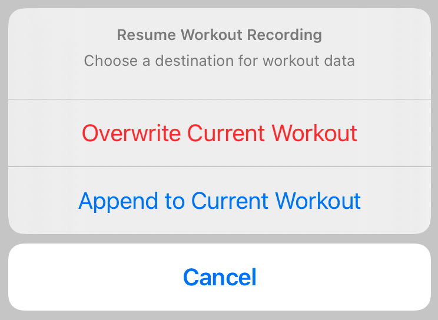

> Navigation: [Technologies](../technologies.md) · [SwiftUI](../swiftui.md)

# ActionSheet

<sub>Structure</sub>

A representation of an action sheet presentation.

> [!warning] Deprecated
> Use a [View](view.md) modifier like [confirmationDialog(_:isPresented:titleVisibility:presenting:actions:message:)](<view/confirmationdialog(__ispresented_titlevisibility_presenting_actions_message_)-8y541.md>) instead.

<sub>iOS, iPadOS, Mac Catalyst, tvOS, visionOS, watchOS</sub>

```swift
struct ActionSheet
```

## Overview

Use an action sheet when you want the user to make a choice between two or more options, in response to their own action. If you want the user to act in response to the state of the app or the system, rather than a user action, use an [Alert](alert.md) instead.

You show an action sheet by using the [actionSheet(isPresented:content:)](<view/actionsheet(ispresented_content_).md>) view modifier to create an action sheet, which then appears whenever the bound `isPresented` value is `true`. The `content` closure you provide to this modifier produces a customized instance of the `ActionSheet` type. To supply the options, create instances of [Button](actionsheet/button.md) to distinguish between ordinary options, destructive options, and cancellation of the user’s original action.

The action sheet handles its dismissal by setting the bound `isPresented` value back to `false` when the user taps a button in the action sheet.

The following example creates an action sheet with three options: a Cancel button, a destructive button, and a default button. The second and third of these call methods are named `overwriteWorkout` and `appendWorkout`, respectively.

```swift
@State private var showActionSheet = false
var body: some View {
    Button("Tap to show action sheet") {
        showActionSheet = true
    }
    .actionSheet(isPresented: $showActionSheet) {
        ActionSheet(title: Text("Resume Workout Recording"),
                    message: Text("Choose a destination for workout data"),
                    buttons: [
                        .cancel(),
                        .destructive(
                            Text("Overwrite Current Workout"),
                            action: overwriteWorkout
                        ),
                        .default(
                            Text("Append to Current Workout"),
                            action: appendWorkout
                        )
                    ]
        )
    }
}
```

The system may interpret the order of items as they appear in the `buttons` array to accommodate platform conventions. In this example, the Cancel button is the first member of the array, but the action sheet puts it in its standard position at the bottom of the sheet.



<sub>An action sheet with the title Resume Workout Recording in bold text and the message Choose a destination for workout data in smaller text. Below the text, three buttons: a destructive Overwrite Current Workout button in red, a default-styled Overwrite Current Workout button, and a Cancel button, farther below and set off in its own button group.</sub>

## Topics

### Creating an action sheet

- [init(title:message:buttons:)](<actionsheet/init(title_message_buttons_).md>) — Creates an action sheet with the provided buttons. _(deprecated)_

### Specifying the button type

- [Button](actionsheet/button.md) — A button representing an operation of an action sheet presentation. _(deprecated)_

## See Also

### Deprecated modal presentations

- [Alert](alert.md) — A representation of an alert presentation. _(deprecated)_
